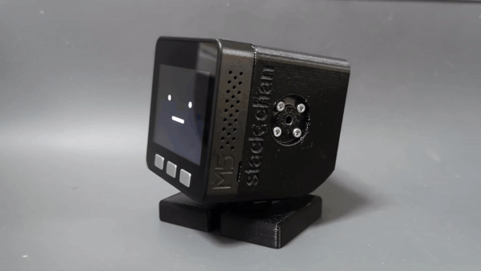

# Stack-chan

[日本語](./README_ja.md)

Stack-chan is a JavaScript-driven M5Stack-embedded super-kawaii robot.

* Video (with English subtitles): https://youtu.be/fZb_mF08xV0
* Official hashtag: [`#stackchan` | `#ｽﾀｯｸﾁｬﾝ` (JP)](https://twitter.com/search?q=%23stackchan%20OR%20%23%EF%BD%BD%EF%BE%80%EF%BD%AF%EF%BD%B8%EF%BE%81%EF%BD%AC%EF%BE%9D).

## Features

* :neutral_face:     Show cute face
* :smile:            Expression(Happy, Angry, Sad etc.)
* :smiley_cat:       Customize face
* :eyes:             Glance/stare/gaze
* :speech_balloon:   Say things
* :bulb:             Addon M5Units
* :cyclone:          Drive Serial(TTL)/PWM servos
* :game_die:         Make applications on your own

## Contents

This repository includes all the component of the robot.

* __firmware__ : Source codes of the firmware.
* __case__ : Stereolithography(STL) of the case.
* __schematics__ : Schematics and board layout data.

## Installation

### Assemble board

* See [schematics/README.md](./schematics/README.md) and [case/README.md](./case/README.md)
* OR You can get a pre-assembled module(COMING SOON)

### Flash firmware to M5Stack

* See [firmware/README.md](./firmware/README.md)

## Contribution

__Feature requests/Bug reports__ are extremely welcome! See [issues](https://github.com/meganetaaan/stack-chan/issues) page to post some.

__Wanna be a sponsor__? It would be my great honor. please visit my [sponsor](https://github.com/sponsors/meganetaaan/) page.

## License

Resources of this repository are distributed under Apache version 2.0 license.
See [LICENSE](./LICENSE).

