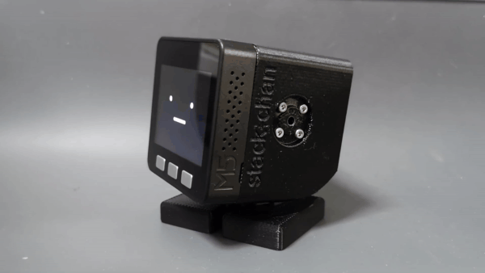
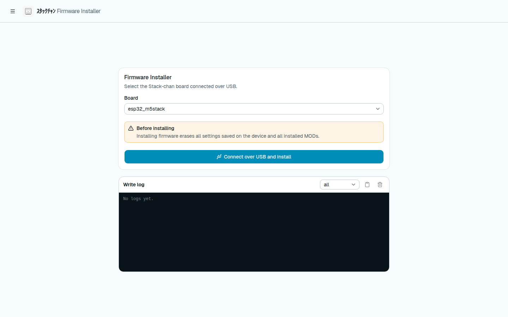
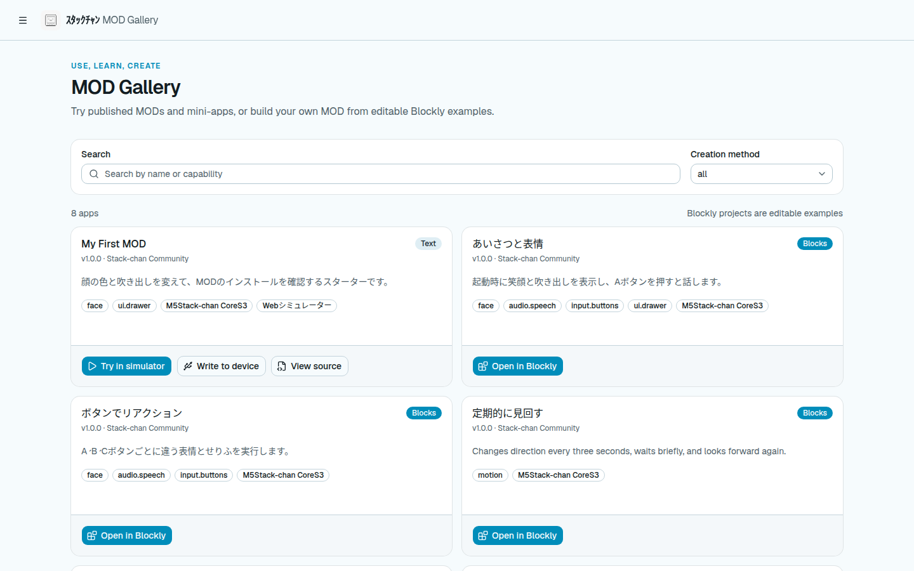
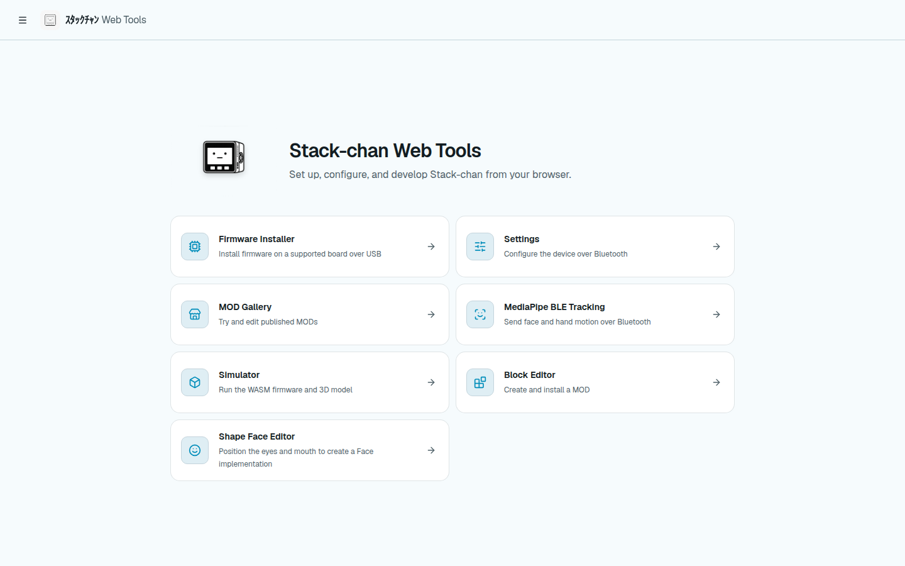
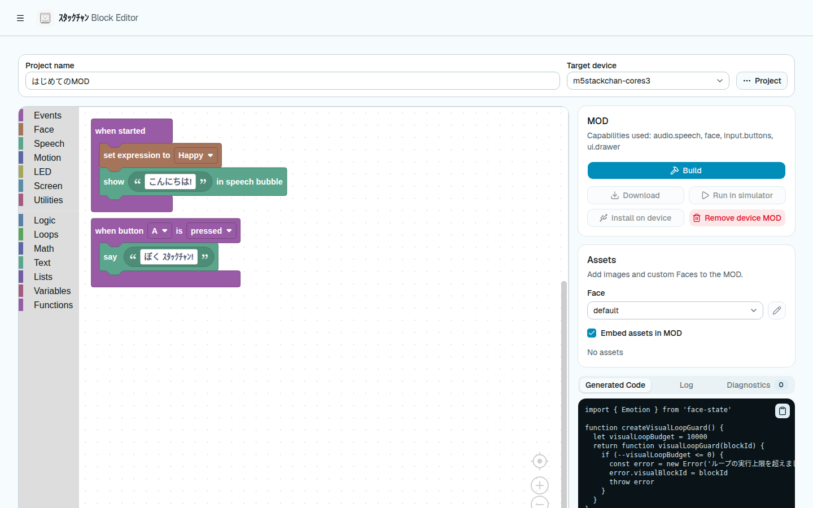

# Stack-chan

[](https://github.com/stack-chan/stack-chan/actions/workflows/build.yml)
[](https://discord.gg/eGhd9adnBm)

[日本語](./README_ja.md)



Stack-chan is an open-source, JavaScript-driven, super-kawaii robot built with M5Stack.

This repository provides firmware with M5StackChan CoreS3 as its standard configuration, user applications called MODs, browser development tools, cases, and schematics.

- Video (with English subtitles): https://youtu.be/fZb_mF08xV0
- Official hashtag: [`#stackchan` | `#ｽﾀｯｸﾁｬﾝ` (JP)](https://twitter.com/search?q=%23stackchan%20OR%20%23%EF%BD%BD%EF%BE%80%EF%BD%AF%EF%BD%B8%EF%BE%81%EF%BD%AC%EF%BE%9D)

## Getting started

If this is your first Stack-chan, start with a preassembled M5StackChan and the browser tools.

### 1. Get an M5StackChan

The standard M5StackChan AI Desktop Robot (K151) package is enough to get started.
The joystick remote controller is optional.

- Worldwide: [M5Stack Official Store](https://shop.m5stack.com/products/stackchan-kawaii-co-created-open-source-ai-desktop-robot)
- Japan: [M5StackChan](https://ssci.to/11129)
- Japan: [M5StackChan with joystick remote controller](https://ssci.to/11131)

### 2. Flash the firmware

Connect M5StackChan to a computer with a data-capable USB cable, then open the [Web firmware installer](https://stack-chan.github.io/stack-chan/web/flash/) in Chrome or Edge.
Select "M5StackChan CoreS3" as the device.
You do not need to install the Moddable SDK or ESP-IDF.

> [!IMPORTANT]
> Flashing this repository's firmware replaces the factory firmware supplied by M5Stack.
> To restore it, follow the restore procedure in the [M5Stack product documentation](https://docs.m5stack.com/en/StackChan) and use M5Burner.

[](https://stack-chan.github.io/stack-chan/web/flash/)

### 3. Try a MOD

Find published MODs and mini apps in the [MOD Gallery](https://stack-chan.github.io/stack-chan/web/mod-gallery/).
Choose a MOD, then run it in the simulator or install it on a device.
Block-based samples can be opened directly in the block editor and changed.

[](https://stack-chan.github.io/stack-chan/web/mod-gallery/)

## Browser tools

Use the [Stack-chan browser tools](https://stack-chan.github.io/stack-chan/web/) to set up a device, change its preferences, and create MODs in a browser.

[](https://stack-chan.github.io/stack-chan/web/)

| Tool | Purpose |
| --- | --- |
| [Firmware installer](https://stack-chan.github.io/stack-chan/web/flash/) | Flash firmware to a supported M5Stack over USB |
| [Preferences](https://stack-chan.github.io/stack-chan/web/preference/) | Change Wi-Fi and device preferences over BLE |
| [MOD Gallery](https://stack-chan.github.io/stack-chan/web/mod-gallery/) | Find, try, and install published MODs |
| [Block editor](https://stack-chan.github.io/stack-chan/web/editor/) | Create MODs with Blockly and run them in the simulator or on a device |
| [Shape face editor](https://stack-chan.github.io/stack-chan/web/face-editor/) | Arrange eyes and a mouth to create a custom Face |
| [Simulator](https://stack-chan.github.io/stack-chan/web/simulator/) | Run MODs with the WebAssembly firmware and a 3D model |
| [MediaPipe BLE tracking](https://stack-chan.github.io/stack-chan/web/mediapipe/) | Send tracked face and hand movement over BLE |

[](https://stack-chan.github.io/stack-chan/web/editor/)

## Supported hardware

The distributed firmware supports M5Stack, M5Stack Core2, M5Stack CoreS3, and M5StackChan CoreS3.
M5StackChan CoreS3 is the standard configuration and the target used for physical-device release validation.

Firmware for Stack-chan RT and Takao Core2 + SG90 can be built from source.
See the [firmware guide](./firmware/README.md) for target-specific commands and constraints.

To build the hardware yourself, see the [case guide](./case/README.md) for parts and assembly instructions.
See the [schematics](./schematics/README.md) for board information.

## Repository contents

- [firmware](./firmware/): Host firmware, modules, MODs, and development scripts
- [web](./web/): Firmware installer, preferences, editors, Gallery, and simulator
- [case](./case/): Case models for 3D printing
- [schematics](./schematics/): Schematics and board layouts
- [docs](./docs/): Roadmap, specifications, operations guides, and release notes

## Development

- [Firmware development](./firmware/README.md)
- [MOD development](./firmware/mods/README.md)
- [Firmware API](./firmware/docs/api.md)
- [Contribution guide](./CONTRIBUTING.md)
- [Latest release](https://github.com/stack-chan/stack-chan/releases/latest)
- [Development roadmap](./docs/ROADMAP.md)

## Contributing

Feature requests, bug reports, and pull requests are welcome.
Read the [contribution guide](./CONTRIBUTING.md), or open an [issue](https://github.com/stack-chan/stack-chan/issues).

To support the project financially, visit the [GitHub Sponsors page](https://github.com/sponsors/meganetaaan/).

## License

The resources in this repository are distributed under the Apache License 2.0.
See [LICENSE](./LICENSE).

## BibTeX

```bibtex
@misc{stackchan,
  author       = {Shinya Ishikawa and the Stack-chan community},
  title        = {Stack-chan: A JavaScript-driven Super-kawaii Robot},
  year         = {2021},
  howpublished = {\url{https://github.com/stack-chan/stack-chan}},
  note         = {Open-source hardware and software.},
}
```
