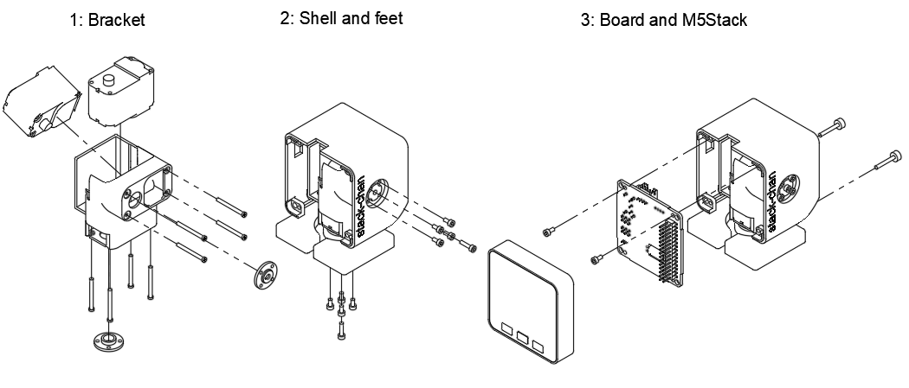

# Stack-chan case

[日本語](./README_ja.md)

Currently the [case data](https://a360.co/3gcw960) is developed with Fusion360.

## Assembly

### Parts

* 3D-printed cases
  * Shell
  * Feet
  * Bracket
* M5Stack Core Basic/Gray/Go/Fire
* [Stack-chan board](../schematics/README.md)
* Two servos
  * Currently available on:
    * RS30X series(TTL version) serial servo
    * SG-90 pwm servo
* Battery with PH 2-pin cable (tested with [lithium polymer 400mAh battery](https://www.sengoku.co.jp/mod/sgk_cart/detail.php?code=EEHD-4YZL))
* Screws
  * M2 4mm * 10pcs
  * M2 8mm * 2pcs
  * M3 14mm * 2pcs

### How to Assemble

(Here are the steps with RS304MD servo. SG-90 is similar to them)

#### Bracket

* Remove four screws from the servo. Be careful not to get any dust inside the servo housing.
* Insert the servo into bracket and fix with four screws. Then attach the horn.

#### Shell and Feet

* Fix feet and shell with screws(M2-4mm * 4pcs, M2-8mm * 1pc for each of them).

#### M5Stack and board

* Insert battery into the pocket of bracket.
* Connect servo and battery cables to the board. Double check the direction of each connector is correct.
* Fix the board on the robot with screws(M2-4mm * 2pcs)
* Stack M5Stack on the robot and Fix them with screws(M3-14mm * 2pcs).
