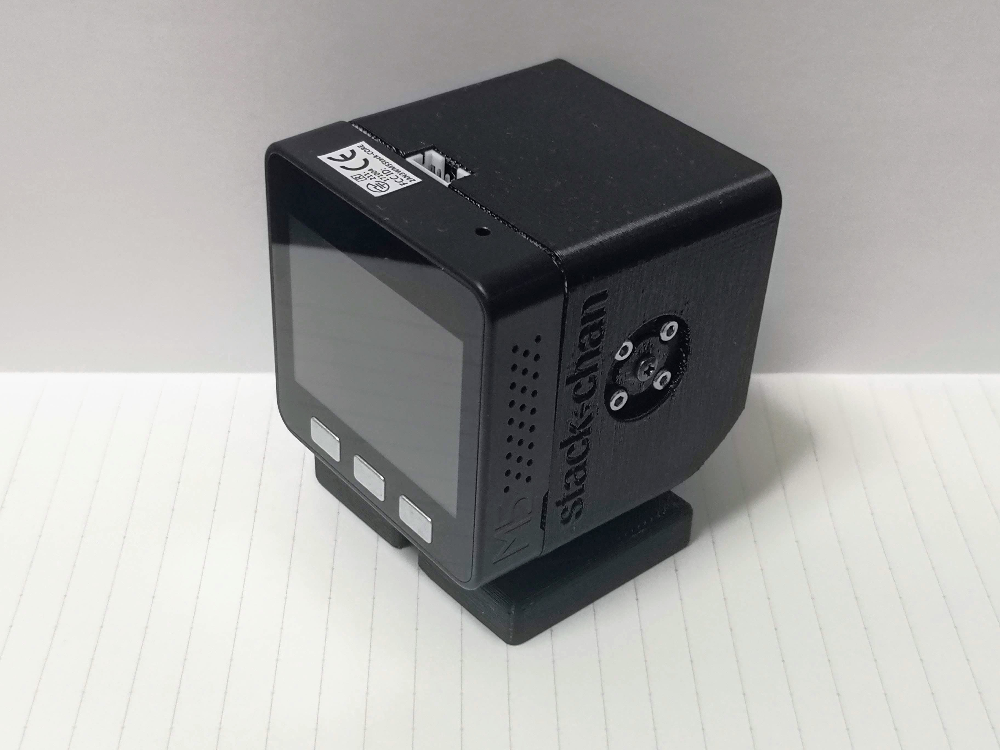
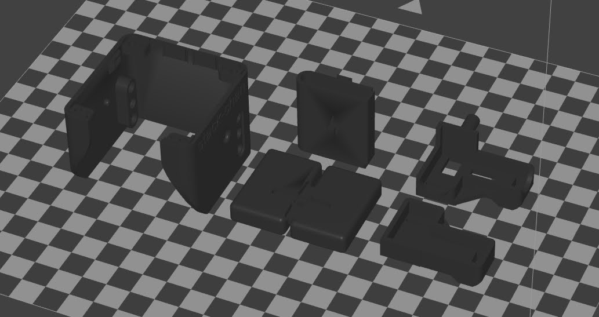
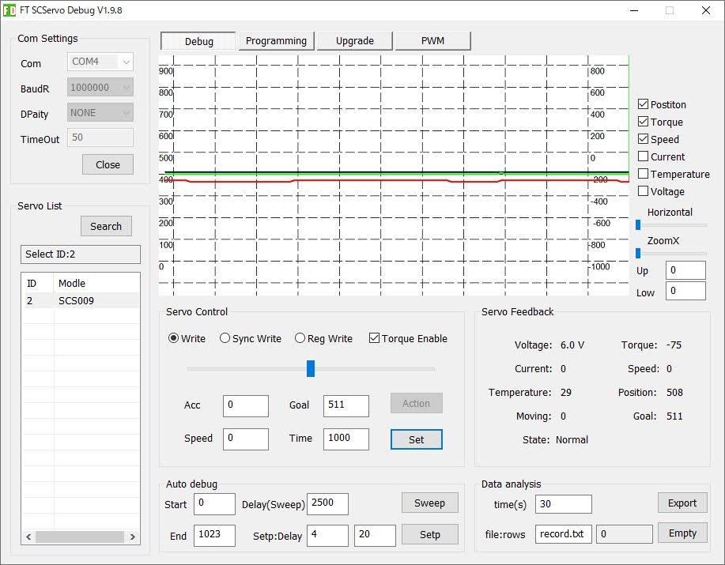
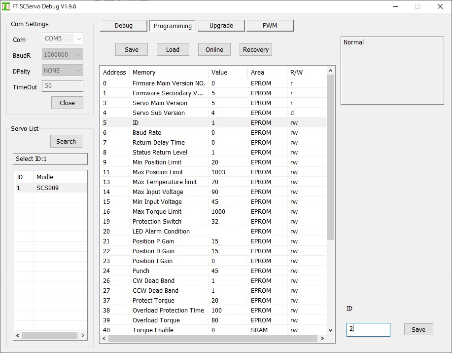
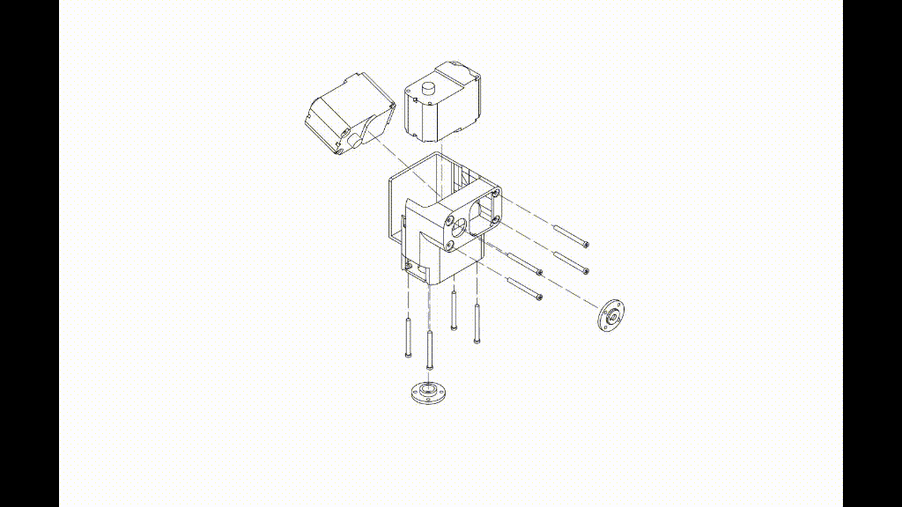
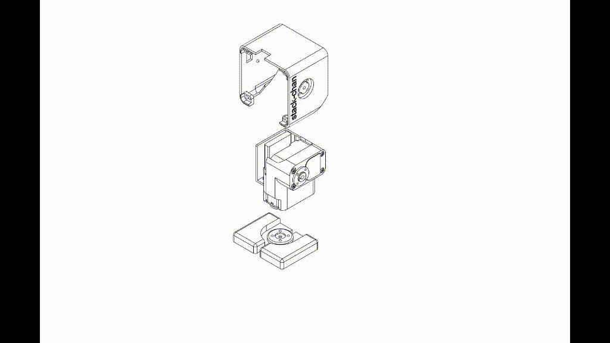
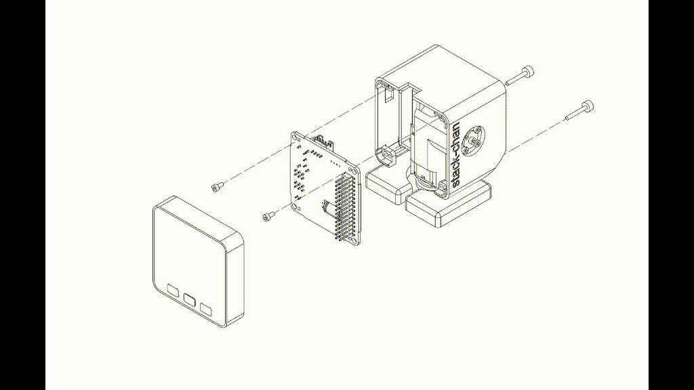
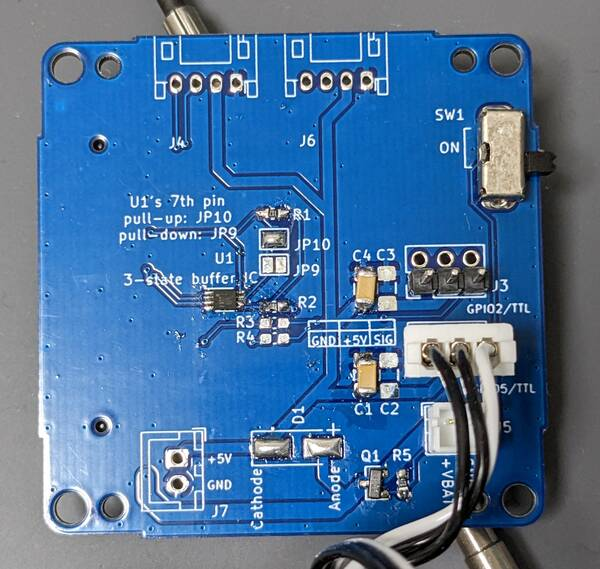

# Stack-chan case v0

[日本語](./README_ja.md)

Currently the [case data](https://a360.co/3gcw960) is developed with Fusion360.

## The case is transitioning to the new specification (v1.0)

We are making a new case with improved compatibility.

- Case v0 (this document)
  - PCB: [`v0.2.1`](https://github.com/meganetaaan/stack-chan/tree/v0.2.1/schematics)
  - Servo motors: RX30X, SCS0009, SG90
- [Case v1.0](./v1/dynamixel.md)
  - PCB: [`v1.0`](../schematics/)
  - Servo motors: XL330 (more to be added over time)

__For the case with the latest specifications, please refer to the [Stack-chan case v1.0 document](./v1/dynamixel.md)__

## Editing

You can import and edit STEP files in each directory using any CAD software.

## 3D Printing

You can print STL files in each directory.
The recommended orientation is below.

## Assembly

### Parts

* 3D-printed cases
  * Shell
  * Feet
  * Bracket
  * Battery backpack
* M5Stack Core Basic/Gray/Go/Fire
* [Stack-chan board](../schematics/README.md)
* Two servos
  * Currently available on:
    * [RS30X series(TTL version)](https://www.vstone.co.jp/robotshop/index.php?main_page=product_info&products_id=2685) serial servo
    * [SCS0009(TTL version)](https://www.switch-science.com/catalog/8042/) serial servo
    * [SG-90 pwm servo](https://akizukidenshi.com/catalog/g/gM-08761/)
* 3.7V Battery with PH 2-pin cable
  * Tested on:
    * [lithium polymer 400mAh battery](https://www.sengoku.co.jp/mod/sgk_cart/detail.php?code=EEHD-4YZL))
    * [lithium polymer 640mAh battery](https://www.sengoku.co.jp/mod/sgk_cart/detail.php?code=EEHD-5GHY))
* Screws
  * M2 4mm * 4pcs
  * M2 8mm * 2pcs
  * (Optional) M3 15mm * 2本

### Serial Servo Setup

Serial servos share a signal line. It's necessary to specify ID for controlling each servo.
Therefore, different IDs must be assigned in advance.

- ID1: Foot side (left-right rotation, pan axis)
- ID2: Face side (vertical rotation, tilt axis)

The serial servo driver has a command `flashId` to rewrite IDs](https://github.com/meganetaaan/moddable-scservo/blob/71292b9358353837a74ecea387cd3265a 610479f/src/scservo.ts#L274). A servo configuration tool using this command is under development.

### About the angle of the servo

The angle of the servo mounting should be as follows.

- The center of the movable range is the reference angle (the angle when the stack chan faces forward).
- Install the servo so that the convex of the cross-shaped servo horn is aligned with the reference angle.
- If the servo is installed in the wrong direction, it will interfere with the stack chamber housing and will not operate properly.
  - We recommend that you check the operation of the servo by writing the firmware once before fixing the servo to the case.
- The movable range and reference angle are different for each servo type (see the following table).

|Servo |Movable range |Reference angle |
|:------|:---------|:------|
|SG-90 |0~180 degrees |90 degrees |
|RS30X |-150~150 degrees |0 degrees |
|SCS0009|0~200 degrees |100 degrees |

### Set up SCS0009 with GUI

Set up the following settings using Feetech's official GUI tool.

* Change the ID of the servo
* Change the angle of the servo to the reference angle

In addition to the SCS0009, the following items are required.

* [URT1](https://www.switch-science.com/catalog/7490/)
* 6-9V power supply

* Download the GUI debugging tools from [Feetech's repository on gitee](https://gitee.com/ftservo/fddebug).
* Connect URT1
  * "DC6V-9V"...Power supply
  * "USB"...PC via microUSB cable
  * "G V1 S"...SCS0009 (Connecting multiple servos with the same ID will not work properly)
* Open `FD.exe`
* Select the COM port that URT1 is connected to, and select "Connect" without changing other values from default.
* Select "Scan"
* Select the servo connected to the URT1 as shown in the lower left corner of the screen.

* Set the value of "Goal" to 511 and select "Set"
  * The servo rotate to the reference angle
* If you change the servo's ID, Open the "Programming" tab
* Select the "ID" row, change the value and select "Save".
  * The ID is rewritten.

__Note: If you select "Recovery", the servo will not work properly__.

### How to Assemble

(Here are the steps with RS304MD servo. SG-90 and SCS0009 is similar to them)

#### Bracket and Battery backpack

* Snap two servos into the bracket.
* Insert battery into the backpack.
* Insert the battery pack into the bracket by hooking the claws.

#### Shell and Feet

* Fix feet and shell with screws(M2-8mm * 1pc for each of them).

#### M5Stack and board

* Connect servo and battery cables to the board. Double check the direction of each connector is correct.
  * For serial servos, the servo with ID: 1 is for the foot side (pan axis) and the servo with ID: 2 is for the face side (tilt axis).

For SCS0009, The signal line (white cable) is connected to write the pin.

* Fix the board on the robot with screws(M2-4mm * 4pcs)
* Stack M5Stack on the robot.
* If you want to fix the M5Stack, use the two holes below to screw(M3-15mm * 2pcs) it in place.
