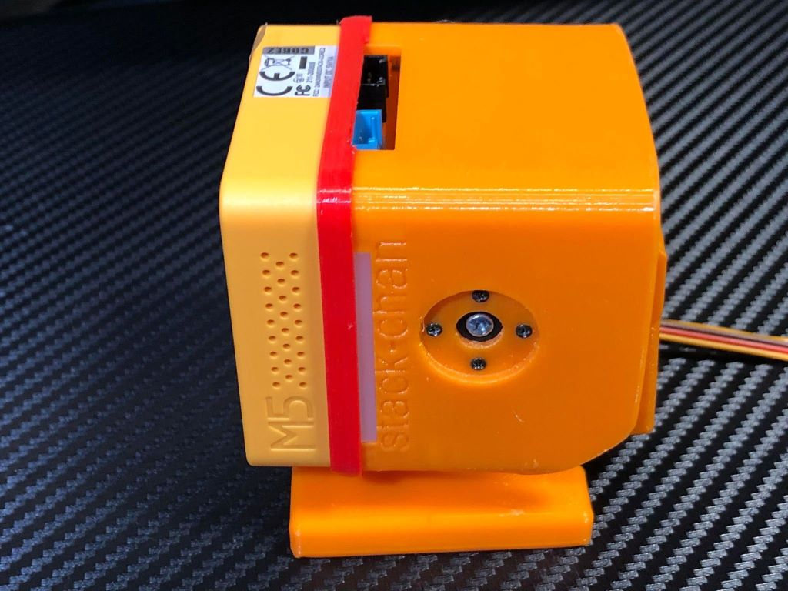
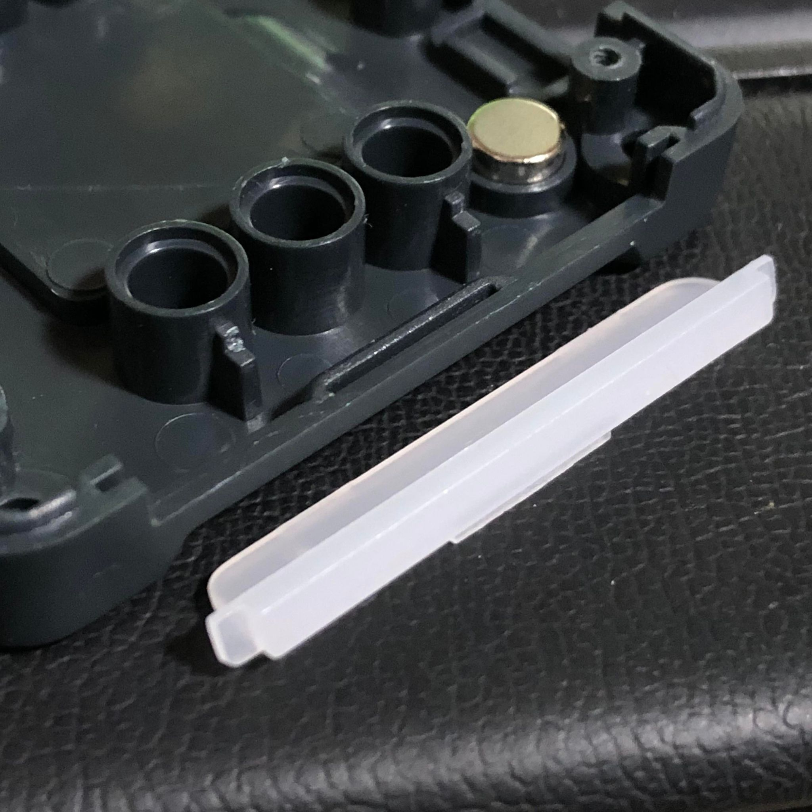
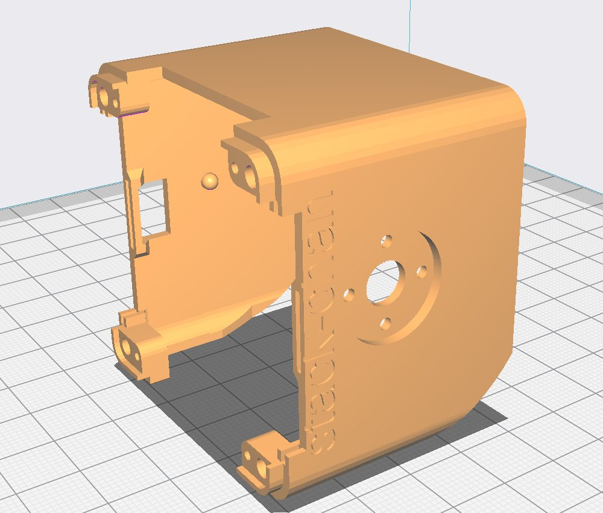
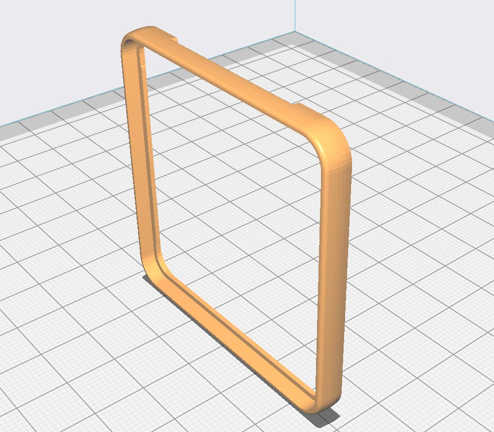

# Stack-chan case for SG90 and M5Stack AWS
[Japanese](./README_for_SG90andM5StackAWS_ja.md) | English

# Notice
The dimensions of the M5Stack's board are different from those of the Stack-Chan board, so the Stack Chan board cannot be used for this model.

# Appearance
This model is a modification of the [existing case model](../mongonta_case_for_SG90_and_M5GoBottomBoard/case_for_SG90andM5GoBottomBoard/shell_SG90_basicgraybottom.stl) to match the M5Stack Core2 for AWS - ESP32 IoT Development Kit.

Considering the material and other factors, the overall appearance was not changed, but the fitting was emphasized and the actual product was matched.

We would like to thank [Hobby Shop Glide Path](https://hsgp.cart.fc2.com/) for their full cooperation.
This time, they kindly shared their STL files with us, so please use them if necessary.

## Correction Point

 * The spacer has been redesigned to make the joint between the M5Stack and the case (body) look neater.
 * Offset processing is applied to the four corners by about 1.3mm to fit the spacer neatly.
 * The case (body) is supposed to be made of PC material for the 3D printer in order to have a good finish and to prevent the screws from licking.
 * The spacer is designed to be made of TPU material to express color and softness, and the corners are rounded. (In case of PLA material, 1-2% enlargement printing is recommended.)
 * The upper part of the connector is processed to allow the cable to escape.
 * M5Stack Core2 for AWS has a transparent LED window on the left side.

  

 

Currently the [case data](./case_for_SG90andM5StackAWS/) is developed with Fusion360 and modified with DesighSparkMechanical.

# Regarding servo behavior
As of May 2023, We are working with Hobby Shop Glide Path to verify the best servo for Stack Chan based on their extensive knowledge of servos.

1. if the power supply problem is solved, I believe MG90S is recommended. I would like to reconsider the supply method or even consider adding a separate external battery.
2. as those in the drone community are familiar with, the commonly used LiPo battery (1S) is used, and the additional M5Stack battery connector is PH2.0. What can we apply this to? Let's think about it together.

