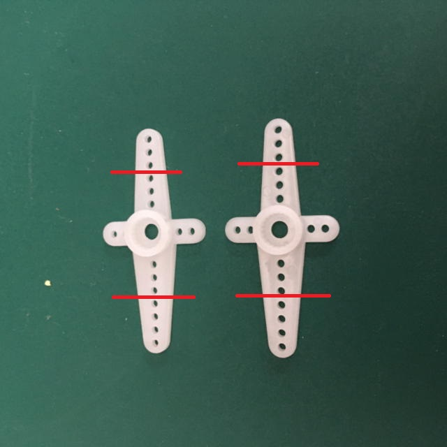

# Stack-chan case for SG90 and M5Stack AWS
日本語 | [English](./README_for_SG90andM5StackAWS.md)

# 注意事項
M5Stackの基板はｽﾀｯｸﾁｬﾝ基板とは寸法が異なるので、ｽﾀｯｸﾁｬﾝ基板はこちらのモデルには使用できません。

# 外観

[case data](./case_for_SG90andM5StackAWS/)はFusion360で作成され、DesignSparkMechanicalで修正しました。

## 用意するもの

### 部品

* 3Dプリンタの出力品
  * シェル
  * 足
  * ブラケット(SG90とMG90Sの2種類あります。)
* M5Stack Core Basic/Gray/Go/Fire(+M5GoBottom1) M5Stack Core2(+ M5GoBottom2)
  * 推奨は[M5Stack Core2 for AWSIoT EduKit](https://shop.m5stack.com/collections/stack-series/products/m5stack-core2-esp32-iot-development-kit-for-aws-iot-edukit)です。AWSIoT EduKitにはM5GoBottom2が装備されています。
  * M5Stack Basic/Gray/Go/Fireと組み合わせる場合は[Power Switch for M5Stack](https://www.switch-science.com/catalog/5726/)及び[ケース](https://www.switch-science.com/catalog/6295/)の装着をおススメします。電源が切れないのでバッテリーの劣化を早めてしまいます。

* サーボ 2個
  * 対応しているサーボは下記のとおりです。
    * SG-90 pwm servo ケーブルの長さが短い[M5Stack Servo Kit 180°](https://shop.m5stack.com/collections/m5-accessories/products/servo-kit-180)がおススメです。

* ネジやボルト
  * M1.6 5mm * 8個 
  * SG90付属 2mmネジ 4個 1.6mm?ネジ 2個
  * M5GoBottom固定用ボルト(M5Stack Core2 for AWSIoT EduKitに付属)
    * M3 18mm * 2個
    * M3 15mm * 2個(for M5Stack Core2 only)
* ケーブル
  * [GROVE - サーボ用2分岐ケーブル (5本セット)](https://www.switch-science.com/catalog/1250/)
  * ケーブルタイ

### 工具
  * 精密ドライバセット（プラスドライバ）
  * 六角レンチ（1.5mmと2.5mm）
  * ニッパー

## 部品の加工

### SG90 の十字サーボホーンをカット
十字の長いを3つ穴を残してニッパーで切断します。 

### M5GoBottomのボードを取り外す
四隅のネジを外して基板を外してください。取り外した後、バッテリーをセロハンテープで固定します。 

### Grove-サーボ2分岐ケーブルをまとめる。
ケーブルタイを使って小さくまとめます。 

## 組み立て

### ①ブラケットにサーボを付ける
ブラケットにサーボを取り付けます。固定はサーボ付属のネジを使ってください。締めすぎないように注意してください。

### ②サーボホーンの取り付け
ケースと足にM1.6のボルトを使ってサーボホーンを固定します。 

### ③ボードとケースの取り付け
Port.Cを使う場合は先にGroveケーブルを差し込んでおきます。
M5GoBottomから取り外した小さいネジを使い、ケースにM5GoBottom基板を固定します。その後、M5Stackを取り付けM3ボルトで固定します。（長さを間違えないように注意） 

### ④接続
サーボ2分岐ケーブルとサーボコネクタを接続します。動作確認用のアプリは下記のピンを使用するように設定してあります。 
1. M5Stack Core2のPort.C(GND,5V,G13,G14)
- GPIO13 - パン（水平方向）のサーボ
- GPIO14 - チルト（垂直方向）のサーボ

2. M5Stack (Basic/Gray/Go)のPort.C(GND,5V,G16,G17) 
- GPIO16 - パン（水平方向）のサーボ
- GPIO17 - チルト（垂直方向）のサーボ

3. M5Stack Fire Port.A(GND,5V,G21,G22)
※１ Port.CはPSRAMと競合するため使用できません。
※２ Port.Aは内部I2Cと共用のためI2Cとサーボの同時利用できません。
- GPIO21 - パン（水平方向）のサーボ
- GPIO22 - チルト（垂直方向）のサーボ

#サーボを90°にした状態で、ブラケットに足とケースを取り付けてサーボ付属の短いネジで固定します。小さくまとめた2分岐ケーブルをブラケットに収納します。 
## ⑤組み立て

# MG90Sについて
 MG90Sについては純正品に合わせたブラケットを公開してあります。しかし下記の問題があるため注意してください。

1. 電源が足りない。 MG90SはM5Stackの内部バッテリーだけでは動かない場合があります。その際は、サーボ用の電源を別で確保する必要があります。
1. AmazonやAliExpressでの模倣品の中にサイズが違うものがあります。 MG90Sとして売っていますが、寸法がSG90と同じものやサーボホーンの大きさが違うものがあります。特にサーボホーンが違うとSG90版とも合わないのでその場合はホーン部分のモデルを修正する必要があります。

