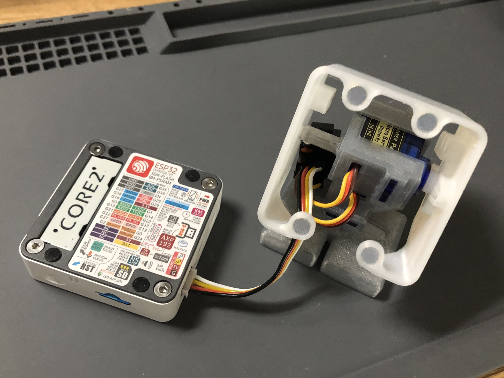
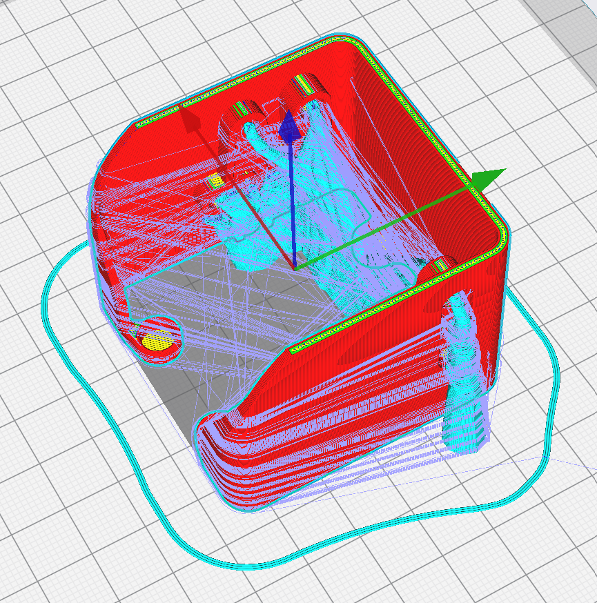
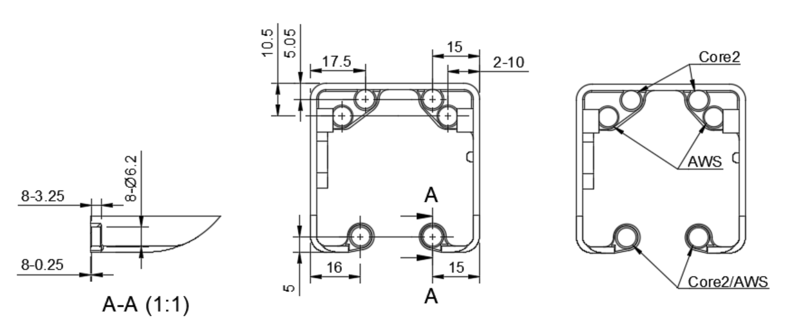

# Stack-chan shell model for Core2/AWS and SG90 with magnet latch feature
日本語 | [English](./README_for_shell_SG90_magnet_latch.md)

# 注意事項
本モデルはM5Stack Core2/AWSとSG90サーボモータの組み合わせで動作確認を行いました。異なる種類のM5Stackとは互換性が無い可能性があります。シェルの造形前にご確認をお願いします。
本モデルを使用するにあたり、M5Stackを分解する必要はありません。

# 外観

# 造形手順
M5Stackを取り付ける側を下にし、ツリー形状サポートの使用を推奨します。

# 組立手順
直径6mm、厚さ2.5mmのマグネットを、4箇所のマグネットスロットに挿入して下さい。マグネットは百均ショップで購入できます。また、取付前にマグネットの極性を確認願います。マグネットの挿入位置は下図を参照して下さい。 

 