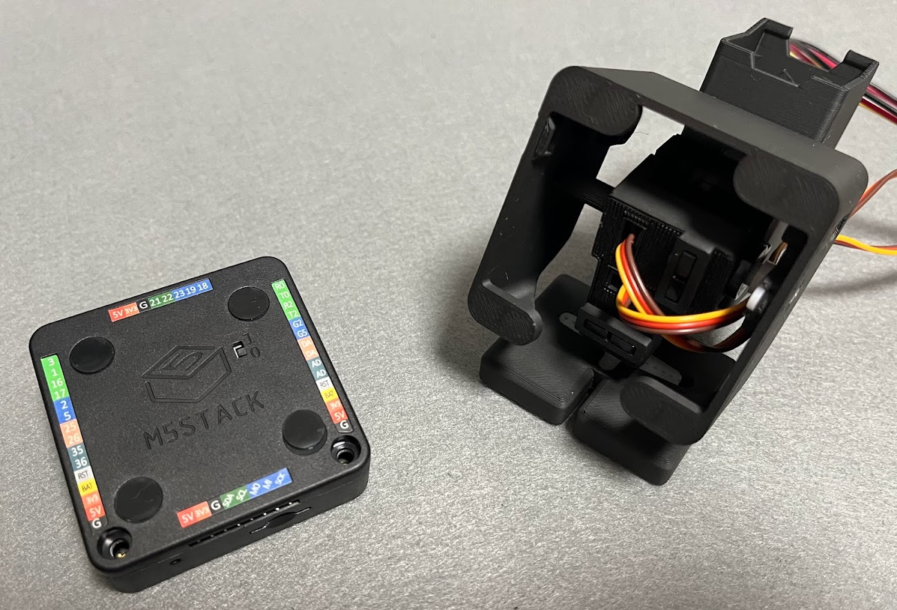
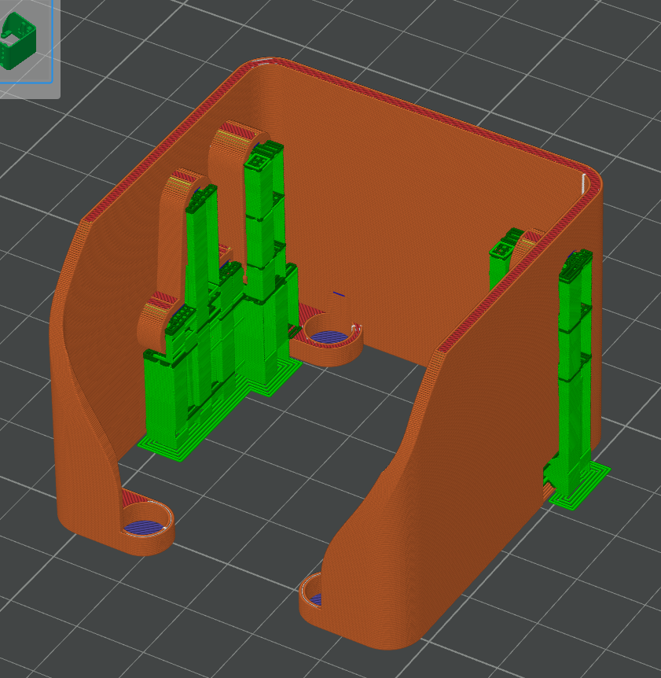

# Stack-chan magnet type shell model for Basic v2.7 and SG90
[日本語](./README_for_shell_SG90_magnet_basic_v2.7.md) | English

# Notice
This model has been checked to stick only  M5Stack **Basic v2.7**. Also, please use the SG90 servo motor.
Different types of M5Stack may not be compatible. There is no need to disassemble M5Stack to use this model.

# Appearance

# Printing instruction
It is recommended to place the M5Stack side facing down and use a support.

# Assembly instruction
Insert magnets with a diameter of 6mm/thickness of 2.5mm into the four slots **after checking the polarity**. Magnets can be purchased at Hyakuyen shops.
