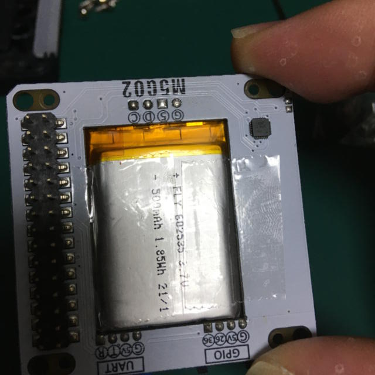
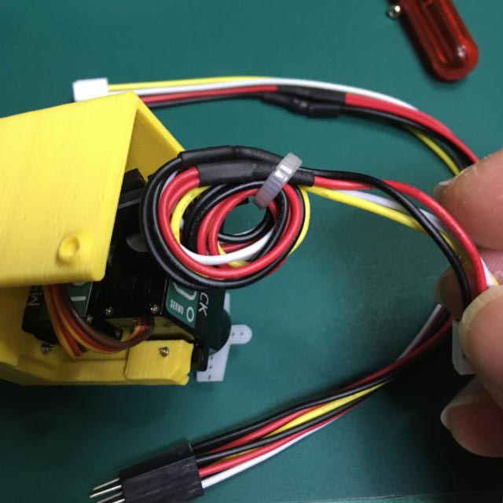
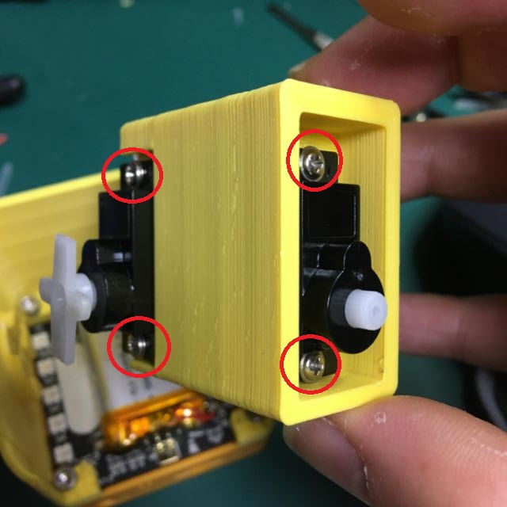
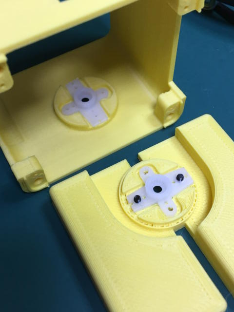
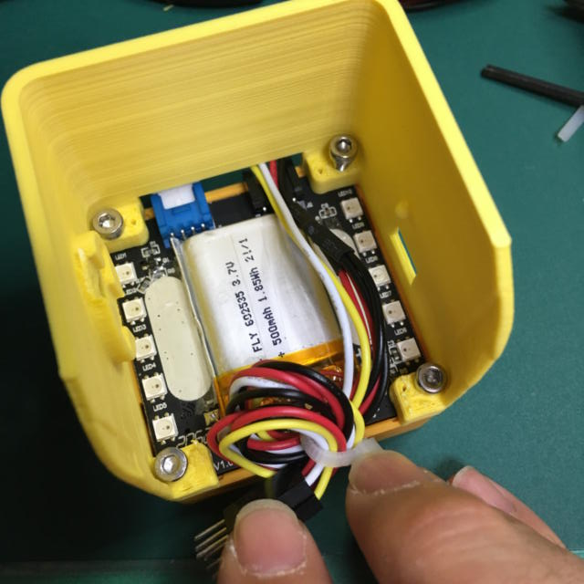
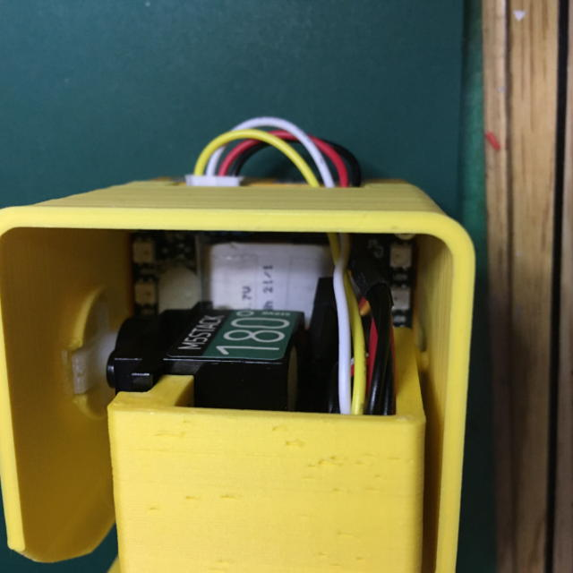
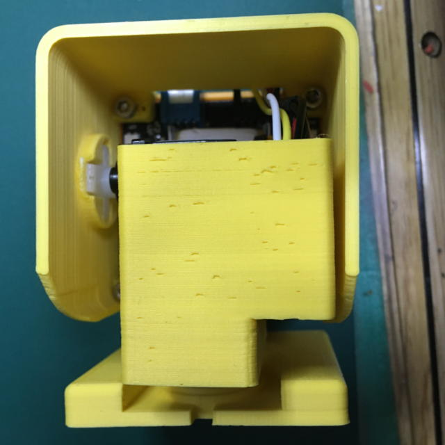

# Stack-chan case for SG90
[日本語](./README_for_SG90andM5GoBottomBoard_ja.md) | English
# Notice

The dimensions of the M5Stack's board are different from those of the Stack-Chan board, so the Stack Chan board cannot be used for this model.

# Appearance

Currently the [case data](./case_for_SG90andM5GoBottomBoard/) is developed with Fusion360 and modified with DesighSparkMechanical.

## Things to prepare

### Parts

* 3D-printed cases
  * Shell
  * Feet
  * Bracket( There are 2 types for SG90 or MG90S) 
* M5Stack Core Basic/Gray/Go/Fire(+M5GoBottom1) or M5Stack Core2(+ M5Bottom2)
  * Recommended is [M5Stack Core2 for AWSIoT EduKit](https://shop.m5stack.com/collections/stack-series/products/m5stack-core2-esp32-iot-development-kit-for-aws-iot-edukit) -AWSIoT EduKit is equipped with M5GoBottom2.
  * If you want to combine with M5Stack Basic/Gray/Go/Fire, you need [Power Switch for M5Stack](https://www.switch-science.com/catalog/5726/) and [Case](https://www.switch-science.com/catalog/6295/) is recommended. Since the power cannot be cut off, it will accelerate the deterioration of the battery.

* Two servos
  * Currently available on:
    * SG-90 pwm servo Recommended is [M5Stack Servo Kit 180°](https://shop.m5stack.com/collections/m5-accessories/products/servo-kit-180), which has a shorter cable length.

* Screws
  * M2Bolt 5mm * 8pcs 
  * Screws included with the Servo(2 set)
    * 2mm screws 4pcs
    * 1.6?mm screws 2pcs
  * for M5GoBottom
    * M3 18mm * 2pcs
    * M3 15mm * 2pcs(for M5Stack Core2 only)
* Cable
  * [Grove - Branch Cable for Servo(5PCs pack)](https://www.seeedstudio.com/Grove-Branch-Cable-for-Servo-5PCs-pack.html)
  * Zip ties

### Tools
  * Precision screwdrivers
  * Hex key wrench (1.5mm and 2.5mm)
  * Cutting nippers

## Machining the parts

### Cut the servo horn of SG90.
Cut the cross-shaped servo horn with nippers at the third hole. 

### Removing the M5GoBottom board

Remove the screws from the four corners and remove the board. After removal, secure the battery by applying scotch tape.  

### Bundle cables
Use Zip ties to bundle the servo branch cables. 

## How to assemble

### 1. Attach the servos to the bracket.
Attach the servo to the bracket. Use the screws provided with the servo to secure it. Do not overtighten. 

### 2. Fix the servo horns.

Secure the servo horn to the case and foot using M1.6 bolts.  

### 3. Installing the board and case
If using Port.C, plug in the Grove cable first.
Using the small screws removed from the M5GoBottom, fix the M5GoBottom board to the case. After that, install the M5Stack and secure it with M3 bolts. (Be careful not to use the wrong length.)

### 4. Connecting

Connect the servo 2-branch cable to the servo connector. The application for operation check is set to use the following pins.   
1. Port.C(GND,5V,G13,G14) of M5Stack Core2
- GPIO13 - Servo for pan (horizontal direction)
- GPIO14 - Tilt (vertical) servo

2. Port.C(GND,5V,G16,G17) of M5Stack (Basic/Gray/Go) 
- GPIO16 - Servo for pan (horizontal direction)
- GPIO17 - Servo for tilt (vertical direction)

3. Port.A(GND,5V,G21,G22) of M5Stack Fire
※1 Port.C cannot be used because it conflicts with PSRAM.
※2 Port.A is shared with internal I2C, so I2C and servo cannot be used simultaneously.
- GPIO21 - Servo for pan (horizontal direction)
- GPIO22 - Servo for tilt (vertical direction)

### 5. Assemble
With the servo at 90°, attach the legs and case to the bracket and secure it with the short screws provided with the servo. Store the small, two-branch cable in the bracket.  

# About MG90S
For the MG90S, we have published a bracket that matches the stock one. However, please be aware of the following problems.

1. power supply is not enough.  MG90S may not run on the M5Stack's internal battery alone. In that case, you will need to secure a separate power supply for the servos.

1. Some of the imitations on Amazon and AliExpress have different sizes.  Some of them are sold as MG90S, but the dimensions are the same as SG90 and the servo horns are different in size. In particular, if the servo horn is different, it will not fit the SG90 version either, in which case you will need to modify the model for the horn part.

