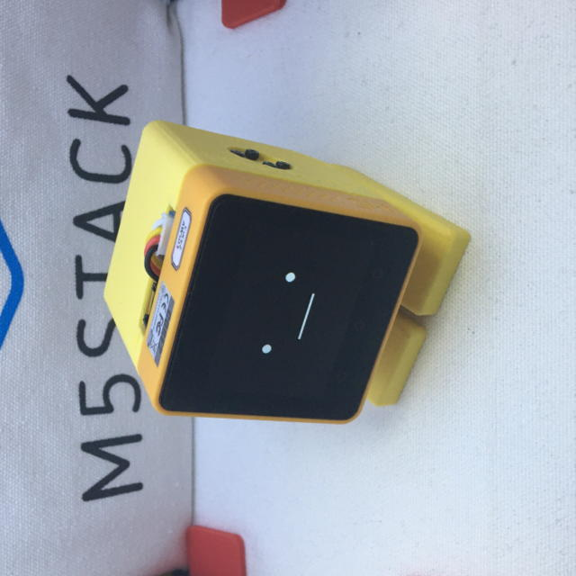
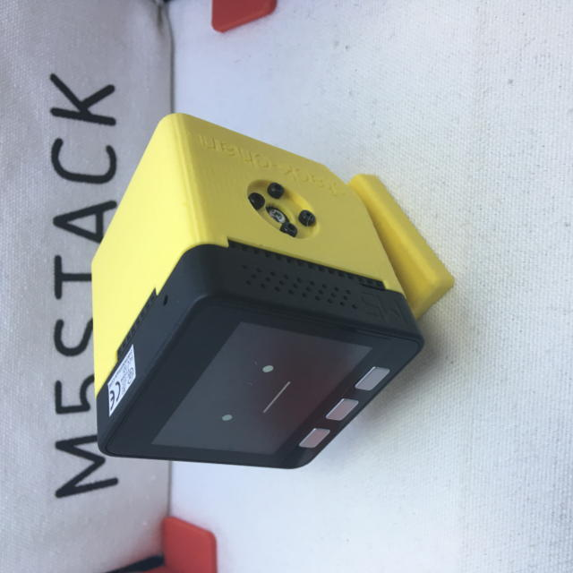

# Stack-chan case for SG90
[日本語](./README_for_SG90andM5GoBottomBoard_ja.md) | English
# Notice

The dimensions of the M5Stack's board are different from those of the Stack-Chan board, so the Stack Chan board cannot be used for this model.

# Appearance

Currently the [case data](./case_for_SG90andM5GoBottomBoard/) is developed with Fusion360 and modified with DesighSparkMechanical.

# Latest Information

This README is simplified and information may be out of date. Please check the following pages for the latest information.(Japanese Only)

* [Regarding the distribution of the Stack Chan Takao version assembly kit](https://raspberrypi.mongonta.com/about-products-stackchan-m5gobottom-version/)
* Assembly method
  * No disassembly
    * [How to assemble the Stackchan Takao version [Part 1: Parts kit](https://raspberrypi.mongonta.com/how-to-make-stackchan-m5gobottom/)
    * [Stack chan without disassembly work. [Stack chan Takao version assembly kit](https://raspberrypi.mongonta.com/how-to-build-easy-stackchan-m5gobottom/)
  * With disassembly
    * [How to assemble Stack Chan Takao version [Part 1: Parts kit]](https://raspberrypi.mongonta.com/how-to-make-stackchan-m5gobottom/)
    * [Stack Chan M5GoBottom version How to assemble [with disassembly] [Part 2: Assembly of the case set and completion](https://raspberrypi.mongonta.com/how-to-make-stackchan-m5gobottom-2/)

# File list

* 3D printer output products
  * Shells (There are 3 types.)
    1. shell_SG90_gobottom_v1.0.stl Core2 (white). core2forAWS (yellow), for
    1. shell_SG90_basicgraybottom_v1.0.stl Basic and Gray bottom to disassemble and fix
    1. shell_SG90_Goplus2_module_v1.0.stl for using Core2+GoPlus2 module
  * feet
    1. feet_SG90_v1.0.stl
  * Bracket (there are 3 types)
    1. bracket_SG90_v2.0.stl This version is compatible with [Stack-chan_Takao_Base](https://www.switch-science.com/products/8905) available at Switch Science.
    1. bracket_SG90_v1.1.stl This version corresponds to the size of TowerPro SG90.
    1. bracket_MG90S_V1.0.stl This version corresponds to the dimensions of TowerPro MG90S (stock).
  * Spacer Use only for procedures without disassembly.
    1. spaver_v1.0.stl

  * HAT An accessory to be placed over the head.
    1. hat_base_v1.0.stl A HAT with nothing attached
    1. hat_cat_ear_v2.0.stl HAT with cat ears
    1. hat_hippo_ear_v1.0.stl Tiny hippo ear HAT
    1. hat_lego_9hole_v1.0.stl UnitLCD or UnitOLED can be attached.
    1. hat_lego_back_v1.0.stl HAT with 3 lego holes on the back side
    1. hat_lego_front_v1.0.stl HAT with 3 lego holes on the front side
    1. hat_stick_adapter_v1.0.stl HAT to fix M5StickC, CPlus and M5StickV

## Things to prepare

### Parts

* 3D-printed cases
  * Shell
  * Feet
  * Bracket( There are 2 types for SG90 or MG90S) 
* M5Stack Core Basic/Gray/Go/Fire(+M5GoBottom1) or M5Stack Core2(+ M5Bottom2)
  * Recommended is [M5Stack Core2 for AWSIoT EduKit](https://shop.m5stack.com/collections/stack-series/products/m5stack-core2-esp32-iot-development-kit-for-aws-iot-edukit) -AWSIoT EduKit is equipped with M5GoBottom2.
  * If you want to combine with M5Stack Basic/Gray/Go/Fire, you need [Power Switch for M5Stack](https://www.switch-science.com/catalog/5726/) and [Case](https://www.switch-science.com/catalog/6295/) is recommended. Since the power cannot be cut off, it will accelerate the deterioration of the battery.

* Two servos
  * Currently available on:
    * SG-90 pwm servo Recommended is [M5Stack Servo Kit 180°](https://shop.m5stack.com/collections/m5-accessories/products/servo-kit-180), which has a shorter cable length.

* Screws
  * M2Bolt 5mm * 8pcs 
  * Screws included with the Servo(2 set)
    * 2mm screws 4pcs
    * 1.6?mm screws 2pcs
  * for M5GoBottom
    * M3 18mm * 2pcs
    * M3 15mm * 2pcs(for M5Stack Core2 only)
* Cable
  * [Grove - Branch Cable for Servo(5PCs pack)](https://www.seeedstudio.com/Grove-Branch-Cable-for-Servo-5PCs-pack.html)
  * Zip ties

### Tools
  * Precision screwdrivers
  * Hex key wrench (1.5mm and 2.5mm)
  * Cutting nippers

# About MG90S
For the MG90S, we have published a bracket that matches the stock one. However, please be aware of the following problems.

1. power supply is not enough.  MG90S may not run on the M5Stack's internal battery alone. In that case, you will need to secure a separate power supply for the servos.

1. Some of the imitations on Amazon and AliExpress have different sizes.  Some of them are sold as MG90S, but the dimensions are the same as SG90 and the servo horns are different in size. In particular, if the servo horn is different, it will not fit the SG90 version either, in which case you will need to modify the model for the horn part.

## Update History fo 3Dmodels

- 2023/4/21 add bracket_sg90_v2.0 Holes added and dimensions changed to accommodate dedicated boards.
- 2023/3/29 bracket_sg90_v1.0 → bracket_sg90_v1.1 Add holes to allow long servo wires to pass through.
