# Stackchan Case v1.0

[日本語](./dynamixel_ja.md) | English

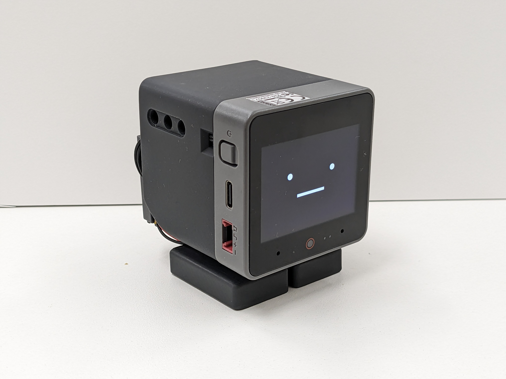
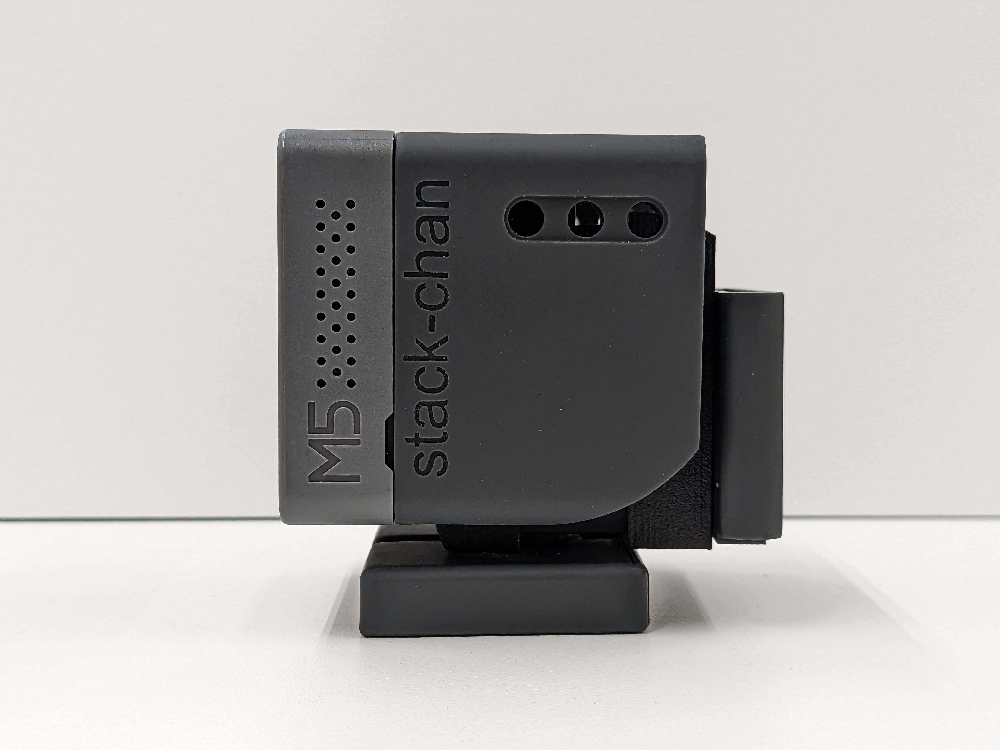

This is the assembly guide for "Stackchan Case v1.0". Currently, it only supports DYNAMIXEL.
It includes a list of necessary parts, configuration methods for the servo motor (DYNAMIXEL XL330), and specific assembly instructions. By following the steps in this guide and assembling the required parts, you will complete the Stackchan.

Note: It is assumed that the exterior will be printed with a 3D printer or acquired through 3D printing services such as [JLCPCB 3D printng](https://3d.jlcpcb.com/) and [DMM.make](https://make.dmm.com/print/personal/). If both options are challenging, please consider purchasing a kit.

## Required Items (DYNAMIXEL Edition)

1. Circuit board x1
2. M5 Stack CoreS3 x1
3. Horn x1
4. Shell x1
5. Gear_XL330 x2
  - Considering the precision of 3D printing, we've allowed extra clearance for the gear holes. If the hole is too loose, please try using Gear_XL330_narrow.
6. Backpack
7. Bracket_XL330_f x1
8. Bracket_XL330_b x1
9. M2x4mm Pan Tapping Screws x4
10. Feet_top x1
11. Feet_bottom x1
12. M2.5x6mm Bind Tapping Screws x2 (Included with XL330)
13. 4cm Communication Cable x2
14. XL330 x2

### Changing the ID and Baud Rate of XL330

To change the ID and Baud Rate of XL330, we use ROBOTIS's Dynamixel Wizard2. To connect the PC with XL330, the following equipment is needed:

#### Other Required Items Apart From XL330

- [U2D2](https://www.rt-shop.jp/index.php?main_page=product_info&products_id=3618)
- [SMPS2Dynamixel](https://www.rt-shop.jp/index.php?main_page=product_info&products_id=523)
- 5V AC Adapter

#### Installing Dynamixel Wizard2

Click on Linux under the software Download section on [emanual.robotis](https://emanual.robotis.com/docs/en/software/dynamixel/dynamixel_wizard2/). The download will begin when you give it execute permission and double-click it.

#### ID and Baud Rate Values

The default settings for XL330 are ID=1, Baud Rate=57600. These will be changed to match the Stackchan program as follows:

|  | ID | Baud Rate |
|--|----|-----|
| Leg Servo    | 1  | 1M  |
| Neck Servo | 2  | 1M  |

### Procedure to Change ID and Baud Rate

1. Click on Options and select the USB connected to the XL330.
2. Click on Scan, and the XL330 will appear on the left, ready for communication.
3. Select XL330 from the list on the left.
4. Change the ID and Baud Rate. Click on each item and from the dropdown at the bottom right, select '1000000bps', then press the Save button to apply the parameters.

**Note**: You cannot connect multiple servos with the same ID. Connect the servos one by one when changing the ID.

## Assembly Instructions

### Assembling the Leg Servo

- Insert gear_xl330 (small cross-shaped piece) into the servo with id=1. Align the gear's protrusions and holes on the XL330 (refer to the picture).

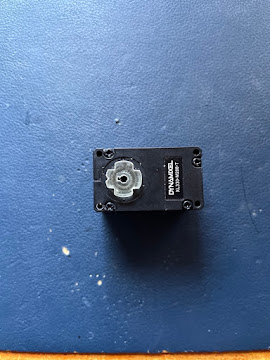

- Insert into feet_top. The protrusion with a notch is the front. Secure it from the back with M2.5x6mm tapping screws.
- Slide feet_bottom into place.

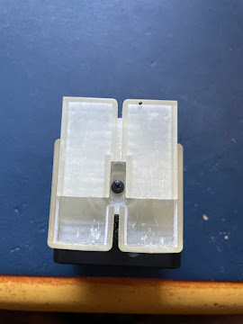

### Assembling the Neck Servo

- Like the leg servo, insert gear_xl330 into the servo with id=2.
- Secure with M2.5x6mm tapping screws.
- Attach the horn.

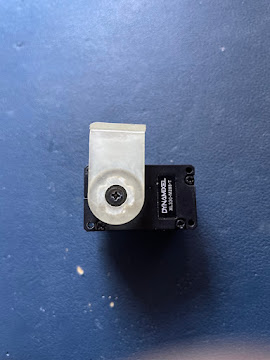

### Assembling the Body

1. Attach the servo cables.

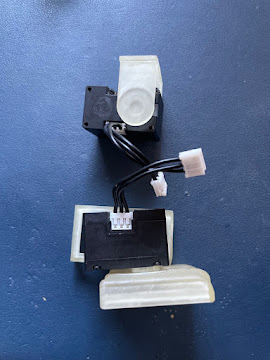

2. Use bracket_XL330_f to combine the upper and lower servos.

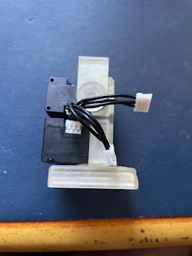

3. Use bracket_XL330_b to secure the upper and lower servos.

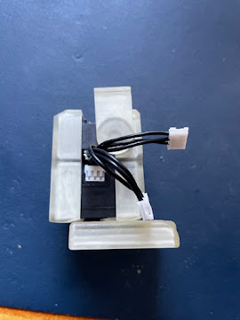

4. Connect the circuit board and servos with cables.

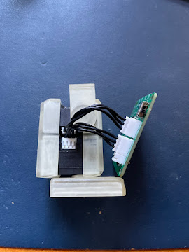

5. Slide the horn into the shell.

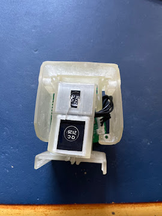

6. Secure the circuit board and shell with 2x4mm pan tapping screws at 4 points.

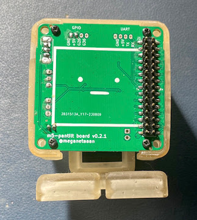

7. Insert the M5Stack body.

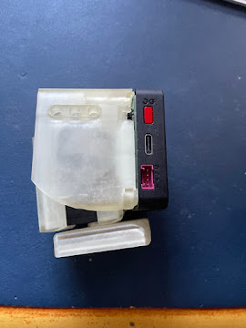

_Completed!_
