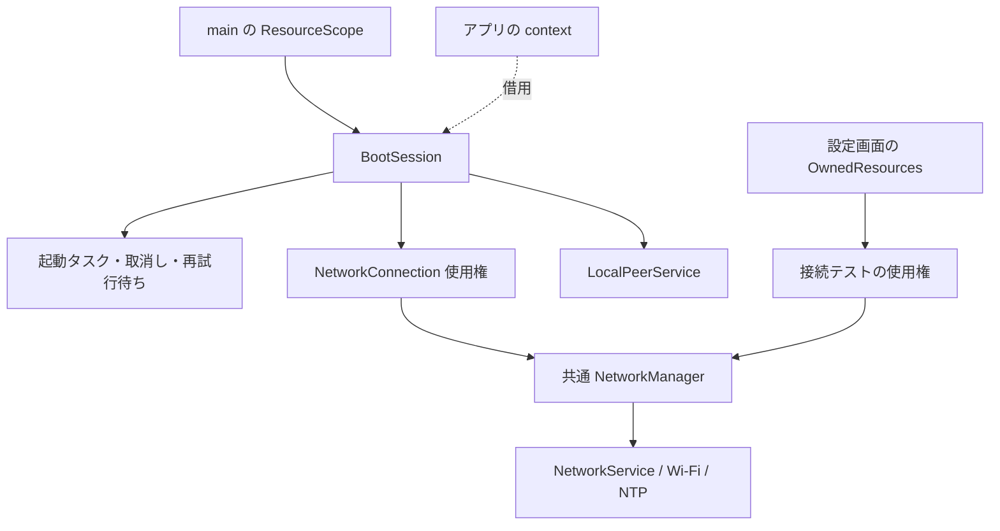

# 起動と接続の所有・終了契約

この文書は F2 / F4 / F8 / F9 に対する実装を記録する。再設計全体の状態は [実装台帳](firmware-sdk-redesign-progress.md) を参照。

## 所有者と依存の向き

- `boot-services.ts` は Timer・プラットフォーム能力・翻訳の接続だけを行う。起動の方針は、時計と接続生成を注入する `BootSession` に置く。
- `main.ts` は起動サービスを作った直後に `bootResources` に登録する。context 作成失敗、通常の context 終了、起動失敗が同じ終了経路を使う。
- `startHostBootServices()` で起動を置き換えると、前の `BootSession.close()` が完了してから新しい Wi-Fi 接続とローカル通信の開始を許可する。新しい起動を直ちに閉じても、前の所有者の終了処理は実行する。
- `close()` は同じ Promise を返す。取消し通知、タスク、使用権、ローカル通信を終了し、途中の解放が失敗しても残りの解放を試みる。解放失敗を成功に変えない。

## Wi-Fi の接続使用権

ホストと設定画面は `openNetworkConnection(options)` を使い、返された `NetworkConnection` を自分で閉じる。

| 状態 | 契約 |
| --- | --- |
| 同じ SSID / password の利用者が追加される | 同じアダプターを共有する。利用者は最大16件 |
| 異なる接続先を要求する | 既存の所有者がいる間は `BUSY` |
| 一つの使用権を閉じる | その利用者の通知を解除する。他の利用者を止めない |
| 最後の使用権を閉じる | NTP、タイマー、Wi-Fi 接続、アダプターを閉じる |
| 物理的な解放が失敗する | `IO` を返し、管理器を再利用不可にする。再起動が必要 |
| 閉じたアダプターに接続を要求する | `CLOSED`。閉じたインスタンスを再起動しない |

アダプター共通の接続期限・再接続間隔は、最初の利用者が生成時に決める。後から参加する利用者は既存の接続に参加する。`BootSession` はこれとは別に自分の待機期限を持ち、期限切れ時に自分の使用権を返す。

`NetworkService` はスキャン開始から関連付け、IP取得、必要な NTP 完了まで一つの期限を使う。スキャンは最大3回。終了済み・期限切れ・前の接続試行に属するコールバックはアダプターの状態を変えない。切断後の再接続タイマーも終了時に取り消す。購読者の例外でアダプターの処理を中断しない。

V1 の `startNetworkConnection()` / `stopNetworkConnection()` は移行用に残す。`stop` はこの入口で取得した使用権だけを返す。旧 `getNetworkConnection()` と戻り値の生の `NetworkService` は、まだ公開境界を迂回できる互換性上の負債であり、V2 SDK へ公開しない。未使用だった `NetworkService.join()` の購読連結は廃止し、管理器の利用者一覧へ集約した。

## 起動の準備状態

`connectivity.network` は `ready`、`availability`、`state` を持つ。`ready` は一度だけ確定し、その後の接続状態は `state` で読む。

| 結果 | 意味 |
| --- | --- |
| `connected` | 必要な接続と時刻同期が完了した |
| `skipped` | SSID 未設定、Wi-Fi がないターゲット、またはユーザーがオフライン起動を選択した |
| `failed` + `code` / `reason` | 期限切れ・接続失敗・終了など。起動終了による取消しは `CLOSED` |

標準は1試行15秒、最大3試行、試行間500ms。回数・時間は生成時に検証し、無制限な自動再試行はしない。失敗した試行の使用権を解放してから次の試行を開始する。接続先競合や設定・引数・未対応のエラーは自動再試行しない。

V1 の失敗画面は `CancellationSignal` を受け取る。選択待ちで終了しても `ready` が確定し、ボタンと画面の処理を戻す。別の画面が後から取り付けたボタン処理や表示は、古い画面の解放で消さない。V2 の教材起動は引き続き Wi-Fi の準備完了を待たない。

## ローカル通信と設定画面

- ローカル通信のサービス自体をホストが所有する。context に返したセッションだけでなく、`open()` 途中の接続もホスト終了で閉じる。
- 送信の完了待ちはセッション終了で `closed` となる。下位ドライバーの Promise が終了通知を返さなくても、上位の待機を確定させる。任意の下位処理を強制終了できるという意味ではない。
- 送信を microtask から開始して XS の同期スタックを制限する。無線送信の待機数にも上限を設ける。無線の物理的な解放失敗は `transport` として保持し、そのサービスでの再接続を拒否する。
- 設定画面は、ビュー、BLE設定サーバー、Wi-Fi スキャン、接続テスト、音量プレビューと音声出力を所有する。「戻る」「起動」のどちらも接続テストを閉じる。全ての解放を試みた後、失敗を呼び出し側へ返す。
- 設定画面が終了した後のスキャン結果や設定変更で、別の画面を更新しない。

## ターゲットごとの実装

接続管理器と型定義は共通化した。実機は `native`、デスクトップ用 Wi-Fi は `simulated`、WASM は `unavailable` とする。WASM の直接 `NetworkService.connect()` は `UNSUPPORTED` を返し、接続成功を模倣しない。ホストの起動は `skipped` となる。

ESP32 用 manifest はシミュレーターの MAC 取得モジュールを明示的に除外する。別名の上書きだけでは正しいソースが選ばれないケースがあり、生成 makefile のソース選択も確認する。

## 検証と残る境界

純粋な起動方針と選択待ちは Node で検証する。Wi-Fi アダプター、Timer、NTP、ローカル通信、Piu の終了は XS で検証する。終了100回、共有所有者、遅延した完了、再試行の期限、古い起動からの通知、解放失敗後の再利用拒否を含む。実施結果とビルド対象は実装台帳に記録する。

この変更だけでは、Wi-Fi / BLE / ESP-NOW の全利用経路の物理的な排他、既存 MOD の直接参照、設定画面の独立スキャンと他用途との競合、ローカル通信の全操作の期限、V1 起動待ち全体の再設計、設定のアプリ公開 API は完了しない。実際の電波環境・再接続・時刻同期・機種別 MAC の実機確認も別途必要である。
