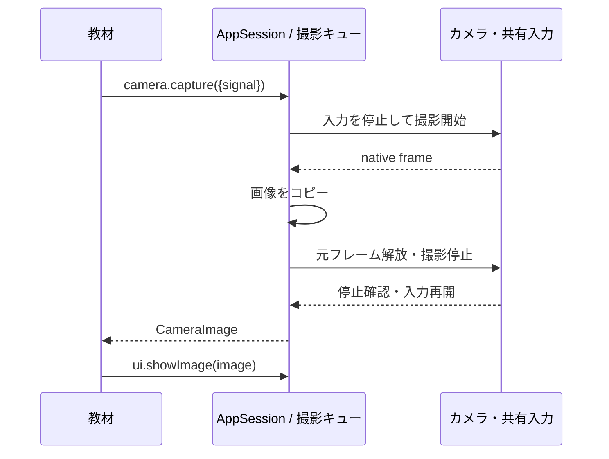

# V2 の撮影と画像表示

この記録は F1 / F2 / F3 / F4 / F5 / F9 のカメラ部分を扱う。再設計全体の状態は [実装台帳](firmware-sdk-redesign-progress.md) を参照する。

アプリは `await app.camera.capture(options)` で一枚を取得し、`app.ui.showImage(image)` で表示する。ドライバーの start / stop / close、Piu、共有 I2C とタッチパネルの操作を教材へ渡さない。

| 境界 | 所有・終了 |
| --- | --- |
| Host | 物理カメラとタッチパネル。撮影中は共有する入力を止め、カメラの停止確認後に戻す |
| AppSession | CameraCaptureSession、撮影要求の取消し、表示中の画像 |
| Capture operation | 開始、フレーム待ち、コピー、元フレーム解放、カメラ停止 |
| CameraImage | 通常の JavaScript ArrayBuffer のコピー。アプリは native handle を持たず、手動解放しない |
| Browser | getUserMedia の stream と全 track、video、開始世代、XS 側のポーリングと期限 |

## 公開契約

- 省略値は幅176、高さ144、`rgb565le`。幅1〜320、高さ1〜240の整数を受け付ける。機器が丸めた実際の寸法を結果で返す。
- RGB565は2バイト/画素。nativeでは `rgb565le` / `rgb565be` / `jpeg`、ブラウザーではRGB565の2形式を受け付ける。能力の `formats` にない形式は開始前に `UNSUPPORTED`。
- 返却データを最大153,600 bytesに制限し、寸法・形式・RGB565のバイト数を検証する。JPEGは非空かつ同じ上限内とする。JPEGの復号・表示はこのAPIに含めず、`showImage` はRGB565を受け付ける。
- 撮影の同時実行は一つ、待機は2件、待機期限30秒、実行期限15秒。取消し時の停止確認は2秒。下位の最初のフレーム待ちはnative / WASMとも500ms。
- 画像未取得を成功にしない。nativeの未取得結果はSDKが `IO` に変換し、WASMのフレーム待ち期限は `TIMEOUT`。不正入力は `INVALID_ARGUMENT`、競合は `BUSY`、取消しは `CANCELLED`、アプリ終了は `CLOSED`。
- 取消し時は上位のタスクが先にrejectする場合があるが、内部の枠を停止完了まで保持する。frame.close / camera.stop の失敗は保持し、後続撮影を開始しない。復旧にはホストの再作成が必要。
- `CameraImage.source` は `native` / `simulated`。ブラウザーのnativeはブラウザーのメディア入力を意味し、ESP32カメラと同じ画角・遅延という意味ではない。

画像のプロパティはreadonly、dataのバイト列はアプリが所有する。アプリが画像を配列などへ蓄積した場合のメモリーを強制回収する契約ではない。既定の一枚は50,688 bytes。表示側は一つだけ保持し、置換・非表示・アプリ終了で登録を外す。native / WASMの表示は既存の200×120プレビューを使用し、表示用コピーと元画像を分ける。Linux試験用のプレビューは既存のモザイク表示を用いる。

## 遅延処理と旧 API

nativeのフレーム待ちは機器と開始世代の両方を確認する。stop / closeで待機を解決し、Timerと取消し登録を解除する。古いnative入力のonReadableは新しい入力を読まない。低レベルの連続入力とdisposable bufferは維持し、コピーを一枚撮影のSDK境界へ置く。

WASMのCameraは取得したbridgeを固定し、同じbridgeを使う別Cameraとの所有を調停する。所有していないCameraのcloseは現在の撮影を止めない。開始・フレーム待ちの取消しでポーリングを解除し、遅れた開始結果がcameraを復活させない。C bridgeも開始世代を無効化し、既に取り消された予約からgetUserMediaを呼ばない。

ブラウザーは許可拒否、media API未対応、canvas失敗を呼び出し側へ返す。合成画像は内部bridgeで `useBrowserCamera: false` を明示した場合に限る。従来の「未取得なら自動的に合成画像」は廃止する。停止後に到着したstreamは、そのstreamのtrackだけを止める。停止失敗でも残りのtrackを解放し、失敗後は再利用を拒否する。

ブラウザーでXSを再起動する際にも、古いC bridgeの開始予約を無効にしてからカメラを止める。XSの終了だけでブラウザーのPromiseが消えるとは仮定しない。ページの終了では一つの解放失敗で残りの解放を飛ばさず、外側のruntime参照も消去する。撮影や再起動でカメラが止まると接続表示を戻し、古い接続結果から表示を更新しない。

V1の明示的な連続撮影は残す。V1が利用中のカメラへV2撮影を重ねると `BUSY`。V1の一枚撮影も、開始されていない状態から呼んだ場合は停止を確認してから共有入力を戻す。V1の公開API全体と機器交換の整理は別の未完了項目である。

## 教材・移行と検証

`firmware/lessons/06-camera` は利用可否を確認し、主ボタンで撮影・表示する。アプリ側に機種名、Piu、カメラのバッファ解放を書く必要はない。

WASMの自動代替画像に依存する旧コードは、実カメラの利用と明示的なシミュレーションを選ぶ。ブラウザーの許可拒否は成功画面へ進まずエラーとして扱う。V2教材の配布は、このブランチのホストを使う開発用経路に限定する。配布metadata、Gallery / Blockly / SDとの接続、全既存MODの移行は継続中。

対応する試験は `camera-capture-session.test.ts`、`camera/__tests__/device-lifecycle`、`camera/__tests__/wasm-lifecycle`、`app/__tests__/context-lifecycle`、`web/simulator/bridge.test.mjs` と `sdk-lessons-visual.mjs`。コピーと解放順、100回の寿命、開始失敗、取消し、停止失敗、古い世代、実Piuの画像置換と終了を検証する。ブラウザー受入はChromiumのテスト用映像入力で、WASM / C bridge / SDK / Piuを通す。物理ESP32カメラの画質・共有I2C・実メモリーは実機での受入が必要であり、ビルド成功では代用しない。

検証済みの対象と結果は [実装台帳のカメラ接続](firmware-sdk-redesign-progress.md#一枚撮影画像表示とカメラの終了2026-09-06) に記録する。
