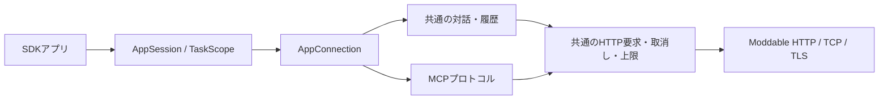

# 対話プロバイダー・MCP・HTTP の統合

項目3の参考ライブラリー整理と、項目5の要求・停止・再試行を実装した記録。テキスト対話を `dialogue`、MCPクライアントを `connectTools` に集約した。使い方と制限は [移行ガイド](../../firmware/mods/examples/provider-dialogues/README_ja.md) を参照する。

## 撤去した責務と残す機能

| 撤去した経路 | 残す機能と所有者 |
| --- | --- |
| ChatGPTDialogue / ClaudeDialogue / GeminiDialogue の個別クラス、Maybeと直接fetch、専用manifest | 共通の `createDialogue` が履歴・同時要求・取消し・完了を管理し、3サービスの要求と応答の形式だけを切り替える |
| raw MCPClientServiceの独立通信とMCP→ChatToolの変換 | `connectTools` がAppConnectionに所属し、共通HTTPを使う。結果はSDKのToolとして渡す |
| MCPサーバーの独自ToolParameter、SDK→独自型→JSON Schemaの往復 | SDKのinputSchemaをコピーしてそのままtools/listへ返す。enum・required・追加制約を保持 |
| 参考クラスのconstructor smoke、撤去した変換器の試験 | 実XSの成功・失敗・再試行・開始終了試験と、実TCPのクライアント／サーバー結合試験 |



接続ごとの独立したアプリ実行器は追加しない。HTTP完了前にアプリが終了した場合は物理クライアントを閉じ、後から到着した返答を履歴や発話へ採用しない。成功した対話だけをチェックポイントにする。OpenAIは成功した応答IDを次へ渡し、Claude / Geminiは初期例と直近3往復を送る。ローカルのhistoryは全サービスで同じコピーを返す。

MCPでは初期化・初期化通知・一覧を順に完了してからToolを公開する。途中の失敗ではローカル接続を閉じる。セッションIDが得られた接続は終了時にDELETEを試みる。サーバー上ですでに始まった外部操作の巻き戻しは保証しない。無期限のSSE通知、OAuth、再開可能な通信は提供していない。

## 共通HTTPで検出した不具合

旧実装はContent-Length分を送った後にも空の `write()` を呼び、ModdableのHTTPクライアントが `bad state` でXSを停止していた。成功時の `onDone(null)` も失敗として扱っていた。固定長本文は最後のデータ書き込みで完了し、nullは正常終了へ正規化する。非同期read/writeの例外でも要求を閉じてSDKのエラーへ戻す。分割した録音本文は元のArrayBufferへのDataViewを使い、録音全体のコピーを増やさない。

この不具合はHTTPのfakeだけでは検出できず、MCPを実TCPで接続した際に再現した。修正後は20接続で認証・ツール一覧・成功結果・ツール失敗を確認した。fakeも固定長本文の終端と実際のnull通知を再現するよう修正した。

## 公開契約とビルド

host APIは10。`conversation.dialogue` と `conversation.tools` の最小世代も10にする。旧ホストがprovider指定を無視してOpenAIへ別サービスのキーを送る経路を、書き込み前・コード評価前の共通検査で拒否する。旧SDKの対話MODも宣言を更新して再ビルドする。Claude / GeminiではキーとモデルIDを必須とし、OpenAIの保存済みキーへフォールバックしない。

通常のMODビルドで、共通設定schemaのJSDoc型を読めない問題も検出した。TypeScript例のmanifestに `allowJs` を揃え、全28教材・実行例をnpm wrapperから再ビルドした。設定キー・値型を別の宣言ファイルへ複製せず、ホストのSDK実装やC依存をMODへ同梱しない。

## 検証

Moddable 9.5.0、native releaseはESP-IDF 6.1、Node 24.19.0を使用。生成物は `firmware/dist` に置く。

- SDK strictと公開型の拒否例、firmware Node 568件、構成77件、manifest 7対象が成功。
- XS全57 manifestが成功。3サービス各100回の開始・終了、履歴上限、seed/historyのコピー、失敗後再試行、取消し後の遅延応答を確認。
- MCPのアプリ所有を100接続で確認し、初期化順序・セッション／版ヘッダー・有限SSE・結果の保持・DELETEの一度だけの実行・登録解除を検査。別に実TCPで20接続を確認。
- 7教材と21例の計28 MODがビルド成功。Webの240件、Reactの77件、WASMとWebビルドが成功。
- Chromiumで7教材と5例、4つのGallery archiveと顔・入力・音声生成、置換時の待機・周期処理停止を確認。旧／未来APIと未対応能力の拒否、ホスト設定からの正常MODへの復旧を確認。
- native release 6機種と4対象の配布bundleが生成・容量検査に成功。

| native release | bytes / app partition | 余裕 |
| --- | ---: | ---: |
| M5Stack | 3,770,960 / 3,801,088 | 30,128 |
| M5Stack Core2 | 3,858,144 / 16,384,000 | 12,525,856 |
| M5Stack CoreS3 | 3,978,800 / 16,318,464 | 12,339,664 |
| M5StackChan CoreS3 | 6,555,600 / 16,318,464 | 9,762,864 |
| Stackchan RT | 3,978,800 / 16,318,464 | 12,339,664 |
| Takao Core2 SG90 | 3,854,048 / 16,384,000 | 12,529,952 |

M5StackChanの接続調査は [USBの記録](m5stackchan-usb-diagnosis-2026-09-09.md) を参照する。実サービスへの認証・課金要求は行っていない。プロバイダーの要求／応答は公式仕様に基づく試験データで確認した。実機ヒープ、TLS接続、無線共存、音声置換、物理電源断、初学者の受入を上の試験で代替しない。

## 参照したプロトコル

- [OpenAI function calling](https://developers.openai.com/api/docs/guides/function-calling)：Responsesのfunction_callと対応するcall_idの結果を使用。既存SDK/MCP schemaを維持するためstrictはfalse。
- [Claude Messages API](https://platform.claude.com/docs/en/api/http/messages/create)：systemとuser/assistantの区別、APIキーと版ヘッダー、textブロックを使用。
- [Gemini generateContent](https://ai.google.dev/api/generate-content)：systemInstruction、user/model、x-goog-api-keyを使用。thought部分を発話・表示履歴に含めない。
- [MCP lifecycle](https://modelcontextprotocol.io/specification/2025-06-18/basic/lifecycle) と [Streamable HTTP](https://modelcontextprotocol.io/specification/2025-06-18/basic/transports)：初期化、版交渉、通知、セッションヘッダー、JSON/有限SSE、任意のセッション削除を実装。

機能撤去と製品ソースの純減は固定した `measure.py` で別に計測する。参考クラスの625行はサンプル列であり、製品ソースの削減へ付け替えない。

## 固定したソースの計測

実装コミットは `a3cc42cfa6beca32277ffad45d1124659c3c63f5`。直前の `d06e88bd8c94c5632e3db46b373756a218fa14fc` と同じ規則で比較した。

| 分類 | 直前 | 今回 | 物理行数の差 |
| --- | ---: | ---: | ---: |
| firmware実装 | 42,321 | 41,994 | -327 |
| SDK・共通契約 | 1,761 | 1,779 | +18 |
| Web実装 | 15,385 | 15,385 | 0 |
| 型宣言 | 693 | 693 | 0 |
| **製品ソース計** | **60,160** | **59,851** | **-309** |
| サンプル・教材（別計上） | 3,541 | 2,916 | -625 |
| 試験・補助（別計上） | 38,744 | 38,652 | -92 |

製品は486ファイルのまま309行減った。削減対象は個別の通信・対話所有、MCPツール型変換であり、機能やソースを教材・生成物へ移していない。起点 `6eb4623` の419ファイル・52,702行に対しては、なお **67ファイル・7,149行増**。再設計全体の純減条件は未達である。

```sh
python3 docs/architecture/evidence/firmware-retirement/measure.py a3cc42c --files
```
