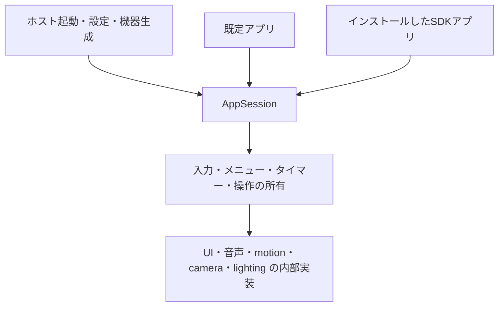

# 既定アプリとUI・入力のSDK境界

既定動作を、インストールされたSDKアプリと同じ `AppDefinition` / `AppSession` へ移した。MODがない場合も、設定画面を閉じた後に既定アプリを開始する。Wi-Fiの接続完了を待たない。

`default-app/main.ts` は三つの登録処理を組み立てる。`appearance.ts` は顔・色・手・感情の選択と一時的な表情を扱う。`companion.ts` は注視、IMU、撫でた反応を扱う。`diagnostics.ts` は発話・撮影・サーボ・tone・録音再生・LEDの確認を扱う。これらは公開SDKとアプリ内の相対importだけを使い、構成検査とstrict型検査で境界を検証する。

旧 `default-behavior/on-context-created.ts` とそのフックを削除した。カメラの遅延停止、フレームのclose、録音形式の取り扱い、raw callbackへの代入、秒への変換をアプリで繰り返さない。手動のタイマーはSDKの `after` / `every` へ接続した。旧通常MODの起動自体はまだ残るが、既定動作の継承は行わない。

UIの追加操作は `stackchan/extensions/ui`、入力は `stackchan/extensions/input`、LEDは `stackchan/extensions/lighting` から取得する。取得先は同じAppSessionのfacetであり、別の所有コンテナーやアプリ実行器は増やしていない。登録上限・再入抑止・取消しは入力とメニューで共用する。基本SDKはPiuオブジェクトを公開しない。

メニューは失敗した選択を元へ戻し、アプリからの新しい値の変更を古い完了で上書きしない。終了時には全メニューを外し、実行中の処理を取り消す。顔の切替はホストが作るPiu実装へ委譲し、終了時は本体設定の顔へ戻す。アプリの色・感情・手・装飾も初期化する。

撫でた反応は、一定時間内の逆向きスワイプを組み合わせる。raw ticksの差分や秒の引数をアプリへ持ち込まず、期限付きの登録で状態を失効させる。前の反応を取り消して新しい反応へ置き換え、アプリが要求していた姿勢・注視へ戻す。5秒の復帰期限はサーボの完了時間と独立し、期限に達したら動作中の操作も取り消す。手動停止や動作失敗の後には古い復帰処理を実行しない。実測位置をアプリに複製するものではない。手動の感情選択を優先し、古い表情復帰タイマーも取り消す。実機での反応の自然さ・可動域・タイミングは別途受入が必要である。

診断中は別の診断を開始せず、未対応や失敗を吹き出しに表示する。ハードウェアがないことを成功に置き換えない。WASMにはLED出力bridgeがないため未対応とし、PY32が検出できない場合も有効なLED一覧へ含めない。

顔の例は周期的な表情・文字・色・眠気の装飾を保持し、旧翻訳メニューの三言語の辞書を統合した。配置とフォントはホストの共通表示を使う。旧localized_drawerのプログラムとmanifestを削除し、統合先への案内だけを残す。

公開契約は [SDK文書](../../firmware/sdk/README_ja.md)、検証結果と未完了範囲は [実装台帳](firmware-sdk-redesign-progress.md) に記録する。旧通常MOD・Blockly・会話・設定拡張・旧contextの撤去・製品コード総量の削減・実機と初学者の受入を含む再設計全体は未完了である。
