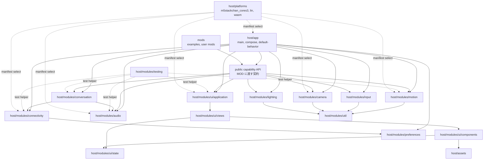

# ファームウェア再設計移行計画

作成日：2026-06-28

更新日：2026-06-29

対象：`firmware/host` と `firmware/mods` を中心とする Moddable ファームウェア。

この文書は、レビューで指摘した設計差分を、1本の移行計画として管理する。

`[x]` は対応済み、`[ ]` は未対応を示す。

移行では後方互換を維持しない。

互換 API、互換ディレクトリ、互換アダプタを残す段階を作らない。

## 目標構成

移行後の `firmware/host` は、起動と合成、module、platform、asset を分ける。

`firmware/mods` は、利用者向け MOD と sample MOD だけを置く。

`firmware/stackchan` は移行元としてだけ扱い、移行後の目標構成には残さない。

```text
firmware/
  mods/
    examples/
    <user-mod>/
  host/
    app/
      main.ts
      compose.ts
      manifest.json
      manifest.local.json
      default-behavior/
        manifest.json
        on-launch.ts
        on-robot-created.ts
    modules/
      audio/
        manifest.json
        manifest.test.json
      camera/
        manifest.json
        manifest.test.json
      conversation/
        manifest.json
        manifest.test.json
      connectivity/
        manifest.json
        manifest.test.json
      input/
        manifest.json
        manifest.test.json
      lighting/
        manifest.json
        manifest.test.json
      motion/
        manifest.json
        manifest.test.json
        protocols/
        servos/
      preferences/
        manifest.json
        manifest.test.json
      testing/
        manifest.json
      util/
        manifest.json
        manifest.test.json
      ui/
        manifest.json
        manifest.test.json
        application/
          app-controller.ts
        views/
          main/
          splash/
          settings/
          camera-preview/
        components/
          app-bar/
          face/
          drawer/
          effects/
          bubble/
          status-bar/
        state/
          face-state.ts
    platforms/
      m5stackchan_cores3/
      lin/
      wasm/
    assets/
      fonts/
      images/
      sounds/
```

矢印は、左の module が右の契約を使う向きを示す。

点線は、manifest による build-time の選択を示す。



## 移行計画

### 0. 方針固定

- [x] 対応済み：再設計後の本線では、旧 `Renderer` 契約を正規 API として扱わない。
- [x] 対応済み：後方互換用の adapter、deprecated API、旧 import alias を残さない方針に固定する。
- [x] 対応済み：UI は Piu `Application`、`Behavior`、`Template`、`Port`、`Skin`、`Texture` を直接使う方針に固定する。
- [ ] 未対応：移行後の merge 条件として、互換層と旧名の残存を検索で検出する手順を CI またはレビュー手順へ入れる。
- [ ] 未対応：検索対象は `RendererCompat`、`renderer-`、`useRenderer`、`addDecorator`、`removeDecorator`、`robot.renderer`、`renderer.type`、`renderers-piu`、`firmware/tests` とする。

### 1. UI 層の移行

- [x] 対応済み：`firmware/stackchan/renderers-piu/renderer-compat.ts` を削除する。
- [x] 対応済み：`RendererCompat is a temporary adapter` の deprecated 警告が出る実装経路を削除する。
- [x] 対応済み：`firmware/stackchan/main.ts` から renderer factory 経由の初期化を外し、`createAppControllerApplication` を直接呼ぶ。
- [x] 対応済み：`RobotUI`、`robot.ui`、`robot.drawer` を正規 API として導入する。
- [x] 対応済み：実装から `robot.renderer`、`useRenderer`、`addDecorator`、`removeDecorator` を削除する。
- [x] 対応済み：旧 Poco 系 renderer の tracked code を `firmware/stackchan/renderers` から削除する。
- [x] 対応済み：Piu UI 実装を旧 renderer 構造から `firmware/stackchan/ui` へ分離する。
- [ ] 未対応：分離済みの Piu UI 実装を `firmware/host/modules/ui` 配下へ移す。
- [ ] 未対応：Piu `Application` の生成と再利用を `firmware/host/modules/ui/application/app-controller.ts` に置く。
- [ ] 未対応：通常画面の実装を `firmware/host/modules/ui/views/main` に置く。
- [ ] 未対応：起動スプラッシュを `firmware/host/modules/ui/views/splash` に置く。
- [ ] 未対応：カメラプレビューを `firmware/host/modules/ui/views/camera-preview` に置く。
- [ ] 未対応：StatusBar を `firmware/host/modules/ui/components/status-bar` に置く。
- [ ] 未対応：Drawer を `firmware/host/modules/ui/components/drawer` に置く。
- [ ] 未対応：Effects を `firmware/host/modules/ui/components/effects` に置く。
- [ ] 未対応：SpeechBalloon と MultiRowBalloon を `firmware/host/modules/ui/components/bubble` に置く。
- [ ] 未対応：顔の部品、顔表示 Behavior、顔関連 skin を `firmware/host/modules/ui/components/face` に置く。
- [ ] 未対応：顔状態を `firmware/host/modules/ui/state` に置く。
- [x] 対応済み：UI manifest と tsconfig から `renderer-*` alias を削除する。
- [x] 対応済み：`renderer` preference と config 名を `ui` へ置き換える。
- [x] 対応済み：default mod と sample mod の UI 呼び出しを `robot.ui.addEffect`、`robot.ui.removeEffect`、`robot.ui.setFace`、`robot.drawer` へ更新する。
- [x] 対応済み：`firmware/docs/api.md` と `firmware/docs/api_ja.md` の公開 API 説明を Renderer から RobotUI へ更新する。
- [ ] 未対応：設定画面の Piu 構築を `firmware/stackchan/default-mods/on-launch.ts` から `firmware/host/modules/ui/views/settings` へ移す。
- [ ] 未対応：`firmware/host/modules/ui/views/settings/settings-view.test.ts` を追加する。
- [ ] 未対応：`FaceContext` 名を view backed な `FaceState` へ置き換える。
- [ ] 未対応：顔状態を plain object ではなく Moddable の view 定義に寄せる。
- [ ] 未対応：`emotion` を文字列ではなく数値 enum として扱う。
- [ ] 未対応：theme 色の内部表現を `ColorRGB` 構造体に固定する。
- [ ] 未対応：Piu 境界でだけ `ColorRGB` を `0xRRGGBB` へ pack する。
- [ ] 未対応：呼吸などの周期更新で `coordinates` を毎フレーム更新しない実装へ変える。
- [ ] 未対応：目、口、吹き出し、絵文字の描画更新を `Port`、`Texture`、`Skin.template`、`variant`、必要最小の `invalidate` に寄せる。
- [ ] 未対応：毎フレーム `new Skin()`、`new Style()`、`Label.string` 更新が発生しないことを確認する。

### 2. アプリケーション層の分離

- [ ] 未対応：`firmware/host/app` を作成する。
- [ ] 未対応：トップレベルの実装ディレクトリを `firmware/stackchan` から `firmware/host` へ移す。
- [ ] 未対応：移行後の build、manifest、import から `firmware/stackchan` への参照を取り除く。
- [ ] 未対応：`firmware/stackchan/main.ts` を `firmware/host/app/main.ts` と `firmware/host/app/compose.ts` へ分ける。
- [ ] 未対応：`app/main.ts` は起動順序、manifest の選択、エラーハンドリングだけを持つ。
- [ ] 未対応：`app/compose.ts` は module の生成と依存注入だけを持つ。
- [ ] 未対応：ドライバ、TTS、UI、入力、センサ、LED、Wi-Fi、WASM、MOD の選択処理を root `main.ts` から移す。
- [ ] 未対応：`config.wasm` の runtime branch を app layer から取り除く。
- [ ] 未対応：WASM、lin、ESP32 の差分を platform manifest の include と modules で表す。
- [ ] 未対応：`firmware/stackchan/manifest*.json` を `firmware/host/app/manifest*.json` へ移す。
- [ ] 未対応：`firmware/package.json` の build、smoke、test script を新しい app manifest へ更新する。
- [ ] 未対応：製品既定動作を `firmware/host/app/default-behavior` に置く。
- [ ] 未対応：`firmware/stackchan/default-mods` を app default behavior へ移し、MOD ディレクトリを利用者向け拡張とサンプルに限定する。

### 3. Robot Facade の分解

- [ ] 未対応：`firmware/stackchan/robot.ts` が driver、TTS、input、camera、LED、drawer、face、motion を直接抱える構造を解消する。
- [ ] 未対応：Face、Motion、Audio、Input、Lighting、Camera、Conversation、Connectivity の公開契約を個別に定義する。
- [ ] 未対応：`Robot` は互換 Facade として残さず、新しい app composition の戻り値または context 型へ置き換える。
- [ ] 未対応：MOD へ渡す API を `Robot` の肥大化ではなく、必要な capability を束ねた型として再定義する。
- [ ] 未対応：Drawer と Face は UI capability として公開し、motion や audio から直接参照しない。
- [ ] 未対応：product default behavior は `Robot` のメソッド追加ではなく、app の振る舞いとして登録する。

### 4. Modules 構造の作成

- [ ] 未対応：`firmware/host/modules/audio` を作成し、`manifest.json` と `manifest.test.json` を置く。
- [ ] 未対応：`firmware/host/modules/camera` を作成し、`manifest.json` と `manifest.test.json` を置く。
- [ ] 未対応：`firmware/host/modules/conversation` を作成し、`manifest.json` と `manifest.test.json` を置く。
- [ ] 未対応：`firmware/host/modules/connectivity` を作成し、`manifest.json` と `manifest.test.json` を置く。
- [ ] 未対応：`firmware/host/modules/input` を作成し、`manifest.json` と `manifest.test.json` を置く。
- [ ] 未対応：`firmware/host/modules/lighting` を作成し、`manifest.json` と `manifest.test.json` を置く。
- [ ] 未対応：`firmware/host/modules/motion` を作成し、`manifest.json` と `manifest.test.json` を置く。
- [ ] 未対応：`firmware/host/modules/preferences` を作成し、`manifest.json` と `manifest.test.json` を置く。
- [ ] 未対応：`firmware/host/modules/testing` を作成し、共有 fake と test helper を置く。
- [ ] 未対応：`firmware/host/modules/util` を作成し、`manifest.json` と `manifest.test.json` を置く。
- [ ] 未対応：module 群は `firmware/stackchan/components` ではなく `firmware/host/modules` に置く。
- [ ] 未対応：各 module は実装、manifest、test、test manifest、専用 fake を同じディレクトリに持つ。
- [ ] 未対応：二つ以上の module で使う fake timer、fake transport、fake provider、fake Piu event は `modules/testing` に置く。

### 5. Motion の移行

- [ ] 未対応：`firmware/stackchan/drivers` を `firmware/host/modules/motion` へ移す。
- [ ] 未対応：`scservo`、`rs30x`、`dynamixel` を `modules/motion/protocols` へ分ける。
- [ ] 未対応：首の pan、tilt、torque、追従制御を `modules/motion` の controller 層に置く。
- [ ] 未対応：低レイヤの送受信待ちから `Promise` queue を取り除く。
- [ ] 未対応：低レイヤの送受信待ちは callback、待ち slot、timeout state で表す。
- [ ] 未対応：上位 API が待ち合わせを必要とする場合だけ、app 境界で callback を `Promise` に変換する。
- [ ] 未対応：fake servo transport を追加し、lin で motion controller の状態遷移を検証する。

### 6. Audio の移行

- [ ] 未対応：`firmware/stackchan/speeches` を `firmware/host/modules/audio` へ移す。
- [ ] 未対応：`firmware/stackchan/microphone.ts` を `firmware/host/modules/audio` へ移す。
- [ ] 未対応：`firmware/stackchan/tone.ts` を `firmware/host/modules/audio` へ移す。
- [ ] 未対応：`firmware/stackchan/transcriptions` を `firmware/host/modules/audio` へ移す。
- [ ] 未対応：TTS provider ごとの実装ファイルは維持し、audio module の manifest で選択する。
- [ ] 未対応：ストリーミング再生と再生完了通知を callback 契約へ統一する。
- [ ] 未対応：`onPlayed` と `onDone` の通知方向は維持し、`stream()` の戻り値へ完了制御を集めない。
- [ ] 未対応：録音 buffer と再生 buffer の所有者を型または契約で明示する。
- [ ] 未対応：大きい `ArrayBuffer` を多段でコピーしないことを audio test で確認する。

### 7. Conversation の移行

- [ ] 未対応：`firmware/stackchan/services/chat.ts` を `firmware/host/modules/conversation` へ移す。
- [ ] 未対応：`firmware/stackchan/dialogues` を `firmware/host/modules/conversation` または `firmware/mods/examples` へ整理する。
- [ ] 未対応：旧 provider demo は core から外し、会話デモとして残すものだけを `firmware/mods/examples` へ移す。
- [ ] 未対応：コアの会話実装は Moddable の `ChatAudioIO` を第一候補にする。
- [ ] 未対応：手製の会話 loop を新規に増やさない。
- [ ] 未対応：MCP tool 呼び出しは conversation から connectivity への明示依存として表す。
- [ ] 未対応：transcript と tool call の状態を conversation module の状態として扱う。

### 8. Connectivity の移行

- [ ] 未対応：`firmware/stackchan/services/http-server` を `firmware/host/modules/connectivity` へ移す。
- [ ] 未対応：`firmware/stackchan/mcp-*` を `firmware/host/modules/connectivity` へ移す。
- [ ] 未対応：`firmware/stackchan/network-service.ts` を `firmware/host/modules/connectivity` へ移す。
- [ ] 未対応：`firmware/stackchan/ble` を `firmware/host/modules/connectivity` へ移す。
- [ ] 未対応：ネットワーク接続とプロトコル処理を app 起動処理から外す。
- [ ] 未対応：接続状態は callback で通知する。
- [ ] 未対応：再接続と timeout は状態機械として実装する。
- [ ] 未対応：fetch を使う外部 API 境界では `Promise` を許容する。
- [ ] 未対応：内部イベント通知では `Promise` ではなく callback を使う。

### 9. Input、Lighting、Camera、Preferences、Util の移行

- [ ] 未対応：`firmware/stackchan/touch*` と `firmware/stackchan/imu*` を `firmware/host/modules/input` へ移す。
- [ ] 未対応：button、touch、touch panel、IMU の入力を短い event struct へ正規化する。
- [ ] 未対応：入力イベントを Piu や MOD へ raw object のまま渡さない。
- [ ] 未対応：入力の polling で `Timer.repeat(async () => ...)` を使わない。
- [ ] 未対応：`firmware/stackchan/led` を `firmware/host/modules/lighting` へ移す。
- [ ] 未対応：py32 差分を lighting module の platform manifest または module 内部差分として扱う。
- [ ] 未対応：`firmware/stackchan/camera.ts` を `firmware/host/modules/camera` へ移す。
- [ ] 未対応：camera の実機実装、WASM stub、lin stub を platform manifest で切り替える。
- [ ] 未対応：`firmware/stackchan/utilities` を `firmware/host/modules/util` と `firmware/host/modules/preferences` へ分ける。
- [ ] 未対応：数学系 helper は `modules/util` に置く。
- [ ] 未対応：`loadPreferences` と設定 schema は `modules/preferences` に置く。
- [ ] 未対応：`loadPreferences` を直接呼ぶ場所を app と preferences に限定する。
- [ ] 未対応：module 内で設定を読む必要がある場合は、app から注入された config を使う。
- [ ] 未対応：sample MOD が直接 preference を読む境界を許可するか、注入 config に寄せるかを決める。

### 10. Platform 層の分離

- [ ] 未対応：`firmware/host/platforms/wasm` を作成する。
- [ ] 未対応：`firmware/host/platforms/lin` を作成する。
- [ ] 未対応：`firmware/host/platforms/m5stackchan_cores3` を作成する。
- [ ] 未対応：`firmware/stackchan/wasm` を `firmware/host/platforms/wasm` へ移す。
- [ ] 未対応：通常コードから WASM 専用 import を取り除く。
- [ ] 未対応：platform 差分を TypeScript の runtime branch ではなく manifest の include、modules、platforms で表す。
- [ ] 未対応：ESP32 target ごとの差分を platform manifest で表し、app composition に混ぜない。

### 11. MOD と sample の整理

- [x] 対応済み：変更対象になった default mod と sample mod の Renderer API 呼び出しを RobotUI API へ更新する。
- [ ] 未対応：`firmware/mods` を利用者向け MOD と sample だけを置く場所にする。
- [ ] 未対応：sample MOD を `firmware/mods/examples` へ移す。
- [ ] 未対応：product default behavior を `firmware/mods` から `firmware/host/app/default-behavior` へ移す。
- [ ] 未対応：古い provider demo を core 依存から切り離す。
- [ ] 未対応：MOD API の公開面を capability 単位で再定義し、旧 `Robot` 互換 API を残さない。

### 12. テスト配置と実行方法の移行

- [ ] 未対応：`firmware/tests` の内容を対象 module または UI ディレクトリへ移す。
- [ ] 未対応：`firmware/tests/unit` の内容を対象 module または UI ディレクトリへ移す。
- [ ] 未対応：集約テストディレクトリとしての `firmware/tests` を削除する。
- [ ] 未対応：各 module と UI view に `manifest.test.json` を置く。
- [ ] 未対応：各 `manifest.test.json` は本体の `manifest.json` と `modules/testing/manifest.json` を include する。
- [ ] 未対応：テスト用 main は同じディレクトリの `*.test.ts` を読む。
- [ ] 未対応：成功時は `ok` を trace し、失敗時は例外を throw する。
- [ ] 未対応：合否判定は `mcconfig -m -d -p lin/m5stack -t run` の終了ステータスで行う。
- [ ] 未対応：`trace("not ok ...")` を合否判定に使わない。
- [ ] 未対応：Node.js の `node:test` は移行補助と pure helper の検証に限定する。
- [ ] 未対応：移行後の正規テスト判定は Moddable の lin 実行結果に寄せる。
- [ ] 未対応：CI は `firmware/host/modules/**/manifest.test.json` を列挙して実行する。
- [ ] 未対応：CI は `firmware/host/modules/ui/**/manifest.test.json` を列挙して実行する。
- [ ] 未対応：Piu の Application や描画イベントを使うテストは `lin/m5stack` を既定にする。
- [ ] 未対応：画面を使わない純粋ロジックは `lin` で実行できるようにする。
- [ ] 未対応：実機依存の確認は unit test ではなく smoke として分ける。

### 13. 非同期境界の移行

- [ ] 未対応：Timer、Piu Behavior、driver、input handler の中で新規 `async` 関数を使わない。
- [ ] 未対応：低レイヤの待ち合わせは callback と状態 enum で進める。
- [ ] 未対応：戻り値に `Promise` を返す関数は network fetch、外部 API、app 境界、test helper に限定する。
- [ ] 未対応：周期更新する状態は固定構造を再利用する。
- [ ] 未対応：毎フレーム動く処理で object を生成しない。
- [ ] 未対応：色、感情、状態は内部で数値として扱う。
- [ ] 未対応：ログや設定ファイルへ出す境界でだけ文字列へ変換する。
- [ ] 未対応：継続可能な状態変化は例外ではなく状態遷移または callback で通知する。
- [ ] 未対応：module 境界の同期エラーは `onError(code, detail)` のような callback で通知する。

### 14. 旧文書と参照の整理

- [x] 対応済み：`firmware/docs/api.md` と `firmware/docs/api_ja.md` の Renderer API 記載を RobotUI API へ更新する。
- [ ] 未対応：`docs/piu-renderer.md` を削除または新 UI 設計文書へ置き換える。
- [ ] 未対応：`docs/piu-renderer_ja.md` を削除または新 UI 設計文書へ置き換える。
- [ ] 未対応：`firmware/docs/0002-image-face.md` の旧 renderer 前提を削除または更新する。
- [ ] 未対応：`firmware/face-context-as-views.md` を `FaceState` 方針に合わせて削除または更新する。
- [ ] 未対応：`firmware/piu-faster.md` を UI performance 方針として統合する。
- [ ] 未対応：`CLAUDE.md` の旧構成参照を削除または更新する。
- [ ] 未対応：`renderer.type`、`renderers-piu`、旧 renderer API を説明する残存文書を削除または更新する。
- [ ] 未対応：tracked tree に旧 `firmware/stackchan/renderers` と旧 `firmware/stackchan/renderers-piu` が残っていないことを確認する。
- [ ] 未対応：ローカルに空ディレクトリが残る場合でも、manifest、import、document から参照しない。

### 15. 検証

- [x] 対応済み：UI 互換層削除後に `npm run format` を実行する。
- [x] 対応済み：UI 互換層削除後に `npm run lint` を実行する。
- [x] 対応済み：UI 互換層削除後に `npm run test:unit` を実行する。
- [x] 対応済み：UI 互換層削除後に `npm run build:wasm` を実行する。
- [x] 対応済み：UI 互換層削除後に `npm run smoke:lin` を実行する。
- [x] 対応済み：UI 互換層削除後に web 側の `npm test` を実行する。
- [x] 対応済み：UI 互換層削除後に変更対象 MOD の mcrun を実行する。
- [x] 対応済み：UI 互換層削除後に lin 向け manifest 群の build を確認する。
- [ ] 未対応：module 移行後に `npm run format` を再実行する。
- [ ] 未対応：module 移行後に `npm run lint` を再実行する。
- [ ] 未対応：module 移行後に `npm run test:unit` を再実行する。
- [ ] 未対応：module 移行後に `npm run build:wasm` を再実行する。
- [ ] 未対応：module 移行後に `npm run smoke:lin` を再実行する。
- [ ] 未対応：module 移行後に web 側の `npm test` を再実行する。
- [ ] 未対応：module 移行後に `firmware/host/modules/*/manifest.test.json` をすべて実行する。
- [ ] 未対応：module 移行後に `firmware/host/modules/ui/**/manifest.test.json` をすべて実行する。
- [ ] 未対応：module 移行後に対象 ESP32 board の build を実行する。
- [ ] 未対応：module 移行後に changed MOD と sample MOD の mcrun を実行する。
- [ ] 未対応：module 移行後に旧 API 検索を実行し、許可した履歴文書以外に旧名が残らないことを確認する。

### 16. Merge 条件

- [ ] 未対応：app layer が module の生成と接続だけを行っている。
- [ ] 未対応：`Robot` が全機能を抱える Facade ではなくなっている。
- [ ] 未対応：Piu が `Renderer` 互換層を経由していない。
- [ ] 未対応：Piu Application、View、Drawer、StatusBar、Bubble、Effects、Face が `firmware/host/modules/ui` 配下にある。
- [ ] 未対応：各機能の本体、単体テスト、test manifest が同じ module または UI ディレクトリにある。
- [ ] 未対応：`firmware/tests` が存在しない。
- [ ] 未対応：低レイヤの Timer、描画、入力、driver 処理に新規 `async` と `Promise` が入っていない。
- [ ] 未対応：platform 差分が manifest で切り替わる。
- [ ] 未対応：通常コードに WASM 専用 import が混ざっていない。
- [ ] 未対応：後方互換用の import alias、deprecated API、移行 adapter が残っていない。
- [ ] 未対応：lin unit、lin smoke、web test、WASM build、対象 ESP32 build が通っている。
