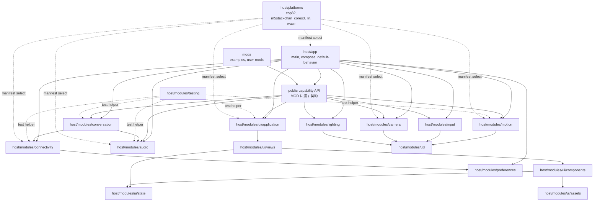

# ファームウェア再設計移行計画

作成日：2026-06-28

更新日：2026-06-30

対象：`firmware/host` と `firmware/mods` を中心とする Moddable ファームウェア。

この文書は、レビューで指摘した設計差分を、1本の移行計画として管理する。

移行後に見えた設計改善課題は [firmware-rearchitecture-followups_ja.md](./firmware-rearchitecture-followups_ja.md) にまとめる。

`[x]` は対応済み、`[ ]` は未対応を示す。

移行では後方互換を維持しない。

互換 API、互換ディレクトリ、互換アダプタを残す段階を作らない。

## 目標構成

移行後の `firmware/host` は、起動と合成、module、platform を分ける。

`firmware/mods` は、利用者向け MOD と sample MOD だけを置く。

`firmware/stackchan` は移行元としてだけ扱い、移行後の目標構成には残さない。

```text
firmware/
  mods/
    examples/
    <user-mod>/
  host/
    app/
      main.ts
      compose.ts
      manifest.json
      manifest_local.json
      default-behavior/
        behavior.ts
        manifest.json
        on-launch.ts
        on-context-created.ts
    modules/
      audio/
        manifest.json
        manifest.test.json
        manifest_wasm.json
        assets/
          sounds/
        wasm/
      camera/
        manifest.json
        manifest.test.json
      conversation/
        manifest.json
        manifest.test.json
        chat-audioio/
      connectivity/
        manifest.json
        manifest.test.json
        manifest_wasm.json
        ble/
        http-server/
        mcp-client/
        mcp-server/
        wasm/
      input/
        manifest.json
        manifest.test.json
      lighting/
        manifest.json
        manifest.test.json
      motion/
        manifest.json
        manifest.test.json
        protocols/
        servos/
      preferences/
        manifest.json
        manifest.test.json
      testing/
        manifest.json
      util/
        manifest.json
        manifest.test.json
      ui/
        manifest.json
        manifest.test.json
        assets/
          fonts/
          images/
        application/
          app-controller.ts
        views/
          main/
          splash/
          settings/
          camera-preview/
        components/
          app-bar/
          face/
          drawer/
          effects/
          bubble/
          status-bar/
        state/
          face-state.ts
    platforms/
      esp32/
      m5stackchan_cores3/
      lin/
      wasm/
```

矢印は、左の module が右の契約を使う向きを示す。

点線は、manifest による build-time の選択を示す。



## 移行計画

### 0. 方針固定

- [x] 対応済み：再設計後の本線では、旧 `Renderer` 契約を正規 API として扱わない。
- [x] 対応済み：後方互換用の adapter、deprecated API、旧 import alias を残さない方針に固定する。
- [x] 対応済み：UI は Piu `Application`、`Behavior`、`Template`、`Port`、`Skin`、`Texture` を直接使う方針に固定する。
- [x] 対応済み：移行後の merge 条件として、互換層と旧名の残存を `npm run check:legacy-names` で検出する手順を PR テンプレートへ入れる。
- [x] 対応済み：検索対象は `RendererCompat`、`renderer-`、`useRenderer`、`addDecorator`、`removeDecorator`、`robot.renderer`、`renderer.type`、`renderers-piu`、`firmware/tests` とする。

### 1. UI 層の移行

- [x] 対応済み：`firmware/stackchan/renderers-piu/renderer-compat.ts` を削除する。
- [x] 対応済み：`RendererCompat is a temporary adapter` の deprecated 警告が出る実装経路を削除する。
- [x] 対応済み：旧 `firmware/stackchan/main.ts` から renderer factory 経由の初期化を外し、`createAppControllerApplication` を直接呼ぶ構成へ移す。
- [x] 対応済み：`RobotUI`、`robot.ui`、`robot.drawer` を正規 API として導入する。
- [x] 対応済み：実装から `robot.renderer`、`useRenderer`、`addDecorator`、`removeDecorator` を削除する。
- [x] 対応済み：旧 Poco 系 renderer の tracked code を `firmware/stackchan/renderers` から削除する。
- [x] 対応済み：Piu UI 実装を旧 renderer 構造から `firmware/host/modules/ui` へ分離する。
- [x] 対応済み：分離済みの Piu UI 実装を `firmware/host/modules/ui` 配下へ移す。
- [x] 対応済み：Piu `Application` の生成と再利用を `firmware/host/modules/ui/application/app-controller.ts` に置く。
- [x] 対応済み：通常画面の実装を `firmware/host/modules/ui/views/main` に置く。
- [x] 対応済み：起動スプラッシュを `firmware/host/modules/ui/views/splash` に置く。
- [x] 対応済み：カメラプレビューを `firmware/host/modules/ui/views/camera-preview` に置く。
- [x] 対応済み：StatusBar を `firmware/host/modules/ui/components/status-bar` に置く。
- [x] 対応済み：Drawer を `firmware/host/modules/ui/components/drawer` に置く。
- [x] 対応済み：Effects を `firmware/host/modules/ui/components/effects` に置く。
- [x] 対応済み：SpeechBalloon と MultiRowBalloon を `firmware/host/modules/ui/components/bubble` に置く。
- [x] 対応済み：顔の部品、顔表示 Behavior、顔関連 skin を `firmware/host/modules/ui/components/face` に置く。
- [x] 対応済み：顔状態を `firmware/host/modules/ui/state` に置く。
- [x] 対応済み：UI 画像と UI フォントを `firmware/host/modules/ui/assets` に置く。
- [x] 対応済み：UI manifest と tsconfig から `renderer-*` alias を削除する。
- [x] 対応済み：`renderer` preference と config 名を `ui` へ置き換える。
- [x] 対応済み：default mod と sample mod の UI 呼び出しを `robot.ui.addEffect`、`robot.ui.removeEffect`、`robot.ui.setFace`、`robot.drawer` へ更新する。
- [x] 対応済み：`firmware/docs/api.md` と `firmware/docs/api_ja.md` の公開 API 説明を Renderer から RobotUI へ更新する。
- [x] 対応済み：設定画面の Piu 構築を app default behavior から `firmware/host/modules/ui/views/settings` へ移す。
- [x] 対応済み：`firmware/host/modules/ui/views/settings/settings-view.test.ts` を追加する。
- [x] 対応済み：`FaceContext` 名を view backed な `FaceState` へ置き換える。
- [x] 対応済み：顔状態を plain object ではなく Moddable の view 定義に寄せる。
- [x] 対応済み：`emotion` を文字列ではなく数値 enum として扱う。
- [x] 対応済み：theme 色の内部表現を `ColorRGB` 構造体に固定する。
- [x] 対応済み：Piu 境界でだけ `ColorRGB` を `0xRRGGBB` または `#rrggbb` へ変換する。
- [x] 対応済み：呼吸などの周期更新で `coordinates` を毎フレーム更新しない実装へ変える。
- [x] 対応済み：絵文字の描画更新を `Port`、`Texture`、必要最小の `invalidate` に寄せる。
- [x] 対応済み：標準顔の目は `Shape` と `Outline` で旧実装の表情形状を保ち、標準顔の口は固定領域の `Port` 描画に寄せる。
- [x] 対応済み：DogFace の眉、鼻、口は `Shape` と `Outline` で旧実装の曲線表現を保ち、量子化した path cache で更新する。
- [x] 対応済み：吹き出しの背景描画を `Texture`、`Skin` cache、`Port`、必要最小の `invalidate` に寄せる。
- [x] 対応済み：毎フレーム `new Skin()`、`new Style()`、`Label.string` 更新が発生しないことを確認する。
- [x] 対応済み：標準顔、DogFace、ImageFace の表情は Stack-chan の core 機能として扱い、描画最適化より visual parity を優先する受け入れ条件を追加する。
- [x] 対応済み：標準顔の目の既定色を旧実装と同じ白へ戻し、`FaceState.theme.primary` が実際の描画色へ反映される `Shape` と共有 `Skin` を使う。
- [x] 対応済み：lin で `Shape` の数値色 `Skin` が白ではなくシアンに見える退行を修正し、顔部品の `Skin` と sprite tint は `#rrggbb` 文字列で指定する。
- [x] 対応済み：標準顔のまぶたについて、旧 Shape 実装にあった `ANGRY`、`SAD`、`HAPPY`、`SLEEPY` の形状変化を復活させる。
- [x] 対応済み：DogFace の口を旧 `Outline.CanvasPath` の曲線表現へ戻す。
- [x] 対応済み：DogFace の眉、鼻、口について、旧 Shape 実装から失われた曲線、傾き、感情表現を復活させる。
- [x] 対応済み：呼吸、瞬き、サッケードを標準顔、DogFace、ImageFace に適用するデフォルトモーションへ戻す。
- [x] 対応済み：AppController 配下の実 Piu timer で `FaceBehavior` が動くことを `lin/m5stack` の Moddable test で検証する。
- [x] 対応済み：呼吸の移動量を整数ピクセルの目標 offset 差分にし、lin で小数 `moveBy` が丸め落とされても動きが消えないようにする。
- [ ] 未対応：呼吸、瞬き、サッケードのデフォルト有効範囲を手動確認結果から調整する。
- [x] 対応済み：UI performance の architecture check は `Shape` と `Outline` の一律禁止ではなく、hot path の allocation を抑える条件へ書き換える。
- [x] 対応済み：表情部品では `Shape` と `Outline` を許可し、禁止対象を `onTimeChanged` と高頻度 `onFaceState` 内の `new Outline.CanvasPath()`、`Outline.fill()`、`Outline.stroke()`、`new Skin()` に限定する。
- [x] 対応済み：連続値で変化する `open`、`eye.open`、感情表現は段階量子化し、量子化キーごとの path cache で再描画時の allocation を抑える。
- [x] 対応済み：色変更は palette と `Skin` cache の再利用で扱い、通常フレームでは `Skin` を作り直さない。
- [x] 対応済み：標準顔と DogFace は固定描画領域内の更新に寄せ、表情変化に伴う ui relocation を発生させない。
- [x] 対応済み：Bubble は texture atlas、`Skin` cache、`Port` 描画で置き換える。
- [x] 対応済み：Outline を使った Emoticon は sprite atlas と `Port` 描画へ置き換える。
- [x] 対応済み：Shape Mouth の再描画に伴う ui relocation は、標準顔の口を固定領域の `Port` 描画へ移して解消する。

### 2. アプリケーション層の分離

- [x] 対応済み：`firmware/host/app` を作成する。
- [x] 対応済み：トップレベルの実装ディレクトリを `firmware/stackchan` から `firmware/host` へ移す。
- [x] 対応済み：移行後の build、manifest、import から `firmware/stackchan` への参照を取り除く。
- [x] 対応済み：`firmware/stackchan/main.ts` を `firmware/host/app/main.ts` と `firmware/host/app/compose.ts` へ分ける。
- [x] 対応済み：`app/main.ts` は起動順序、manifest の選択、エラーハンドリングだけを持つ。
- [x] 対応済み：`app/compose.ts` は module の生成と依存注入だけを持つ。
- [x] 対応済み：ドライバ、TTS、UI、入力、センサ、LED、Wi-Fi、WASM、MOD の選択処理を root `main.ts` から移す。
- [x] 対応済み：`config.wasm` の runtime branch を app layer から取り除く。
- [x] 対応済み：WASM、lin、ESP32 の差分を platform manifest の include と modules で表す。
- [x] 対応済み：`firmware/stackchan/manifest*.json` を `firmware/host/app/manifest*.json` へ移す。
- [x] 対応済み：`firmware/package.json` の build、smoke、test script を新しい app manifest へ更新する。
- [x] 対応済み：製品既定動作を `firmware/host/app/default-behavior` に置く。
- [x] 対応済み：`firmware/stackchan/default-mods` を app default behavior へ移し、MOD ディレクトリを利用者向け拡張とサンプルに限定する。

### 3. Robot Facade の分解

- [x] 対応済み：`firmware/host/app/runtime-context.ts` が driver、TTS、input、camera、LED、drawer、face、motion を直接抱える構造を解消する。
- [x] 対応済み：Face、Motion、Audio、Input、Lighting、Camera、Conversation、Connectivity の公開契約を個別に定義する。
- [x] 対応済み：`Robot` は互換 Facade として残さず、新しい app composition の戻り値または context 型へ置き換える。
- [x] 対応済み：MOD へ渡す API を `Robot` の肥大化ではなく、必要な capability を束ねた型として再定義する。
- [x] 対応済み：Drawer と Face は UI capability として公開し、motion や audio から直接参照しない。
- [x] 対応済み：product default behavior は `Robot` のメソッド追加ではなく、app の振る舞いとして登録する。

### 4. Modules 構造の作成

- [x] 対応済み：`firmware/host/modules/audio` を作成し、`manifest.json` と `manifest.test.json` を置く。
- [x] 対応済み：`firmware/host/modules/camera` を作成し、`manifest.json` と `manifest.test.json` を置く。
- [x] 対応済み：`firmware/host/modules/conversation` を作成し、`manifest.json` と `manifest.test.json` を置く。
- [x] 対応済み：`firmware/host/modules/connectivity` を作成し、`manifest.json` と `manifest.test.json` を置く。
- [x] 対応済み：`firmware/host/modules/input` を作成し、`manifest.json` と `manifest.test.json` を置く。
- [x] 対応済み：`firmware/host/modules/lighting` を作成し、`manifest.json` と `manifest.test.json` を置く。
- [x] 対応済み：`firmware/host/modules/motion` を作成し、`manifest.json` と `manifest.test.json` を置く。
- [x] 対応済み：`firmware/host/modules/preferences` を作成し、`manifest.json` と `manifest.test.json` を置く。
- [x] 対応済み：`firmware/host/modules/testing` を作成し、共有 fake と test helper を置く。
- [x] 対応済み：`firmware/host/modules/util` を作成し、`manifest.json` と `manifest.test.json` を置く。
- [x] 対応済み：module 群は `firmware/stackchan/components` ではなく `firmware/host/modules` に置く。
- [x] 対応済み：各 module は実装、manifest、test、test manifest、専用 fake を同じディレクトリに持つ。
- [x] 対応済み：二つ以上の module で使う fake timer、fake transport、fake provider、fake Piu event は `modules/testing` に置く。

### 5. Motion の移行

- [x] 対応済み：`firmware/stackchan/drivers` を `firmware/host/modules/motion` へ移す。
- [x] 対応済み：`scservo`、`rs30x`、`dynamixel` を `modules/motion/protocols` へ分ける。
- [x] 対応済み：首の pan、tilt、torque、追従制御を `modules/motion` の controller 層に置く。
- [x] 対応済み：低レイヤの送受信待ちから `Promise` queue を取り除く。
- [x] 対応済み：低レイヤの送受信待ちは callback、待ち slot、timeout state で表す。
- [x] 対応済み：上位 API が待ち合わせを必要とする場合だけ、app 境界で callback を `Promise` に変換する。
- [x] 対応済み：fake motion driver と fake timer を追加し、Node test と lin build で motion controller の状態遷移を検証する。

### 6. Audio の移行

- [x] 対応済み：`firmware/stackchan/speeches` を `firmware/host/modules/audio` へ移す。
- [x] 対応済み：`firmware/stackchan/microphone.ts` を `firmware/host/modules/audio` へ移す。
- [x] 対応済み：`firmware/stackchan/tone.ts` を `firmware/host/modules/audio` へ移す。
- [x] 対応済み：`firmware/stackchan/transcriptions` を `firmware/host/modules/audio` へ移す。
- [x] 対応済み：`firmware/stackchan/assets/sounds` を `firmware/host/modules/audio/assets/sounds` へ移す。
- [x] 対応済み：`firmware/stackchan/wasm` の音声 stub を `firmware/host/modules/audio/wasm` へ移す。
- [x] 対応済み：TTS provider ごとの実装ファイルは維持し、audio module の manifest で選択する。
- [x] 対応済み：ストリーミング再生と再生完了通知を callback 契約へ統一する。
- [x] 対応済み：`onPlayed` と `onDone` の通知方向は維持し、`stream()` の戻り値へ完了制御を集めない。
- [x] 対応済み：録音 buffer と再生 buffer の所有者を型または契約で明示する。
- [x] 対応済み：大きい `ArrayBuffer` を多段でコピーしないことを audio test で確認する。
- [x] 対応済み：`m5stack_fire` では旧 `pins/audioin` と `embedded:io/audio/in` の native 名衝突を避けるため、manifest で `embedded:io/audio/in` を platform adapter に差し替える。

### 7. Conversation の移行

- [x] 対応済み：`firmware/stackchan/services/chat.ts` を `firmware/host/modules/conversation` へ移す。
- [x] 対応済み：`firmware/stackchan/dialogues` を `firmware/host/modules/conversation` へ整理する。
- [x] 対応済み：旧 provider demo は core から外し、会話デモとして残すものだけを `firmware/mods/examples` へ移す。
- [x] 対応済み：コアの会話実装は Moddable の `ChatAudioIO` を第一候補にする。
- [x] 対応済み：手製の会話 loop を新規に増やさない。
- [x] 対応済み：MCP tool 呼び出しは conversation から connectivity への明示依存として表す。
- [x] 対応済み：transcript と tool call の状態を conversation module の状態として扱う。

### 8. Connectivity の移行

- [x] 対応済み：`firmware/stackchan/services/http-server` を `firmware/host/modules/connectivity` へ移す。
- [x] 対応済み：`firmware/stackchan/services/mcp-client` と `firmware/stackchan/services/mcp-server` を `firmware/host/modules/connectivity` へ移す。
- [x] 対応済み：`firmware/stackchan/network-service.ts` を `firmware/host/modules/connectivity` へ移す。
- [x] 対応済み：`firmware/stackchan/services/preference-server.ts` を `firmware/host/modules/connectivity` へ移す。
- [x] 対応済み：`firmware/stackchan/services/wasm` の network/preference stub を `firmware/host/modules/connectivity/wasm` へ移す。
- [x] 対応済み：`firmware/stackchan/ble` を `firmware/host/modules/connectivity` へ移す。
- [x] 対応済み：ネットワーク接続とプロトコル処理を app 起動処理から外す。
- [x] 対応済み：接続状態は callback で通知する。
- [x] 対応済み：再接続と timeout は状態機械として実装する。
- [x] 対応済み：fetch を使う外部 API 境界では `Promise` を許容する。
- [x] 対応済み：内部イベント通知では `Promise` ではなく callback を使う。

### 9. Input、Lighting、Camera、Preferences、Util の移行

- [x] 対応済み：`firmware/stackchan/touch*` と `firmware/stackchan/imu*` を `firmware/host/modules/input` へ移す。
- [x] 対応済み：touch、touch panel、IMU の入力 callback を短い `InputEvent` へ正規化する。
- [x] 対応済み：`robot.button` の公開 API を `read()` 付き raw object ではなく `ButtonInputEvent` へ置き換える。
- [x] 対応済み：MOD 境界に公開される `robot.button.read()`、`touchPanel.sample()`、`imu.sample()` を event callback API へ置き換える。
- [x] 対応済み：`globalThis.button` を直接参照する起動時設定経路を設定 view の command へ置き換える。
- [x] 対応済み：入力の polling で `Timer.repeat(async () => ...)` を使わない。
- [x] 対応済み：`firmware/stackchan/led` を `firmware/host/modules/lighting` へ移す。
- [x] 対応済み：py32 差分を lighting module の platform manifest または module 内部差分として扱う。
- [x] 対応済み：`firmware/stackchan/camera.ts` を `firmware/host/modules/camera` へ移す。
- [x] 対応済み：camera の実機実装、WASM stub、lin stub を platform manifest で切り替える。
- [x] 対応済み：`firmware/stackchan/utilities` を `firmware/host/modules/util` と `firmware/host/modules/preferences` へ分ける。
- [x] 対応済み：数学系 helper は `modules/util` に置く。
- [x] 対応済み：`loadPreferences` と設定 schema は `modules/preferences` に置く。
- [x] 対応済み：`loadPreferences` を直接呼ぶ場所を app と preferences に限定する。
- [x] 対応済み：module 内で設定を読む必要がある場合は、app から注入された config を使う。
- [x] 対応済み：sample MOD が直接 preference を読む境界を許可するか、注入 config に寄せるかを決める。

### 10. Platform 層の分離

- [x] 対応済み：`firmware/host/platforms/wasm` を作成する。
- [x] 対応済み：`firmware/host/platforms/lin` を作成する。
- [x] 対応済み：`firmware/host/platforms/esp32` を作成する。
- [x] 対応済み：`firmware/host/platforms/m5stackchan_cores3` を作成する。
- [x] 対応済み：module 固有ではない WASM platform 差分を `firmware/host/platforms/wasm` へ移す。
- [x] 対応済み：通常コードから WASM 専用 import を取り除く。
- [x] 対応済み：platform 差分を TypeScript の runtime branch ではなく manifest の include、modules、platforms で表す。
- [x] 対応済み：ESP32 target ごとの差分を platform manifest で表し、app composition に混ぜない。
- [x] 対応済み：`m5stack_fire` の audio input 差分を app composition ではなく audio module の platform manifest で表す。

### 11. MOD と sample の整理

- [x] 対応済み：変更対象になった default mod と sample mod の Renderer API 呼び出しを RobotUI API へ更新する。
- [x] 対応済み：`firmware/mods` を利用者向け MOD と sample だけを置く場所にする。
- [x] 対応済み：sample MOD を `firmware/mods/examples` へ移す。
- [x] 対応済み：product default behavior を `firmware/mods` から `firmware/host/app/default-behavior` へ移す。
- [x] 対応済み：古い provider demo を core 依存から切り離す。
- [x] 対応済み：MOD API の公開面を capability 単位で再定義し、旧 `Robot` 互換 API を残さない。

### 12. テスト配置と実行方法の移行

この節では、テストを移動して実行できる状態と、振る舞いを保証する状態を分けて扱う。

ソースコード文字列の正規表現検査は、移行漏れ検出または構成検査であり、振る舞いテストとして数えない。

- [x] 対応済み：`firmware/tests` の内容を対象 module または UI ディレクトリへ移す。
- [x] 対応済み：`firmware/tests/unit` の内容を対象 module または UI ディレクトリへ移す。
- [x] 対応済み：集約テストディレクトリとしての `firmware/tests` を削除する。
- [x] 対応済み：各 module と UI view に `manifest.test.json` を置く。
- [x] 対応済み：各 `manifest.test.json` は本体の `manifest.json` と `modules/testing/manifest.json` を include する。
- [x] 対応済み：テスト用 `modules.main` は同じディレクトリの `*.test.ts` または `*.test.js` を読む。
- [x] 対応済み：成功時は `ok` を trace し、失敗時は例外を throw する。
- [x] 対応済み：合否判定は `mcconfig -m -d -p <platform> -t build` で生成した `mcsim` を xsbug ログ監視で実行し、`ok` trace と例外 marker で行う。
- [x] 対応済み：`trace("not ok ...")` を合否判定に使わない。
- [x] 対応済み：Node.js の `node:test` は移行補助と pure helper の検証に限定する。
- [x] 対応済み：`mcconfig -m -d -p lin/m5stack -t run` は現在の lin/m5stack makefile に存在しないため、正規手順から外す。
- [x] 対応済み：移行後の正規テスト判定は `npm run test:moddable` に寄せる。
- [x] 対応済み：CI は `firmware/host/modules/**/manifest.test.json` を列挙して実行する。
- [x] 対応済み：CI は `firmware/host/modules/ui/**/manifest.test.json` を列挙して実行する。
- [x] 対応済み：Piu の Application や描画イベントを使うテストは `lin/m5stack` を既定にする。
- [x] 対応済み：画面を使わない純粋ロジックは `lin` で実行できるようにする。
- [x] 対応済み：実機依存の確認は unit test ではなく smoke として分ける。
- [x] 対応済み：`firmware/host/modules/ui/views/splash/splash-view.test.ts` のソース文字列 assert を棚卸しし、振る舞いテスト、manifest 構造検査、移行漏れ検査へ分類し直す。
- [x] 対応済み：起動スプラッシュと起動時選択について、`assert.match(source, ...)` と `assert.doesNotMatch(source, ...)` で実装行を追認しているテストを、振る舞いテストの達成条件から外す。
- [x] 対応済み：`$MODDABLE/documentation/xs/xst.md`、`$MODDABLE/xs/tools/xst.c`、`$MODDABLE/tests` 配下の既存テストを読み、`$DONE`、`$DO`、`$TESTMC.timeout`、async module の扱いを確認したうえで、今回の対象は Node.js の pure helper test と `mcconfig` 生成 `mcsim` の Piu test へ分類する。
- [x] 対応済み：Moddable API に依存するテストは、`xst` で足りるもの、`mcconfig` で生成した `mcsim` が必要なもの、実機 smoke に回すものへ分ける。
- [x] 対応済み：起動時選択の待ち合わせを `app-default-behavior/startup-choice` のような明示的な module 識別子で import できる単位へ切り出す。
- [x] 対応済み：起動時選択テストでは fake timer、fake Application、fake splash hook を注入し、3秒後の自動 boot、タッチ時の settings 遷移、二重 resolve の抑止、選択後の後始末を検証する。
- [x] 対応済み：起動スプラッシュのテストでは `showStartupSplash` の戻り値、Piu tree、Label 表示、touch callback を `lin/m5stack` の test manifest 上で検証し、`new Application` や `new Label` の文字列検査に依存しない。
- [x] 対応済み：WASM default behavior のテストでは、manifest が解決する module 識別子と起動 hook の呼び出し結果を検証し、`app-default-behavior/wasm/on-launch` という文字列の有無だけを合否にしない。
- [x] 対応済み：Moddable に依存しない pure helper は Node.js でテストしてよいが、相対パス import ではなく manifest と同じ module 識別子を解決する loader または alias 設定を用意する。
- [x] 対応済み：Node.js テストで Moddable global、Timer、Piu、Modules、Preference を扱う場合は、明示的な mock を注入し、実装ファイルの文字列走査で代用しない。
- [x] 対応済み：構成検査として残すソース文字列検査は `check:legacy-names` または architecture lint に寄せ、振る舞いテストと別の名前で CI に表示する。
- [x] 対応済み：書き換え後のテストを `npm run test:unit`、`npm run test:moddable`、必要に応じて `xst` 直接実行で検証し、PR の Validation に分けて記録する。
- [ ] 未対応：`npm run test:moddable` の既定列挙対象に `host/app` の runnable `manifest.test.json` を含める。
- [ ] 未対応：sample MOD の `manifest.test.json` を CI 対象に含めるか、手動対象として扱うかを決め、`npm run test:moddable` と文書の説明を一致させる。
- [ ] 未対応：Piu を使う `host/app` と sample MOD の Moddable test は、`lin` ではなく `lin/m5stack` で実行する条件を `run-module-tests.js` に入れる。
- [ ] 未対応：production manifest の `app-default-behavior/*` を明示的な module specifier の列挙へ置き換える。
- [ ] 未対応：production manifest が `*.test.ts`、`*.architecture.ts`、`__tests__` を解決対象に含む場合に失敗する architecture check を追加する。
- [ ] 未対応：`*.test.ts` に残っている manifest 固定テストを `*.architecture.ts` または manifest preflight へ移す。

### 13. 非同期境界の移行

- [x] 対応済み：Timer、Piu Behavior、driver、input handler の中で新規 `async` 関数を使わない。
- [x] 対応済み：低レイヤの待ち合わせは callback と状態 enum で進める。
- [x] 対応済み：戻り値に `Promise` を返す関数は network fetch、外部 API、app 境界、test helper に限定する。
- [x] 対応済み：周期更新する状態は固定構造を再利用する。
- [x] 対応済み：毎フレーム動く処理で object を生成しない。
- [x] 対応済み：色、感情、状態は内部で数値として扱う。
- [x] 対応済み：ログ、設定ファイル、Piu 描画、表示文字列へ出す境界でだけ文字列へ変換する。
- [x] 対応済み：継続可能な状態変化（servo command busy、wait slot 重複、任意ハードウェア初期化失敗）は例外ではなく戻り値または callback で通知する。
- [x] 対応済み：module 境界の同期エラーは motion protocol の `onError` や PY32 の `tryGet...` callback で通知し、設定不備や構築 invariant の例外だけを残す。

### 14. 旧文書と参照の整理

- [x] 対応済み：`firmware/docs/api.md` と `firmware/docs/api_ja.md` の Renderer API 記載を RobotUI API へ更新する。
- [x] 対応済み：`docs/piu-renderer.md` を削除または新 UI 設計文書へ置き換える。
- [x] 対応済み：`docs/piu-renderer_ja.md` を削除または新 UI 設計文書へ置き換える。
- [x] 対応済み：`firmware/docs/0002-image-face.md` の旧 renderer 前提を削除または更新する。
- [x] 対応済み：`firmware/face-context-as-views.md` を `FaceState` 方針に合わせて削除または更新する。
- [x] 対応済み：`firmware/piu-faster.md` を UI performance 方針として統合する。
- [x] 対応済み：`CLAUDE.md` の旧構成参照を削除または更新する。
- [x] 対応済み：`renderer.type`、`renderers-piu`、旧 renderer API を説明する残存文書を削除または更新する。
- [x] 対応済み：tracked tree に旧 `firmware/stackchan/renderers` と旧 `firmware/stackchan/renderers-piu` が残っていないことを確認する。
- [x] 対応済み：ローカルに空ディレクトリが残る場合でも、manifest、import、document から参照しない。
- [ ] 未対応：`firmware/chat.md` の `Robot/Mod`、`FaceContext`、旧 `tests/chats/` 前提を `StackchanContext`、capability API、移行後の test 配置へ更新する。

### 15. 検証

- [x] 対応済み：UI 互換層削除後に `npm run format` を実行する。
- [x] 対応済み：UI 互換層削除後に `npm run lint` を実行する。
- [x] 対応済み：UI 互換層削除後に `npm run test:unit` を実行する。
- [x] 対応済み：UI 互換層削除後に `npm run build:wasm` を実行する。
- [x] 対応済み：UI 互換層削除後に `npm run smoke:lin` を実行する。
- [x] 対応済み：UI 互換層削除後に web 側の `npm test` を実行する。
- [x] 対応済み：UI 互換層削除後に変更対象 MOD の mcrun を実行する。
- [x] 対応済み：UI 互換層削除後に lin 向け manifest 群の build を確認する。
- [x] 対応済み：module 移行後に `npm run format` を再実行する。
- [x] 対応済み：module 移行後に `npm run lint` を再実行する。
- [x] 対応済み：module 移行後に `npm run test:unit` を再実行する。
- [x] 対応済み：module 移行後に `npm run build:wasm` を再実行する。
- [x] 対応済み：module 移行後に `npm run smoke:lin` を再実行する。
- [x] 対応済み：module 移行後に web 側の `npm test` を再実行する。
- [x] 対応済み：module 移行後に `firmware/host/modules/**/manifest.test.json` をすべて実行する。
- [x] 対応済み：module 移行後に `firmware/host/modules/ui/**/manifest.test.json` をすべて実行する。
- [x] 対応済み：module 移行後に対象 ESP32 board の build を実行する。
- [x] 対応済み：module 移行後に changed MOD と sample MOD の `mcrun -t build` を実行する。
- [x] 対応済み：module 移行後に旧 API 検索を実行し、許可した移行計画文書と検査テスト以外に旧名が残らないことを確認する。
- [x] 対応済み：`npm run check:legacy-names` で検出される旧 renderer 文書と generated API docs を削除または更新する。
- [x] 対応済み：ソースコード文字列の追認に依存している UI 起動テストを振る舞いテストへ置き換えた後で、`npm run test:unit`、`npm run test:moddable`、必要な `xst` 検証を再実行する。
- [x] 対応済み：描画復元後に対象ファイルの `npx biome lint` を実行する。
- [x] 対応済み：描画復元後に `npm run check:architecture` を実行する。
- [x] 対応済み：描画復元後に `npm run test:unit` を実行する。
- [x] 対応済み：描画復元後に `host/modules/ui/components/face/__tests__/face-rendering/manifest.test.json` を `lin/m5stack` で実行し、標準顔、DogFace、ImageFace の描画状態と実 Piu timer による呼吸、瞬きを検証する。
- [x] 対応済み：描画復元後に `npm run test:moddable -- host/modules/ui` を実行し、UI 配下の Moddable test manifest を `lin/m5stack` で検証する。
- [x] 対応済み：描画復元後に `npm run smoke:lin` を実行する。
- [x] 対応済み：描画復元後に `npm run build:wasm` を実行する。
- [ ] 未対応：ユーザーの手元の `lin/m5stack` で標準顔、DogFace、ImageFace を表示し、既定色、口形状、呼吸、瞬き、サッケードを目視で確認する。
- [x] 対応済み：表示退行を検出するため、`lin/m5stack` の描画状態を使った visual smoke を追加する。

### 16. Merge 条件

注：移行計画の完遂後も、`develop` へのマージは行わず、PR の作成までを作業範囲とする。

- [x] 対応済み：app layer が module の生成と接続だけを行っている。
- [x] 対応済み：`Robot` が全機能を抱える Facade ではなくなっている。
- [x] 対応済み：Piu が `Renderer` 互換層を経由していない。
- [x] 対応済み：Piu Application、View、Drawer、StatusBar、Bubble、Effects、Face が `firmware/host/modules/ui` 配下にある。
- [x] 対応済み：各機能の本体、単体テスト、test manifest が同じ module または UI ディレクトリにある。
- [x] 対応済み：`firmware/tests` が存在しない。
- [x] 対応済み：低レイヤの Timer、描画、入力、driver 処理に新規 `async` と `Promise` が入っていない。
- [x] 対応済み：platform 差分が manifest で切り替わる。
- [x] 対応済み：通常コードに WASM 専用 import が混ざっていない。
- [x] 対応済み：後方互換用の import alias、deprecated API、移行 adapter が残っていない。
- [x] 対応済み：lin unit、lin smoke、web test、WASM build、対象 ESP32 build が通っている。
- [x] 対応済み：起動スプラッシュと起動時選択のテストが、ソースコード文字列の追認ではなく実行時の振る舞いを検証している。
