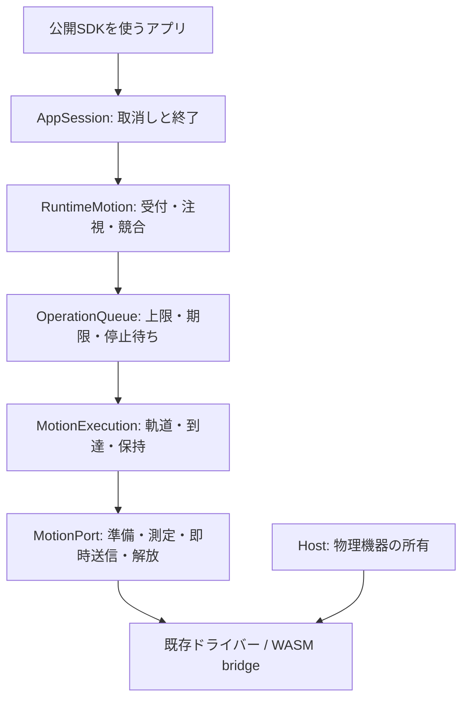
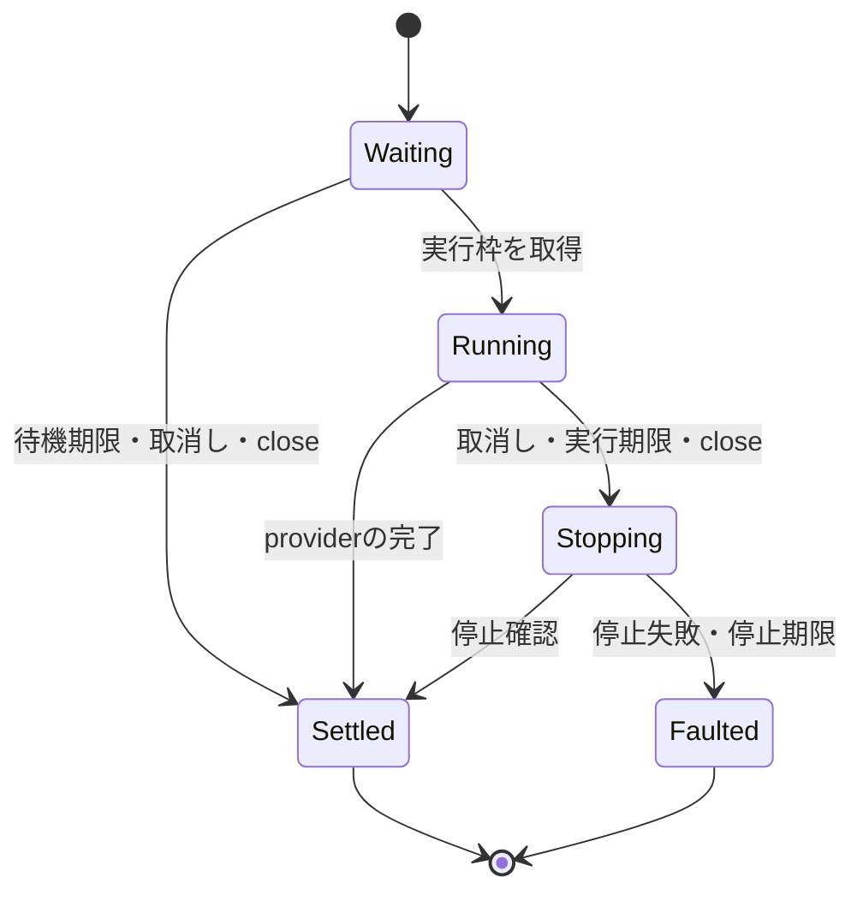

# 動作の完了・取消しとドライバーの所有

レビューのF1〜F4・F9を進めるための実装記録。V2の `motion.move`、実測と推定の完了、注視と単発移動の調停をAppSessionへ接続した。V1の全MOD移行と実機受入は未完了である。

## V2の責務と公開契約

SDKの正本は `firmware/sdk/motion.ts`。公開角度は `yawDeg` / `pitchDeg`、時間は `durationMs` / `timeoutMs` とし、内部のradianと秒、UARTの時間表現を外へ出さない。対象とoptionsを受付時にコピーして検証し、可動域外や未対応の実測要求を移動開始前に拒否する。

- 実行時にportを準備し、初期位置を取得してからsine補間を始める。経過時間を使い、0msでも最終指令を送る。フレームの前の書き込みが終わるまで次の書き込みを始めない。Promiseは操作全体に置き、軌道・保持用のRotationバッファとエンジンのdriver callbackを再利用する。
- `estimated` は軌道の最終指令の送信完了。`measured` はその後の新しい位置測定で、両軸が±1°以内に50ms以上離れた2回連続で入った状態を表す。速度や負荷、機構の整定までは保証しない。
- `completion: 'measured'` は実測必須。省略時と `'trajectory'` では推定完了も許容するが、実測できるドライバーは到達確認まで待つ。
- 軌道時間は0〜60秒。実行期限は準備を含め、初期値は軌道時間+5秒、上限120秒。待機列は共通キューの8件・30秒に制限する。
- 注視先は最新の一つだけを保持する。進行中の注視へ変更が続いても待機列を増やさず、終了時に最新の値を使う。単発移動が入ると進行中の注視を取り消し、停止後に単発移動を始める。単発の待機列が空になると注視を復帰する。到達済みの同じ注視を繰り返し送信しない。

取消し時は未完了のI/O callbackを待ち、停止時の位置を読み、保持指令を送る。実測機種は保持の到達も確認する。推定機種は最後の指令位置を使う。取消し後の保持は2秒の期限を持ち、失敗・期限切れではportとキューを再利用しない。期限後のcallbackと古いTimerは後続操作を開始できない。

AppSessionの協調タスクは取消し時にアプリへ早くrejectを返す場合がある。それでもサービスの実行枠は停止中に保持する。`motion.stop()` は注視と待機を解除して停止を待ち、成功時に新しい受付を可能にする。AppSessionのcloseは別途motionのcloseを待つため、任意のアプリPromiseの終了に依存して機器を引き渡すことはない。機器のトルク解除にも2秒の期限を設け、失敗してもdetachと残りのホスト解放を試みる。

V2起動前に旧MotionControllerを閉じ、V2のスケジューラーと並行させない。rawドライバーの所有はHostに残す。全V1直接参照、ホットスワップ、既定動作のAppSession移行は別途必要である。

## 機種ごとのport

| 機種 | 完了 | 接続方法と差分 |
| --- | --- | --- |
| PWM | estimated | 共通軌道から即時位置だけを書き、旧ドライバー内の時間補間を重ねない。offsetを考慮した可動域。トルク解除を持たない |
| SCServo / RS30X | measured | 読み取り・保持・トルク投入を準備にまとめ、各軌道の書き込み完了と新しい位置をcallbackで取得 |
| M5StackChan | measured | 校正とraw上限から可動域を取得。必要なPY32電源が未検出ならunavailable。外部電源は明示的なnone設定を使う |
| DYNAMIXEL | measured | 既存の自動制御周期を止め、進行中の制御を待ってから専用操作権を渡す。解放後は最後の目標を保持する自動制御を再開 |
| WASM | estimated / simulated | privateなブラウザーdriverへC bridge経由で構造化した値を送信。利用先がなければunavailable、送信失敗はError |
| native none | unavailable | 旧no-opをV2の成功として公開しない |

SCServoの読み取りの中心を、既存の書き込みと同じ100°に修正した。M5StackChanの測定はraw位置を直接角度へ変換し、実際には範囲外の位置をclampして目標へ到達したように扱わない。両変更は旧読み取りAPIにも影響するため、機構の校正と可動域を実機で確認する必要がある。

DYNAMIXELの準備はトルクを切った初期化と実際の位置での保持を経てトルクを入れる。旧既定目標2048へ動かしてから開始する構造を避け、専用の読み取りで新しいサンプルを得る。操作権の世代を解除後に進め、遅れて来た保持や初期化の応答からトルクを再投入しない。物理UARTの停止・復旧条件は [ServoBusの契約](servo-bus-lifecycle.md) を併せて使う。

WASMのブラウザー受入で、Moddable 9.5の `Time.ticks` が未実装のため軌道時間が進まない問題を検出した。共通の `clock-ticks` 入口をmanifestで解決し、WASMでは `emscripten_get_now()`、nativeでは既存のTimeを使用する。教材へ環境分岐を置かない。ESP32の32bit wrapは差分計算で処理する。desktopの既存Timeが壁時計を使う点は残り、時計変更の影響の除去は今後のplatform時刻統一に含める。

## 停止を待ってから資源を渡す

`OperationQueue.run(start, cancel, signal)` の `cancel` は `void | Promise<void>` を返す。同期の停止はその戻り、非同期の停止はPromiseの成功を資源解放の確認とする。停止中は実行枠を保持し、次の操作を開始しない。

- 初期値は待機8件、待機期限30秒、実行期限120秒、停止期限5秒。停止期限は `cancellationTimeoutMs` で1〜60,000msに設定できる。待機中の操作の期限は、前の操作が停止中でも進む。
- 取消しに入った操作は、元のproviderが後から成功しても成功へ戻らない。重複取消しは停止を再実行せず、解放済みの期限コールバックも後続操作へ影響しない。
- 停止が失敗した場合はキューを終端状態にし、待機中の操作も失敗させる。停止期限を超えた後に停止応答が届いても、キューは再利用しない。
- 取消された操作は最初の取消し理由で失敗する。停止自体の失敗は待機中の操作と `close()` から観測できる。これにより、利用者の取消し理由と、所有者が扱う機器回収の失敗を混同しない。
- `close()` は新規受付を直ちに止め、進行中の停止が完了するまで待つ。同じPromiseを返し、停止処理からの再入にも対応する。内部利用者もこのPromiseを待つ。音声runtimeの終了処理は、キュー終了を待ってから機器を閉じる構成を既に使用している。
- 所有者終了は `CLOSED`、再利用可能なmotionの明示停止は `CANCELLED` を理由にキューを閉じる。最初のcloseの理由を保持する。motionは停止中の受付を `BUSY` とし、停止後に新しいキューを作る。停止失敗時は能力情報も `unavailable` となる。

このキューは機器の停止方法を実装しない。provider側が、停止確認までを表すPromiseを返す必要がある。通常の成功・失敗はproviderが必要な解放を終えてから通知する契約であり、任意のPromiseの強制終了は提供しない。停止handlerから同じ所有者の `close()` を返して相互に待たせる構造は避ける。

## ドライバー交換の境界

`MotionController` はドライバーを接続するたびに世代を作る。位置取得、トルク投入、動作受付、トルク解放のcallbackと、その世代のTimerを同じ境界で無効化する。

1. 交換開始時に世代を更新し、位置取得とトルク解放のTimerを解除する。
2. 古いドライバーをdetachする。その最中に返る古い成功通知も無効となる。
3. 未完了の明示コマンドを交換のエラーで一度だけ完了させる。
4. 新しいcallback群を作り、新しいドライバーをattachする。注視先が残る場合は新しい世代のpollを開始する。

接続途中で失敗した場合は、途中までattachしたドライバーをdetachし、controllerを閉じる。最初の失敗を保持し、以後の操作は拒否する。同じドライバーの再指定ではdetach・attachを繰り返さない。

callback群の生成は接続時だけであり、pollごとの生成は増やしていない。位置と座標変換のバッファの再利用、低レベルのcallback方式も維持する。

`onDetached()` は物理的な停止確認を表す契約ではない。また、controllerはrawドライバーの所有者ではなく、raw機器のcloseはHost側の責任である。V1の任意の直接参照や、実行中の機器を安全に交換するV2サービスは引き続き対応が必要となる。

## DYNAMIXELの要求と送信済みの目標

従来はGoal Positionを書き込んだ応答を受けた時点の `goalPosition` を送信済みとして記録していた。UARTの応答待ち中に新しい目標が来ると、まだ送っていない値を送信済みと誤認し、その後も送信しない場合があった。

現在は書き込み時に目標を捕捉し、その値だけを応答後に記録する。新しい目標は次の制御周期に送る。初期位置の取得も、初期化前または初期化中に受け付けた目標を上書きしない。最初の送信前は送信済みの値を未定義とし、目標0も省略しない。

旧 `applyRotation` のcallbackは引き続き指令受付を表す。V2では前述の専用portが実際のGoal Position送信を待ち、共通エンジンが時間指定・到達・取消し後の保持を扱う。旧callbackの意味を暗黙に変更しない。

## 検証と残作業

- Nodeで、非同期停止中の排他、停止失敗・停止期限、停止待ち中の待機期限、終了への再入、期限Timerの取得失敗、遅延した完了を検証する。
- XSのruntime寿命試験で、実Timerを使う非同期停止と資源の引き渡しを100回繰り返し、Timerと取消し購読が基準に戻ることを確認する。
- XSのmotion-controller試験で100回の交換、古い位置・トルク・動作受付callback、detach内での成功通知、attach失敗のrollbackを検証する。
- XSの実DYNAMIXELプロトコルとfake Serialを使い、応答待ち中と初期化中の目標変更が実際の送信パケットへ反映されることを確認する。
- Nodeのruntime-motion試験で、軌道の最終送信、0ms、不正値、32bit wrap、2回の実測到達、非同期I/Oの停止待ち、保持失敗、注視の中断と最新値への復帰、100回の寿命を検証する。
- XSのruntime-motion試験はAppSessionと実PWMドライバーを通り、実Timerで100回の開始・終了と終了後の出力抑止を検証する。準備・取消しの深い同期callback連鎖で見つかったスタック不足は、操作開始のTimer境界で解消した。
- XSのDYNAMIXEL試験は、初期の測定位置での保持、専用操作中の自動制御停止、fresh read、目標の実送信、自動制御への復帰、取消し後の遅延ACKによるトルク再投入の抑止を検証する。
- WASMの教材受入は、生成した実ホストとMOD archiveを読み込み、ブラウザーへ届く値を既存factoryの注入境界で記録する。首振り3回の順序・最終位置・経過時間を確認する。privateなruntimeインスタンスをbrowser globalとして公開しない。

実機の停止・電源・可動域・到達、サーボの発熱・負荷・実測誤差は未検証。既定動作や全V1 MODの移行、校正を一元化するボード設定、復旧診断のUI、desktop時刻の統一、配布世代の検査は継続する。ビルド・fake Serial・WASMの成功を実機受入の代わりにはしない。最新の検証結果は [実装台帳](firmware-sdk-redesign-progress.md) に記録する。
