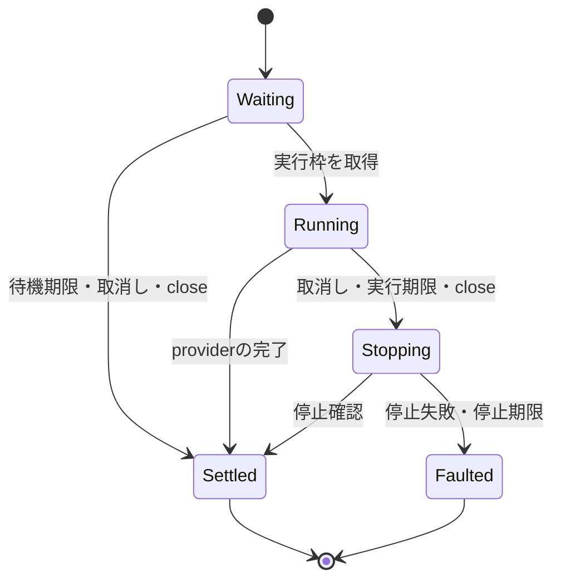

# 操作の停止待ちとmotionのドライバー世代

レビューのF2・F3・F4を進めるための実装記録。V2の `motion.move`、到達判定、注視と単発移動の調停は、この段階では未接続である。

## 停止を待ってから資源を渡す

`OperationQueue.run(start, cancel, signal)` の `cancel` は `void | Promise<void>` を返す。同期の停止はその戻り、非同期の停止はPromiseの成功を資源解放の確認とする。停止中は実行枠を保持し、次の操作を開始しない。

- 初期値は待機8件、待機期限30秒、実行期限120秒、停止期限5秒。停止期限は `cancellationTimeoutMs` で1〜60,000msに設定できる。待機中の操作の期限は、前の操作が停止中でも進む。
- 取消しに入った操作は、元のproviderが後から成功しても成功へ戻らない。重複取消しは停止を再実行せず、解放済みの期限コールバックも後続操作へ影響しない。
- 停止が失敗した場合はキューを終端状態にし、待機中の操作も失敗させる。停止期限を超えた後に停止応答が届いても、キューは再利用しない。
- 取消された操作は最初の取消し理由で失敗する。停止自体の失敗は待機中の操作と `close()` から観測できる。これにより、利用者の取消し理由と、所有者が扱う機器回収の失敗を混同しない。
- `close()` は新規受付を直ちに止め、進行中の停止が完了するまで待つ。同じPromiseを返し、停止処理からの再入にも対応する。内部利用者もこのPromiseを待つ。音声runtimeの終了処理は、キュー終了を待ってから機器を閉じる構成を既に使用している。

このキューは機器の停止方法を実装しない。provider側が、停止確認までを表すPromiseを返す必要がある。通常の成功・失敗はproviderが必要な解放を終えてから通知する契約であり、任意のPromiseの強制終了は提供しない。停止handlerから同じ所有者の `close()` を返して相互に待たせる構造は避ける。

## ドライバー交換の境界

`MotionController` はドライバーを接続するたびに世代を作る。位置取得、トルク投入、動作受付、トルク解放のcallbackと、その世代のTimerを同じ境界で無効化する。

1. 交換開始時に世代を更新し、位置取得とトルク解放のTimerを解除する。
2. 古いドライバーをdetachする。その最中に返る古い成功通知も無効となる。
3. 未完了の明示コマンドを交換のエラーで一度だけ完了させる。
4. 新しいcallback群を作り、新しいドライバーをattachする。注視先が残る場合は新しい世代のpollを開始する。

接続途中で失敗した場合は、途中までattachしたドライバーをdetachし、controllerを閉じる。最初の失敗を保持し、以後の操作は拒否する。同じドライバーの再指定ではdetach・attachを繰り返さない。

callback群の生成は接続時だけであり、pollごとの生成は増やしていない。位置と座標変換のバッファの再利用、低レベルのcallback方式も維持する。

`onDetached()` は物理的な停止確認を表す契約ではない。また、controllerはrawドライバーの所有者ではなく、raw機器のcloseはHost側の責任である。V1の任意の直接参照や、実行中の機器を安全に交換するV2サービスは引き続き対応が必要となる。

## DYNAMIXELの要求と送信済みの目標

従来はGoal Positionを書き込んだ応答を受けた時点の `goalPosition` を送信済みとして記録していた。UARTの応答待ち中に新しい目標が来ると、まだ送っていない値を送信済みと誤認し、その後も送信しない場合があった。

現在は書き込み時に目標を捕捉し、その値だけを応答後に記録する。新しい目標は次の制御周期に送る。初期位置の取得も、初期化前または初期化中に受け付けた目標を上書きしない。最初の送信前は送信済みの値を未定義とし、目標0も省略しない。

これは目標の取りこぼしを修正する変更である。旧 `applyRotation` のcallbackは引き続き指令受付を表し、DYNAMIXELの時間指定、実測による到達、取消し後の保持姿勢を保証するものではない。

## 検証と残作業

- Nodeで、非同期停止中の排他、停止失敗・停止期限、停止待ち中の待機期限、終了への再入、期限Timerの取得失敗、遅延した完了を検証する。
- XSのruntime寿命試験で、実Timerを使う非同期停止と資源の引き渡しを100回繰り返し、Timerと取消し購読が基準に戻ることを確認する。
- XSのmotion-controller試験で100回の交換、古い位置・トルク・動作受付callback、detach内での成功通知、attach失敗のrollbackを検証する。
- XSの実DYNAMIXELプロトコルとfake Serialを使い、応答待ち中と初期化中の目標変更が実際の送信パケットへ反映されることを確認する。

実機の停止・電源・可動域・到達は未検証。V2のmotion用portとAppSessionへの接続、PWMの軌道終了、各機種の位置測定と停止方法、注視の中断・復帰、能力情報、初心者向け教材と復旧表示を実装する作業が残る。キュー単体の停止試験を、これらの実装や実機受入の代わりにはしない。
