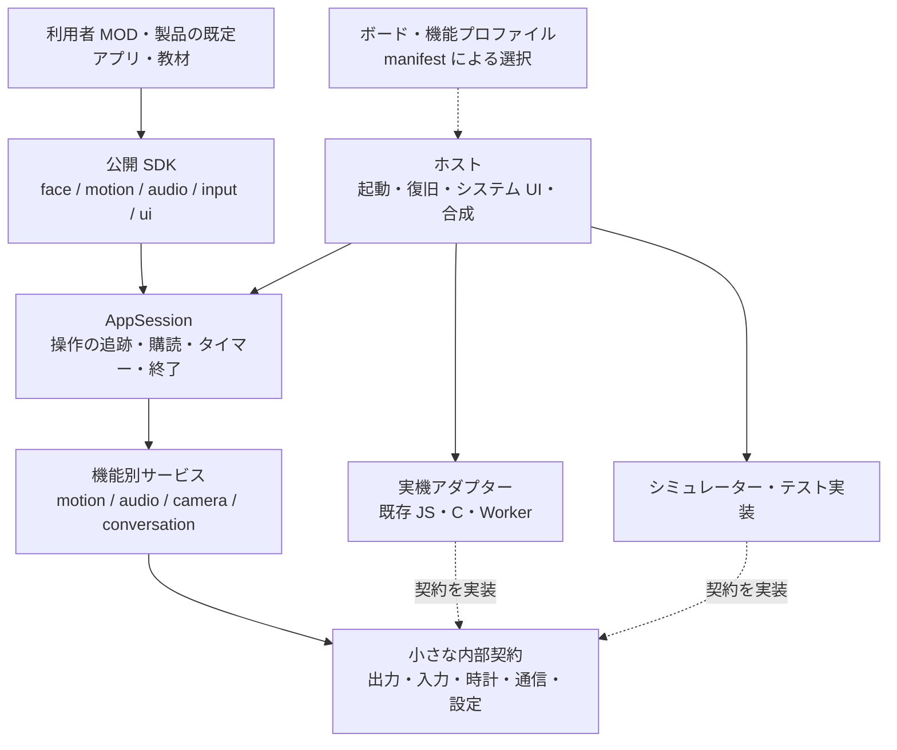

# Stack-chan firmware：アーキテクチャレビューと再設計案

2026-09-05／対象：`stack-chan/stack-chan` の `develop`、コミット `9b01df46fbf7b8126ca0e2ed5648064fa300f1be`（2026-09-01）。

このディレクトリーは他セッションから参照するための調査資料です。本文、ソース参照一覧、棚卸し、再現スクリプト、検証ログを同梱しています。リリース影響は `none` で、ファームウェアの実装・配布物を変更しないため changeset は不要です。

**提案の中心は、MOD を「ホストの内部を操作するコード」から「自分の寿命を持つ、小さなロボットアプリケーション」へ変えることです。** 公開 SDK、アプリケーションごとの資源管理、機能の契約、実機・シミュレーターの実装を分離します。Moddable／XS、Piu、既存ドライバーやネイティブ実装は活用します。

現状は、責務分離が始まっていないコードベースではありません。`app`／`modules`／`platforms`、capability の名前空間、音声再生の共通ライフサイクル、状態機械、テスト群がすでにあります。次に解くべき問題は、**分割した部品をつなぐ契約と、その契約を利用者へ届ける経路が統一されていないこと**です。

その結果、短い MOD を書くためにも「この戻り値は成功なのか」「このタイマーは誰が止めるのか」「この音声引数は文章かファイル名か」「このサンプルは実機とブラウザーの両方で動くのか」を個別に調べる必要があります。初学者の挫折との因果関係は利用者調査をしていないため仮説ですが、これらの学習負荷を生むコード上の条件は確認できます。

## 1. 対象範囲と現状の評価

Git 追跡対象の `firmware` 全体を棚卸しし、起動・合成、公開型、各 runtime、主要ドライバー、音声・会話、設定・通信、UI、MOD の入口、manifest、検査スクリプトを横断しました。既存の再設計文書も参照しましたが、過去の指摘を現行コードへそのまま転記していません。`web` は MOD 配布仕様と CI 接続の確認に限定しています。

| 棚卸し | 結果 |
|---|---:|
| `firmware` の追跡ファイル | 967 |
| 外部 vendor を除く `.ts/.js/.mjs/.c/.h` | 585ファイル、67,004行 |
| 上記のうち host 実装 | 287ファイル、36,807行 |
| テストとその補助 | 206ファイル、19,696行 |
| MOD／ミニアプリの入口 | 32ファイル（JS 27、TS 5） |
| 名前に `manifest` を含む JSON | 134 |

行数は空行・コメントを含む物理行数です。コード化された画像データも含み、重複率や複雑度を意味しません。分類方法と全結果は [inventory.py](evidence/inventory.py)、[inventory.json](evidence/inventory.json) で再現できます。

読み込みの重点は以下のとおりです。全ネイティブ処理の逐行検証、全サンプルの実機実行、各プロバイダーとの通信試験は行っていません。

| 領域 | 主に追跡した経路 |
|---|---|
| 起動・拡張 | `main → app-launch → boot-services → compose → runtime-context → behavior`、MOD／miniapp／Dock の開始と終了 |
| 公開 I/F | `capabilities`、`app-behavior`、`mini-app`、camera／TTS／motion／local-peer の型と実装 |
| 音声・会話 | runtime audio、TTS lifecycle、録音・再生、WASM 差分、ChatService、provider-dialogues、USB Dock |
| ハードウェア | MotionController、PWM／SCServo／Dynamixel／M5StackChan ドライバー、UART キュー、input、camera、LED、ボード設定 |
| UI・既定動作 | runtime UI、AppController、miniapp viewport、既定 behavior、状態更新・描画性能方針 |
| 開発体験 | サンプル入口、API／導入文書、設定優先順位、manifest 合成、TS 解決、Node／構成検査、CI |

維持したい成果があります。TTS の終了・エラー処理はすでに `tts-playback-lifecycle.ts` に共通化されています。音声バッファの所有／借用を表す型、motion の単位変換、UI の固定状態と描画キャッシュも存在します。WASM の TTS 互換ファイル6個は同じ1行の再 export であり、これを「大量のロジック重複」と数えるべきではありません。Node テストの glob 探索、WASM を含む CI、manifest 検査も整備済みです。[TTS 共通処理][tts-lifecycle]、[バッファ型][audio-buffer]、[構成検査][structure-check]、[CI][ci]

## 2. 優先して解く設計上の問題

以下の P1／P2 は再設計の着手優先度です。実機での発生頻度や障害の深刻度を計測した区分ではありません。「再現」は同梱の Node 検証で、IO／Timer を fake に置き換えて確認したものです。

| ID | 優先度 | 確認できる問題 | 利用者・保守への影響 |
|---|---|---|---|
| F1 | P1 | 新旧 API と内部拡張 API が同じ `StackchanContext` に入る | 正しい入口を選べず、互換用の表面積が通常の API として増え続ける |
| F2 | P1 | 資源の所有者と終了の責任が最後までつながっていない | 終了後の処理、再起動時の競合、エラーからの復帰を各 MOD が考える必要がある |
| F3 | P1 | 非同期完了・失敗・未対応・単位の意味が機能ごとに違う | `await` と `try/catch` を覚えても他の機能へ知識を転用できない |
| F4 | P1 | 音声出力や動作の競合処理が個別機能に分散 | 機能を二つ組み合わせた時点で動作が不安定になり得る |
| F5 | P1 | サンプルが公開契約から外れ、環境依存の回避策まで教材へ入る | コピーしたコードが別機種で失敗し、学ぶべき原理を見分けられない |
| F6 | P2 | 既定 behavior に製品機能と診断デモが集まり、拡張モデルも複数ある | 機能追加のたびにホストを変更しやすい |
| F7 | P2 | module map、型、ボード設定を複数箇所で維持する | 1機能の変更が関係の薄いファイルへ波及する |
| F8 | P2 | 設定の読み込み・検証・適用規則が機能によって異なる | 「設定したのに効かない」を説明しにくい |
| F9 | P1 | シミュレーターの一部スタブが未実行でも成功を返す | ブラウザーでの成功を実機互換性と取り違えやすい |
| F10 | P2 | 設計ルールの検査が契約を十分に捉えず、文書の有効期限も不明瞭 | 検査が緑でも I/F の逸脱を増やせる |

### F1：名前空間を導入しても、公開境界が狭くなっていない

`StackchanContext` は `StackchanCapabilityNamespaces & StackchanLegacyFlatCapability` です。新規 MOD が受け取る型にも `say` と `audio.say`、`drawer` と `ui.drawer` が現れます。`conversation.say` も同じ発話処理へ委譲します。互換性の維持自体は妥当ですが、移行用の型が新しい型の一部になっています。[capabilities.ts:252–294][capabilities-ui]

さらに `AudioCapability` は可変な `tts` と `useTTS`、`RuntimeUICapability` は低レベルの `RobotUI` 全体と `controller` を公開します。UI には `application?: unknown` があり、入力には `Touch`／`TouchPanel`／`IMU` の実装型が露出しています。基本機能を使う MOD と、ホストの実装を差し替える拡張の境界が同じです。[capabilities.ts:31–174][capabilities-core]

特に Drawer には、表示仕様を登録する `ui.addDrawerButton` と、コールバックまで登録する `ui.drawer.addDrawerButton` が並びます。これは単なる名前の重複ではなく、異なる責務を同じ利用面へ出している例です。[runtime-context.ts:594–622][runtime-ui-facade]、[runtime-ui.ts:171–197][runtime-ui-drawer]

**設計判断：V2 の MOD 用 SDK と、provider／Piu 拡張用 SDK を分ける。V2 の公開型から互換 API と実装インスタンスを外す。**

### F2：`close()` が存在することと、資源を閉じられることは別

通常 MOD の契約には `onLaunch` と `onContextCreated` があり、後者の戻り値は `void | Promise<void>` です。タイマー、購読、セッションをホストへ返して所有させる手段がありません。既定 behavior の `Timer.repeat(targetLoop, 5000)` はハンドルを保持せず、タッチ購読の解除関数も回収していません。[app-behavior.ts][app-behavior]、[既定動作:390–408][default-look]、[既定動作:641–707][default-touch]

終了漏れは内部にもあります。

- `MotionController.close()` は自分のタイマーを止めますが、`onAttached()` 済みドライバーの `onDetached()` を呼びません。Dynamixel はそのフックで内部タイマーを止め、M5StackChan はサーボ電源を切るため、この委譲漏れには実装上の意味があります。fake ドライバーのタイマーが残ることを P3 で確認しました。[controller:130–141][motion-close]、[Dynamixel:180–194][dynamixel-lifecycle]、[M5StackChan:72–78][m5-lifecycle]
- `StackchanRuntimeAudio.close()` は microphone と web radio を止めますが、再生中の TTS／tone を中止する契約を持ちません。P2 では close 後も発話の Promise が未完了で、遅れて成功へ解決しました。[runtime-audio.ts:151–161][audio-close]
- `compose` は driver、UI、TTS、sensor 等を順番に生成してから runtime を返します。途中の constructor が失敗したとき、生成済み資源をまとめて巻き戻す所有コンテナがありません。`main` 側では context をまだ受け取っていないため、その清掃を代行できません。これは静的に確認した失敗経路です。[compose.ts:189–272][compose-resources]、[main.ts:146–160][main-cleanup]

**設計判断：ホストの寿命、MOD の寿命、個々の操作の寿命を分け、生成した直後に所有者へ登録する。終了を全操作へ伝搬させる。**

### F3：`await` が保証する事実を定義し直す

| 現在の操作 | 成功／失敗／完了の意味 |
|---|---|
| `audio.say(text)` | `Maybe<string>` を resolve。provider の失敗を通常の rejection としては返さない |
| `audio.record(ms)` | バッファを resolve。microphone がなければ reject |
| `audio.playAudio(buffer)` | 未対応・空バッファ・失敗が `false` に集約される |
| `motion.setPose(pose, time)` | ドライバーのコマンド完了通知を待つ。移動の到達を待つ API ではない |
| `camera.capture()` | フレーム、`undefined`、実装由来の reject があり得る |
| 存在しない名前への LED 操作 | runtime では何もせず返る |

これらは現在の API 文書にも一部明文化されています。問題は完全な無方針ではなく、「復旧可能か」「制御フローか」を MOD 作者が機能ごとに判断しなければならず、失敗理由が潰れる点です。[API 文書][api-doc]、[runtime-audio][audio-runtime]、[camera 契約][camera-contract]、[LED runtime][lighting-runtime]

PWM では完了 callback が最初の PWM 書き込みより前に呼ばれます。P4 で確認しました。`await setPose(...); await say(...)` と書いても、利用者が期待する「首振りが終わってから話す」にはなりません。`time=0` ではフレーム数ゼロから `NaN` が計算され、fake PWM へ渡ることも P5 で確認しています。単位変換の共通化だけでは、時間の意味や入力検証までは揃いません。[PWM driver][pwm-driver]

発話の入力にも意味の違いがあります。local TTS は文字列を `${key}.maud` のキーとして扱い、他の TTS は文章として扱います。`monologue` は `config.tts.type` を見て引数を分岐しています。[local TTS][tts-local]、[monologue][monologue]

**設計判断：利用者向け command は「定義された完了で resolve／失敗は型付き Error で reject」に統一する。録音済み素材の再生と自由文の読み上げは別操作にする。**

### F4：共有資源の競合を、利用者のフラグで解かせている

`runtime-audio` は web radio と通常操作の関係を管理しますが、`#activeOperations` は `say` と `tone` の相互排他には使われません。TTS と Speaker がそれぞれ AudioOut を開く経路があります。P2 では、発話の完了前に tone が別の出力へ入ることを確認しました。実機での具体的症状は未測定です。[runtime-audio.ts:78–147][audio-runtime]、[Speaker][speaker]

会話には、MOD が STT／Dialogue／TTS を組み立てる経路、`ChatService`／ChatAudioIO、USB remote session があります。いずれも価値のある方式ですが、音声資源と UI の所有権を揃える共通境界が薄いため、`talking`、`isAudioTesting` 等のフラグと cleanup が利用側へ広がります。[ai_stackchan][ai-example]、[chat_audioio][chat-example]、[USB Dock runtime][dock-runtime]

首も、自発的な視線移動、なでられた反応、直接的な姿勢指定が同じ actuator を操作します。既定 behavior はタイマーと torque の状態を手作業で調整しています。UART では SCServo と Dynamixel に類似するインスタンス単位のキューがあり、Dynamixel のコメントにも SCServo のキューを踏襲した旨があります。wire format の違いと、共有バスの待機・中止・混雑制御を分ける余地があります。[既定動作][default-behavior]、[SCServo キュー][scservo-queue]、[Dynamixel キュー][dynamixel-queue]

**設計判断：speaker／microphone／motion／物理 UART ごとに、所有権と競合方針を1か所へ集める。**

### F5：サンプルが公開 SDK の適合例になっていない

`lip_sync` は `robot.audio.microphone.onReadable` と `start()` を使います。しかし公開 `AudioCapability.microphone` の型は `record()` のみです。実機の具象 Microphone には streaming API がある一方、WASM 版にはありません。両者を組み合わせた P6 は `microphone.start is not a function` になります。このサンプルが Gallery で WASM 対応と表示されているとまでは調べていませんが、公開型・サンプル・実装が一致していないことは確認できます。[サンプル][lip-sync]、[公開型][capabilities-core]、[実機 Microphone][device-mic]、[WASM Microphone][wasm-mic]

`look_around` は optional な `button.a/b/c` を存在確認せず使います。`beacon_advertiser` ではサンプルレートの機種差を解くために TTS を差し替えています。教材の目的とは別に、入力デバイスの構成や音声実装の事情を知る必要があります。[look_around][look-example]、[beacon_advertiser:23–29][beacon-example]

再利用される動作にも実際の重複があります。ランダムな注視点の生成・周期更新・開始停止は、既定 behavior、`look_around`、`chatgpt`、`chat_audioio` に現れます。共通化すべき対象は「ランダム値生成の数行」より、その動作が停止・競合・エラーを扱う一式です。[既定動作][default-look]、[chatgpt][chatgpt-example]、[chat_audioio][chat-example]

**設計判断：教材は公開 SDK の実行可能な適合例にする。最小レッスン、完成アプリ、ハードウェア診断を分ける。JS でも型の補完と検査が働くようにする。**

### F6：製品機能の組み立てとアプリの実行モデルを分ける

`default-behavior/on-context-created.ts` は707行あり、感情 UI、カメラプレビュー、録音再生、サーボ診断、ランダム注視、IMU、なでる反応を持ちます。単に長いことが問題ではなく、UI の見せ方、利用者向け機能、機種制約への対処を一緒に編集する必要がある点が問題です。[既定 behavior][default-behavior]

通常 MOD は hook、miniapp は `create → content + dispose`、Dock は `start → onContextCreated → close` です。miniapp が限られた Piu 環境で動くことや、Dock が先に物理輸送を確保することには理由があります。統一すべきなのは権限や描画 API の大きさではなく、登録・開始失敗・中止・終了の規則です。[miniapp 契約][mini-app]、[loader][mini-loader]、[Dock][dock-runtime]

**設計判断：共通の AppSession の上に、通常アプリ、UI 拡張、バックグラウンド機能を配置する。診断機能は明示的に起動するアプリへ移す。**

### F7：ファイル配置以上に、正本を増やさない設計が必要

host の module map は `host/app/manifest.json` と `host/platforms/wasm/manifest.json` に並び、現在は構成検査で同期を確認しています。型側には `tsconfig.paths` と Node テスト用 alias が別途あります。共通アプリのモジュールを追加すると複数箇所を更新する構造です。[app manifest][app-manifest]、[WASM manifest][wasm-manifest]、[tsconfig][tsconfig]、[Node テスト型解決][tsconfig-test]

CoreS3 の `audioIn` 設定は audio と conversation の manifest に重複しています。`capabilities` の型も production、Node fake、miniapp 用 ambient 宣言へ分かれています。特に fake の `StackchanContext = unknown` は実物との契約適合性を保証する仕組みではありません。[audio manifest][audio-manifest]、[conversation manifest][conversation-manifest]、[fake 型][fake-capabilities]、[ambient 型][ambient-capabilities]

**設計判断：ボード設定、公開契約、module export の正本をそれぞれ1つにする。型解決や配布用一覧はその正本から得る。** manifest 自体を別の独自ビルドシステムで置き換える必要はありません。

### F8：設定を単なる辞書の合成として扱わない

`PreferenceConfig` はドメインごとの `Record<string, any>` です。通常の読み込みは host config、MOD config、保存値の順ですが、driver の固定値や旧 UI ドメインの移行は例外処理です。[loadPreference.ts][preferences]

Wi-Fi 起動経路はこの解決済み config ではなく、`mc/config` の値を `connectStoredWiFi` へ渡し、未指定のとき保存値を読みます。通常設定と同じ優先順位にはなりません。設定を書き換えても、どの経路がどの値を使うかを追う必要があります。[boot-services:126–170][boot-wifi]、[stored-wifi][stored-wifi]

`PreferenceServer` は汎用的な値の保存を担当し、読み取り専用キー以外について、許可キー・値域・反映方法を共通スキーマで検証する境界にはなっていません。設定変更の trace には値が入り、`chatgpt` サンプルには token の trace もあります。型・検証・診断時の秘匿を同じ設定定義へ集める必要があります。[PreferenceServer][preference-server]、[chatgpt:20–24][chatgpt-example]

**設計判断：型付き設定サービスを唯一の入口にし、値域・優先順位・秘密値・反映タイミングを定義する。**

### F9：未対応とシミュレーションは成功の代用品にしない

WASM の6つの TTS 互換 module は `tts-stub` を再 export し、stub は音を出さず callback を成功で呼びます。P1 では `audio.say('hello')` が成功を返しました。これは WASM 音声全体が未実装という意味ではありません。現在の既定 `stackchan-voice` は別実装です。[WASM TTS stub][wasm-tts]、[WASM audio manifest][wasm-audio-manifest]、[WASM 既定構成][wasm-manifest]

**設計判断：実際に実行できる機能、意味を再現するシミュレーション、未対応を能力情報に明記する。未対応操作の no-op 成功を契約テストで禁止する。**

### F10：チェックが保証している範囲を明確にする

`sample MODs use namespaced context capabilities` は `.js` の `robot.<指定名>` を正規表現で探します。`setMouthOpen` は検査対象に含まれず、`lip_sync` の flat 呼び出しは通ります。別の変数名や `.ts` の同じ問題もこの検査では保証されません。また public module 判定は特定の path prefix の禁止なので、bare specifier の内部 module が自動的に非公開になるわけではありません。[module-structure.architecture.ts:423–496][sample-check]

探索的な全体型検査 `tsc -p tsconfig.json --noEmit` も、そのままでは失敗しました。Node テストと target 別ソースの混載、module／型解決の診断を含むため、これを「ファームウェアがビルド不能」とは扱いません。**成功させる対象が明確な SDK／target ごとの型検査が必要**という結果です。

過去の再設計計画には「互換 API を残さない」、followups には「MOD があれば default behavior を実行しない」とあります。現行コードは互換 API を残し、未定義 hook を default から継承します。P7 で `onContextCreated` だけの MOD に default `onLaunch` が残ることを確認しました。後者は現在の起動 UI を維持する意図があり得るため、実装ミスと断定せず、設計記録の更新漏れとして扱います。[旧計画][old-plan]、[followups][followups]、[現行 resolver][behavior-resolver]

**設計判断：ルールは公開契約と解決済み依存グラフを検査する。設計文書には有効な API 世代と、置き換えた決定を記録する。**

## 3. 重複をどう扱うか

| 現在の重複・類似 | 再設計での扱い | 一緒にしない部分 |
|---|---|---|
| 新旧 API の委譲、Drawer の二つの登録面 | V2 SDK の入口を一本化。互換処理は V1 の境界へ閉じる | 安定 API と高度な Piu 拡張 |
| 注視動作、busy フラグ、Timer／購読の片付け | scope 付きの動作部品と操作契約へ共通化 | 各アプリ固有の会話・感情の表現 |
| SCServo／Dynamixel の command キュー | 物理バスの scheduler と timeout／cancel の契約を共通化 | packet codec、CRC、レジスター、ACK の有無 |
| host／WASM の共通 module map、重複ボード設定 | 共通 manifest、ボード記述、解決結果の生成物へ寄せる | C 実装、ブラウザー bridge、実機固有メモリー設定 |
| production／test の契約型 | 共通の依存の少ない型を import し、fake は実装だけを差し替える | テスト環境の IO 実装 |
| TTS provider ごとの開始／終了 | 現在の共通 lifecycle を発展させ、出力所有権と取消しを追加 | 認証、接続手順、ストリーミング形式 |

目標は「似たコードをすべて1つの基底クラスへ入れる」ことではありません。**一度決めた失敗・競合・終了の方針を、それぞれの利用者が再実装しなくて済む状態**を目指します。

## 4. 提案するアーキテクチャ

**「小さな公開 SDK ＋ アプリごとの実行管理 ＋ 機能別サービス ＋ プラットフォーム実装」を、同じリポジトリ内に置く構成を推奨します。** パッケージを大量に独立公開する必要はありません。インスタンスの生成と注入は明示的な composition root で行います。



図の実線は利用関係、点線は実装・選択関係です。コード上の依存ルールは別途明確にします。アプリは公開 SDK、機能実装は自身の型と必要な内部契約、アダプターはその内部契約と SDK／OS の IO にだけ依存します。composition root が具体クラスを知ります。公開 SDK の型から Piu、具体的な sensor、`mc/config`、provider の constructor へ依存させません。

配置の一案です。最初に全ファイルを移動する必要はなく、契約を先に切り出して現在の実装を接続します。

```text
firmware/
  sdk/
    app.ts                 # defineApp、AppContext
    capabilities.ts        # 公開能力と利用条件
    motion.ts / audio.ts / input.ts / ui.ts
    errors.ts / units.ts
    extensions/piu.ts      # 高度な UI 拡張。基本教材からは使わない
  host/
    main.ts / compose.ts
    system-ui/             # 起動、設定、復旧、アプリ選択
    runtime/
      app-session.ts       # 起動・停止・失敗の管理
      resource-scope.ts    # Timer、購読、IO の所有
      task-scope.ts        # 登録した非同期操作の追跡
      diagnostics.ts
  features/
    face/  motion/  audio/  camera/  conversation/  connectivity/
    settings/
  platform/
    contracts/             # 内部 IO 契約
    moddable/              # 共通 Moddable IO 実装
    boards/                # CoreS3、Core2、PWM 構成等
    wasm/                  # ブラウザー bridge
    test/                  # fake clock、fake IO
  profiles/                # 既定構成、開発用最小構成、明示的な拡張
  apps/
    default/               # 公開 SDK で書く通常動作
    diagnostics/           # サーボ校正、録音試験、機種診断
    examples/              # 会話、ネットワーク、ゲーム等の完成例
  lessons/                 # 概念を一つずつ増やす教材
  contracts/               # 同じ契約試験を各アダプターへ適用
  scripts/  vendor/
```

現在の `host/modules` を `features` と `platform` へどう分けるかは、最終的な責務で決めます。例えば `audio/platforms/m5stackchan-cores3/*` のコーデックは platform、音声操作の競合方針は feature、利用者の `say` 型は SDK です。モジュールの名称変更それ自体は成果指標にしません。

### 4.1 利用者の API：入口を少なくし、意味を固定する

以下は**提案 API**であり、現在そのまま実行できるコードではありません。最初の JavaScript 教材は、例えばこの程度で完結させます。

```js
import { defineApp } from 'stackchan'

export default defineApp({
  setup(app) {
    app.input.onPress('primary', async () => {
      app.face.setEmotion('happy')
      await app.audio.say('こんにちは。スタックちゃんです。')
    })
  },
})
```

この例は、自由文のオフライン発話を持つ標準 CoreS3 構成を想定します。非搭載機種向けの最初の音教材には `tone` または `playClip` を使います。全機種で同じ TTS 能力があるようには見せません。

`primary` はボードごとの主入力です。物理ボタンか、ホストが用意する画面上のボタンかをプロファイルが決め、教材から `a/b/c` の有無を隠します。物理ピンやボタン自体を学ぶレッスンでは、別の高度な入力 API を使います。

`setup` は登録を終えたら返ります。返ったあとも AppSession は動作を続け、利用者が閉じるか、致命的な開始失敗が起きたときに終了します。`onPress` が受け取る非同期 handler は同時実行方針とエラーの報告先を持ち、初期値は同じ handler の実行中に来た押下を追加実行しない方式とします。

必要機能は、既存の `stackchan-mod.json` の `capabilities` を正本として宣言します。V2 では同じ定義から、配布表示・インストール検査・起動前検査・編集時の型情報を得ます。アプリ本体にも同じ一覧を手書きさせません。現在すでに Gallery の capabilities 検査と host API 世代があります。それをホスト起動までつなぐ拡張です。[既存 MOD 仕様][mod-spec]

公開する機能面は、次のように整理します。

| 面 | 提案する入口 | 基本教材へ出さないもの |
|---|---|---|
| 表情 | `face.setEmotion`、`setColor`、`setMouthOpen` | FaceState の共有内部バッファ、Piu Behavior |
| 首・視線 | `motion.move`、`lookAt`、`stop` | driver インスタンス、レジスター操作、torque の手動手順 |
| 音 | `audio.say`、`playClip`、`tone`、`record`、`play` | TTS インスタンスの差し替え、AudioOut、コーデック |
| 入力 | `input.onPress`、必要な gesture の購読 | `onEvent` スロットの直接上書き、sensor の start／stop |
| 表示 | `ui.showBalloon`、`ui.actions.add` | `application: unknown`、`controller`、Piu イベント名の生成 |
| 周期・待機 | `time.every`、`time.sleep` | Timer ハンドルの取り回し |
| 会話 | 必要なアプリだけに会話セッションを提供 | 音声認識→生成→発話の状態管理のコピー |

名前空間の追加は利用者の目的で判断します。`conversation.say` のような音声 API の別名は増やしません。高度な provider 実装や独自 Piu 画面には `stackchan/extensions/...` の契約を用意し、公開の範囲と責任を明示します。

JavaScript を維持し、`defineApp` の文脈型と JSDoc によって補完・検査を行います。TypeScript は実装者や希望する利用者が使えます。「型を手書きしないと最初の一歩を踏み出せない」構成にはしません。

### 4.2 契約として固定する項目

| 項目 | V2 で固定する規則 |
|---|---|
| 同期の状態更新 | `void`。不正な引数は `StackchanError` を throw |
| 有限の非同期操作 | `Promise<T>`。定義された完了で resolve、失敗・取消しは reject |
| 失敗理由 | `code` を持つ共通 Error。`INVALID_ARGUMENT`、`UNSUPPORTED`、`BUSY`、`TIMEOUT`、`CANCELLED`、`CLOSED`、`IO`、`CONFIG` 等を用途とともに定義 |
| 必須能力 | 起動前に metadata と実機の能力を照合。未対応なら理由と必要な変更を表示 |
| 任意能力 | 明示的な取得 API が capability または `undefined` を返す。操作を呼んだあとの no-op 成功にはしない |
| シミュレーション | 能力情報に `native`／`simulated` を持たせる。非実装なら未対応 |
| 時間 | 公開引数は `durationMs`、`timeoutMs`、`intervalMs`。全て有限の数として検証 |
| 角度・位置 | 初級の首操作は `yawDeg`／`pitchDeg`。3D 拡張は `...Rad`／`...Meters` を明示し、既存の座標系を保持 |
| 音量・色 | 音量は 0–1、RGB は 0–255。公開境界で `NaN`、範囲外を検証 |
| イベント | 複数購読と解除をサポートし、購読の所有 scope を必須にする |
| 終了 | `close()` は終端操作で冪等。同時に呼んでも同じ完了を待ち、終了後の新規操作は `CLOSED` |
| 停止・中断 | `stop` は継続動作を止める、`cancel` は個別操作を取り消す、`pause/resume` は再開可能な中断 |
| ログ | 操作 ID と error code を記録し、秘密値を除外。画面では平易な対処を案内 |

`Maybe` の全廃を内部実装まで求めるものではありません。例えば繰り返し取得する sensor の状態は判別共用体で表せます。**公開 command の失敗通知を一貫させ、低レベルの高頻度経路には適切な callback を残す**方針です。

首の完了はさらに明確にします。

```ts
// 提案 API の抜粋
type MotionResult = {
  completion: 'measured' | 'estimated'
}

interface MotionCapability {
  move(
    target: { yawDeg: number; pitchDeg: number },
    options: {
      durationMs: number
      timeoutMs?: number
      completion?: 'trajectory' | 'measured'
    }
  ): Promise<MotionResult>
}
```

通常の `move` は、少なくとも指定した軌道の実行終了まで待ちます。フィードバックで到達を確認した結果は `measured`、PWM 等で指令の実行終了しか確認できない場合は `estimated` とします。実測での到達が必要な要求を、未対応ドライバーが推定で成功させてはいけません。指令受付だけが必要なら高度な API に分離します。`durationMs=0` の即時指定も別経路として定義し、ゼロ除算を許しません。

### 4.3 AppSession と資源の所有

最も重要な共通部品は、汎用 DI コンテナではなく **ResourceScope と、scope に属する操作の追跡**です。

| 所有者 | 所有するもの | 終了時の処理 |
|---|---|---|
| HostScope | 共有バス、ボード電源、基盤 UI、ネットワーク基盤 | デバイス終了・再構成時に閉じる |
| AppScope | 入力購読、周期処理、画面、アプリ固有セッション、共有機器の使用権 | アプリ終了時に登録と操作を止め、使用権を返す |
| OperationScope | 発話、1回の移動、録音、通信待機、借用中のフレーム | 完了・失敗・取消しのいずれでも片付ける |

`AppSession` の状態は `created → starting → running → closing → closed` とし、開始失敗も `closing` を通します。各資源は取得直後に scope へ登録します。開始途中の失敗では、取得済みのものを逆順に解放します。

終了では新規イベントの受付を止め、進行中の操作へ取消しを伝え、Promise／callback を一度だけ決着させ、その後に資源を解放します。遅れて届く driver callback は操作世代で識別し、新しいアプリや画面を更新させません。ある close が失敗しても残りの解放を試み、失敗を記録します。ハードウェアが閉じられない場合は復旧 UI と再起動へ進めるようにします。

この構造なら、アプリの `time.every`、入力購読、`audio.say` は明示的な handle 管理なしで終了へ追従できます。一方、任意の JavaScript Promise や無限ループを強制中断できるという保証はしません。独自 IO や外部 SDK の利用は、取消し可能な adapter または明示的な `scope.own(...)` 登録を高度な拡張契約で要求します。

Piu の `dispose`、既存ドライバーの `onDetached` は adapter 内で scope の終了へ結びます。全ライブラリのメソッド名を機械的に改名する必要はありません。

### 4.4 機器の競合を共通サービスで制御する

音声は speaker と microphone の使用権を別々に管理します。TTS、tone、録音再生、radio、ChatAudioIO、USB の各方式が同じ管理を通ります。フルデュプレックスの可否はボード能力として扱います。

初期方針は、通常の発話・短い音の順次実行、継続会話・radio の明示的な session 占有、上限付き待ち行列です。新しい操作が継続 session と競合した場合は、`BUSY` にするか、明示された置換方針で旧 session を終了してから開始します。キュー容量と待機期限はプロファイルで固定し、初学者向け画面に「再生中」等の状態を示します。音を混ぜる機能が必要なら、その能力を持つ mixer adapter として追加します。

motion は「常時注視」「一回の動作」「一時的な反応」を区別し、優先順位と復帰規則を MotionService が所有します。これにより、なでる反応が終わったら元の注視へ戻る、といった処理を各 MOD が torque と Timer で再実装せずに済みます。関節可動域、速度、電源投入・解放の方針はボード／ドライバーへ寄せます。実際に torque を切れない PWM 構成では、その能力差を明示します。

UART の共通化単位は servo インスタンスより**物理バス**です。送受信の直列化、期限、遅延応答、キュー上限、終了処理を bus scheduler へまとめます。SCServo／Dynamixel／RS30X の codec、エコー処理、ACK 要求の差は個別に残し、実機のプロトコルごとに試験します。

### 4.5 高度な機能を増やしても初級 API を太らせない

会話は、テキストの request/response、双方向音声、外部端末との remote session を別の機能契約として持たせます。共通にするのは開始・停止・状態購読、入力／出力の使用権、ツール実行の入口です。すべての provider 固有フィールドを巨大な `ChatConfig` に押し込む設計は避けます。

USB の transport 状態、remote activation 状態、会話状態を分けている現在の考え方は維持します。また、USB のリングバッファを起動早期の連続した内部 RAM に確保する現行方針を尊重します。**メモリーの予約は早期、会話や presentation の有効化は要求時**にできます。「すべて遅延初期化」を一律には適用しません。[Dock の起動順序][dock-runtime]

miniapp は AppSession の一種として viewport と終了をホストから借りますが、現在の制限された Piu 環境を維持します。通常 MOD と同じ権限へ広げる必要はありません。公開 SDK の制限や `capabilities` 宣言も、それだけで任意のホスト realm のコードを隔離できる仕組みとは位置づけません。

### 4.6 起動・設定・ビルドを同じ設計に接続する

起動は「ボードの必要資源を確保 → 顔と復旧 UI を使える状態にする → アプリの必須能力を確認 → AppSession を開始」とします。ネットワークは並行して準備し、必要な機能が ready を待ちます。現在の `main` は Wi-Fi の ready を context 作成前に await するため、保存された認証情報に問題がある場合も、その試行結果や復旧選択を待ってから通常動作が始まります。ネットワークなしで成立する教材はその待機から独立させます。[main.ts:122–145][main-network]

設定は `SettingsService` が一度解決し、boot・compose・設定画面・MOD が同じ結果を見るようにします。定義に型、既定値、値域、secret、適用範囲、変更後の再起動要否、migration を持たせます。優先順位は「ボード既定 < 製品既定 < MOD 既定 < 利用者保存値」を基本にし、変更不可の物理配線は別枠に置きます。Wi-Fi 接続情報などホスト専有設定を MOD の既定値で変更できるかは、項目ごとに定義します。

設定画面と BLE 更新はともに `settings.update` を使い、検証後に保存・適用します。値とともに「保存設定から」「この機種で固定」等の由来を診断時に取得できるようにします。

ビルドは Moddable manifest を継続利用します。共通 module／resource は共通 manifest、機種の配線はボード定義、機能選択は profile に置きます。大量の実行時 registry や依存注入機構を載せるより、ビルド時に具体的な factory を選びます。

TypeScript と Node テストの module 解決は、Moddable の解決済み manifest／export 情報から生成します。独自 JSON 走査で Moddable の全仕様を再実装する方法にはしません。実機・WASM の型検査を別の project とし、Node テストは同じ公開型を import して fake IO を注入します。

利用者への既定配布は現在の標準機種を中心とする構成を維持します。開発用の最小 profile と追加機能の選択は用意しますが、初回導入で多数の組合せを選ばせません。optional provider を外して得られる flash／heap の削減量は、実際の link 結果を測ってから判断します。

### 4.7 組み込みの性能を守る条件

公開 API の分かりやすさと、内部の省メモリー設計は両立させます。

- Promise と Error は操作開始・終了の境界で使い、音声フレームや UART の1バイトごとには生成しない。
- 高頻度の callback、固定長キュー、再利用バッファ、C／Worker の codec は維持する。キュー・履歴・キャッシュには上限を設定する。
- 既存の Piu 方針を継続し、顔更新のたびに UI 構造や Skin／Style を作り直さない。高頻度に届く口の開度などは最新値を1つ保持し、表示周期で反映する。[描画性能方針][piu-policy]
- アプリには metadata を持つ `AudioClip`／`CameraFrame` を渡し、その寿命を AppScope で管理する。連続処理用の借用バッファは別の高度な契約で、有効期間を明示する。
- TypeScript の所有権風の型だけで解放後アクセスを完全に防げるとはしない。native buffer の寿命、世代、取消しを実行時検査と契約試験で確かめる。
- 既存の全量コピー削減や状態再利用を後退させない。抽象化導入前後で最大使用 RAM、最大連続空き領域、フレーム間隔、音切れを比較する。

## 5. 初学者が迷わない学習経路

ブラウザーの書き込み・Gallery・ブロックエディタは、現在すでに初回導入の入口になっています。この資産を維持し、そこからコードを読んだときにも同じ API と操作モデルが見えるようにします。[firmware の案内][firmware-guide]、[MOD の案内][mod-guide]

| 段階 | 作るもの | 新しく学ぶこと | その段階で不要にするもの |
|---|---|---|---|
| 1 | 顔を笑顔にする | 関数呼び出し、値 | SDK インストール、ネットワーク、driver 選択 |
| 2 | ボタンで音を鳴らす | イベントと `await` | ボタン極性、AudioOut、Timer cleanup |
| 3 | 首を振ってから話す | 順次実行、単位、完了 | torque の手動制御、provider ごとの戻り値 |
| 4 | 近くの人や入力に反応する | 周期、状態、停止 | 複数の busy フラグ、解除漏れ |
| 5 | 会話・通信を使う | 接続状態、失敗と再試行 | 会話サービスの内部状態機械 |
| 6 | センサーや独自の顔を追加する | IO、資源の所有、Piu 拡張 | ホスト全体の作り直し |

最初の4レッスンは標準機種でオフライン動作する構成にします。教材は1つの目的に集中し、利用者が主に編集するファイルを1つにします。型定義、manifest、配布 metadata はテンプレートが整えます。UI に表示するエラーは、例えば「この機種では録音を使えません」「音声を再生中です」「Wi-Fi の接続設定を確認してください」のように、原因と次の操作をつなげます。

完成アプリには、必要な機能、対応 profile、起動後の操作、外部サービス、止め方、変更すると学べる箇所を付けます。校正・プロトコル操作・負荷測定のサンプルは診断または発展教材として表示します。低レベルを触れることは組み込み学習の価値なので、入口から隠したままにせず、段階6から明確にたどれるようにします。

## 6. 移行手順と完了条件

**V1 の利用者を維持しながら、V2 の公開契約を別世代として完成させる移行を推奨します。** ここでの V2 は提案する API 世代であり、リリース済みの製品名ではありません。`await` の意味や失敗通知を変えるため、単なる patch として既存 MOD へ適用しません。

| 段階 | 主な作業 | 次へ進む条件 |
|---|---|---|
| 0. 基準と判断を固定 | 本レビューの再現を正式な試験へ昇格。公開契約、単位、互換方針、所有権を短い設計決定記録へまとめる | 現行の成功／失敗／未対応を表にし、V1 と V2 の差分をレビューできる |
| 1. V1 の終了経路を補強 | driver detach、TTS の取消し、開始途中の rollback 等を、現在の契約と実機で確認して修正 | 同じ操作の繰り返しと終了途中の失敗で資源が残らない。既存 MOD の通常動作を維持 |
| 2. 最初の一連の経路を完成 | 公開 SDK、AppSession、ResourceScope を作り、「ボタン→表情→短い音→終了」を接続 | 標準 CoreS3 と WASM が同じアプリ・契約試験で動く。基本教材が内部 import を持たない |
| 3. 音声と motion を接続 | 音声の使用権、motion の完了・取消し、単位変換、機種能力を導入 | 音声競合と首の連続操作が規定どおり。PWM も含め到達の実測／推定を区別 |
| 4. 機能と構成を移行 | camera、会話、Dock、設定を scope と ports へ接続。共通 manifest と型を整える | 新しい provider の追加が SDK や既定アプリの分岐追加を要しない。必要な能力を一貫して判定 |
| 5. 教材・配布を切り替え | 32の入口を分類・移行。API 文書、テンプレート、Blockly 生成、Gallery、WASM、ローカル導入を同じ世代へ揃える | 利用者の導入から停止までの受入試験を通し、旧 MOD の案内・再ビルド手順がある |

互換性は次の形で管理します。

- V1 では既存 source／API を保守し、V2 では flat shim を公開型へ混ぜない。内部の既存 driver を使う adapter は残してよいが、利用者に二つの同等 API を見せない。
- MOD の API 世代は、既存の host API 世代と配布 metadata の仕組みを拡張して表す。`schemaVersion`、host API、XS archive の版、対象チップは別の互換軸として検査する。
- Gallery だけでなく、ローカル書き込み、SD 上の archive、WASM 読み込みでも必要な情報を得られるようにする。現在の SD installer の検査は archive 形式・XS 版・サイズが中心であり、SDK 世代と能力は同じものではない。[archive 検査][mod-installer]
- metadata を起動前に検査できる形式で archive に同梱する。古い metadata のない archive を V2 と推測して実行しない。V1 利用の案内または移行を提示する。
- 機械的な `robot.say → app.audio.say` の置換だけで移行完了としない。`Maybe`／`false` の処理、移動待ち時間、素材キー、optional input、終了処理を変換表で確認する。XS の互換条件に合わせた再ビルドも必要。
- API 文書のコード例、ブロックから生成したコード、Gallery の配布物を V2 SDK の同じ検査に通す。`web` 側の詳細実装は今回のレビュー対象外なので、段階5の独立した実装範囲として扱う。
- V1 保守の終了条件を、主要な配布 MOD の移行完了と利用者向けの告知に結び付ける。移行用コードを新 SDK に恒久的に残さない。

最初に着手する変更は、巨大なディレクトリ移動ではなく、**終了契約の再現試験と修正 → 依存の少ない SDK 型 → 最小 AppSession → 最小教材**の順がよいと考えます。この順なら、それぞれの変更が何を改善したかを確認できます。

## 7. 設計を維持する検査と評価指標

現在の Node／XS／構成検査を土台に、次の検証を加えます。ソース上の特定の綴りを固定する検査は、公開 module ID 等が契約そのものである場合に限定します。

| 検証 | 確かめる不変条件 |
|---|---|
| SDK の型検査 | JS と TS の教材が同じ公開型を使い、具象 sensor や fake の型を必要としない |
| adapter の共通契約試験 | 完了は一度だけ、失敗理由を保持、cancel／close 後の新規操作を拒否、未対応の成功偽装なし |
| 寿命の試験 | AppSession を100回開始・終了して Timer／購読／使用権が毎回基準値へ戻る。開始途中の各段階に失敗を注入する |
| 競合の試験 | say＋tone、radio＋say、会話＋録音、注視＋単発移動を同時要求し、順序・置換・BUSY が契約どおり |
| motion の試験 | 0ms、有限の正常値、不正値、範囲外、timeout、到達前の取消し、フィードバックのない機種を確認 |
| 資源量の試験 | キュー・履歴・PCM リングが上限を超えない。長時間の会話や接続失敗で保持メモリーが増え続けない |
| 解決済み依存の検査 | MOD が公開 export だけを使用し、production graph に test が入らない。共通設定・型の正本との整合を確認 |
| 実機・WASM の受入試験 | 同じ教材の状態遷移を比較し、実機固有の電源・音声・可動域・遅延は実機で確認する |

100回などの数値は新設する試験の提案値で、今回達成した実測値ではありません。

教育面はコード行数の削減だけで判定しません。少人数の初学者に「ボタンで音」「首を振って話す」「失敗から戻る」を試してもらい、初回成功までの時間、内部実装を読む必要があった回数、エラー後に自力で復帰できた割合を記録します。例えば「標準環境で初回成功15分以内、最初の教材は主編集ファイル1つ」を仮の目標にし、試行結果で調整します。現在の到達時間や離脱率は測っていません。

保守面は、次の変更の影響範囲で評価します。

- TTS provider を増やすとき、provider 実装・設定定義・profile・契約試験の変更で済むか。
- ボードを増やすとき、アプリと会話ロジックを変更せず、ボード能力と adapter を追加できるか。
- 新しいなでる反応を追加するとき、AudioOut や Timer の cleanup を書き直さずに済むか。
- 顔を差し替えるとき、音声・motion・システム UI の状態管理を変更せずに済むか。

性能の合否基準は、標準 CoreS3、WASM、PWM 系構成の基準値を測ってから確定します。今回、flash・heap の改善率や工数の具体値を示せる実測はありません。既存の低メモリー機種や USB の早期 RAM 予約を検証せず、機種横断の最適化完了とは判定しません。

## 8. 他の選択肢との比較

| 選択肢 | 得られるもの | 今回の課題への限界 |
|---|---|---|
| 命名整理と重複関数の抽出を中心にする | 小さな変更で読みやすさを改善 | MOD の寿命、完了の意味、教材の契約逸脱は残る |
| **公開 SDK と AppSession を中心に境界を作り直す** | 既存技術を活用し、初学者の操作モデルと内部責務を揃えられる | API 世代の更新と配布経路全体の移行が必要 |
| 言語・実行基盤から全面的に置き換える | IO とメモリー管理まで再選択できる | 既存 MOD、Piu、WASM、教材への投資を大きく移行する必要があり、I/F の不統一は言語変更だけでは解けない |

本レビューでは中央の案を推奨します。現在の分割・共通化・実機知識を再利用しつつ、**一つの機能を使って覚えた知識が、次の機能でも通用する**ことを設計の基準にできます。

## 9. 今回の検証記録

production のコードは変更していません。公開リポジトリをローカルへ取得し、依存関係を `npm ci --ignore-scripts --no-audit --no-fund` で導入して確認しました。

| 実施項目 | 結果 |
|---|---|
| `npm run test:unit` | 404件成功、失敗0 |
| `npm run check:architecture` | 78件成功、失敗0 |
| `npm run check:manifest` | 6ターゲット成功。ネイティブのコンパイル・リンク完了を意味する検査ではない |
| `npm run check:legacy-names` | 成功 |
| `npm exec -- tsc --project tsconfig.json --noEmit --pretty false` | 失敗。804件の `error TS` 診断。Node／target 別ソース混載等を含む探索的な検査で、804個の独立したバグとは扱わない |
| 追加の振る舞い確認 | P1–P7 の7項目を再現 |

使用環境は Node `v24.19.0`、npm `11.17.0`、TypeScript `7.0.2` です。リポジトリの `.nvmrc` は22を指定しているため、上記は CI と完全同一環境での結果ではありません。XS module tests、ファームウェアのフルビルド、実機試験、外部会話 API 試験は実行していません。

再現確認は [probes.mjs](evidence/probes.mjs)、観察結果は [probes.json](evidence/probes.json) にあります。Node が型構文を除去して未変更の production module を読み、依存する IO／Timer だけを fake に置き換えています。XS のスケジューリングやハードウェアの電気的挙動を証明するものではありません。

Git、Python 3、Node 24.19.0 で、リポジトリーのルートから次を実行できます。この2本のスクリプトに npm 依存関係のインストールは不要です。[sources.json](evidence/sources.json) に固定した対象コミットを Git から読み込むため、現在のチェックアウトの変更を調査結果へ混ぜません。shallow clone 等で対象コミットがない場合は、先にその履歴を取得してください。出力は同じディレクトリーの JSON を更新します。

```console
python3 docs/architecture/reviews/2026-09-05-firmware-redesign/evidence/inventory.py
node --experimental-vm-modules docs/architecture/reviews/2026-09-05-firmware-redesign/evidence/probes.mjs
```

| 確認 | 観察した振る舞い | 対応する指摘 |
|---|---|---|
| P1 | WASM TTS stub の無音操作が発話成功になる | F9 |
| P2 | 未完了の発話と tone が重なり、close 後の発話も遅れて成功する | F2、F4 |
| P3 | controller の close が driver の detach を呼ばず、fake の driver Timer が残る | F2 |
| P4 | PWM の完了 callback が最初の書き込み前に走る | F3 |
| P5 | PWM の時間0で非有限値が writer に渡る | F3 |
| P6 | lip_sync と WASM microphone の組合せで `start()` が存在せず失敗する | F5 |
| P7 | `onContextCreated` だけの MOD は default の `onLaunch` を継承する | F10 |

この資料は設計提案です。新 API、AppSession、各 adapter、移行ツールはまだ実装していません。実装時には、ここで確認した挙動のうち現行仕様として維持するものと修正するものを、契約と受入条件に照らして確定させます。

参照リンクはすべて冒頭のコミットへ固定しています。検証ログは [単体テスト](evidence/unit.log)、[構成検査](evidence/architecture.log)、[manifest](evidence/manifest.log)、[全体型検査](evidence/typecheck.log)、[依存関係導入](evidence/npm-ci.log) を参照してください。ログ内のローカル絶対パスは共有用の表記へ置き換えています。

[ai-example]: https://github.com/stack-chan/stack-chan/blob/9b01df46fbf7b8126ca0e2ed5648064fa300f1be/firmware/mods/examples/ai_stackchan/mod.js#L45-L136
[ambient-capabilities]: https://github.com/stack-chan/stack-chan/blob/9b01df46fbf7b8126ca0e2ed5648064fa300f1be/firmware/typings/capabilities.d.ts#L1-L25
[api-doc]: https://github.com/stack-chan/stack-chan/blob/9b01df46fbf7b8126ca0e2ed5648064fa300f1be/firmware/docs/api_ja.md
[app-behavior]: https://github.com/stack-chan/stack-chan/blob/9b01df46fbf7b8126ca0e2ed5648064fa300f1be/firmware/host/app/app-behavior.ts#L1-L24
[app-manifest]: https://github.com/stack-chan/stack-chan/blob/9b01df46fbf7b8126ca0e2ed5648064fa300f1be/firmware/host/app/manifest.json
[audio-buffer]: https://github.com/stack-chan/stack-chan/blob/9b01df46fbf7b8126ca0e2ed5648064fa300f1be/firmware/host/modules/audio/audio-buffer.ts
[audio-close]: https://github.com/stack-chan/stack-chan/blob/9b01df46fbf7b8126ca0e2ed5648064fa300f1be/firmware/host/app/runtime-audio.ts#L151-L163
[audio-manifest]: https://github.com/stack-chan/stack-chan/blob/9b01df46fbf7b8126ca0e2ed5648064fa300f1be/firmware/host/modules/audio/manifest.json
[audio-runtime]: https://github.com/stack-chan/stack-chan/blob/9b01df46fbf7b8126ca0e2ed5648064fa300f1be/firmware/host/app/runtime-audio.ts#L64-L163
[beacon-example]: https://github.com/stack-chan/stack-chan/blob/9b01df46fbf7b8126ca0e2ed5648064fa300f1be/firmware/mods/examples/beacon_advertiser/mod.js#L23-L29
[behavior-resolver]: https://github.com/stack-chan/stack-chan/blob/9b01df46fbf7b8126ca0e2ed5648064fa300f1be/firmware/host/app/app-behavior-resolver.ts
[boot-wifi]: https://github.com/stack-chan/stack-chan/blob/9b01df46fbf7b8126ca0e2ed5648064fa300f1be/firmware/host/app/boot-services.ts#L126-L170
[camera-contract]: https://github.com/stack-chan/stack-chan/blob/9b01df46fbf7b8126ca0e2ed5648064fa300f1be/firmware/host/modules/camera/camera.ts#L1-L23
[capabilities-core]: https://github.com/stack-chan/stack-chan/blob/9b01df46fbf7b8126ca0e2ed5648064fa300f1be/firmware/host/app/capabilities.ts#L31-L174
[capabilities-ui]: https://github.com/stack-chan/stack-chan/blob/9b01df46fbf7b8126ca0e2ed5648064fa300f1be/firmware/host/app/capabilities.ts#L252-L294
[chat-example]: https://github.com/stack-chan/stack-chan/blob/9b01df46fbf7b8126ca0e2ed5648064fa300f1be/firmware/mods/examples/chat_audioio/mod.js#L172-L370
[chatgpt-example]: https://github.com/stack-chan/stack-chan/blob/9b01df46fbf7b8126ca0e2ed5648064fa300f1be/firmware/mods/examples/chatgpt/mod.js#L20-L119
[ci]: https://github.com/stack-chan/stack-chan/blob/9b01df46fbf7b8126ca0e2ed5648064fa300f1be/.github/workflows/build.yml#L88-L210
[compose-resources]: https://github.com/stack-chan/stack-chan/blob/9b01df46fbf7b8126ca0e2ed5648064fa300f1be/firmware/host/app/compose.ts#L189-L272
[conversation-manifest]: https://github.com/stack-chan/stack-chan/blob/9b01df46fbf7b8126ca0e2ed5648064fa300f1be/firmware/host/modules/conversation/manifest.json
[default-behavior]: https://github.com/stack-chan/stack-chan/blob/9b01df46fbf7b8126ca0e2ed5648064fa300f1be/firmware/host/app/default-behavior/on-context-created.ts
[default-look]: https://github.com/stack-chan/stack-chan/blob/9b01df46fbf7b8126ca0e2ed5648064fa300f1be/firmware/host/app/default-behavior/on-context-created.ts#L371-L408
[default-touch]: https://github.com/stack-chan/stack-chan/blob/9b01df46fbf7b8126ca0e2ed5648064fa300f1be/firmware/host/app/default-behavior/on-context-created.ts#L641-L707
[device-mic]: https://github.com/stack-chan/stack-chan/blob/9b01df46fbf7b8126ca0e2ed5648064fa300f1be/firmware/host/modules/audio/microphone.ts#L6-L42
[dock-runtime]: https://github.com/stack-chan/stack-chan/blob/9b01df46fbf7b8126ca0e2ed5648064fa300f1be/firmware/host/app/docks/android-usb-audio/runtime.ts
[dynamixel-lifecycle]: https://github.com/stack-chan/stack-chan/blob/9b01df46fbf7b8126ca0e2ed5648064fa300f1be/firmware/host/modules/motion/dynamixel-driver.ts#L180-L194
[dynamixel-queue]: https://github.com/stack-chan/stack-chan/blob/9b01df46fbf7b8126ca0e2ed5648064fa300f1be/firmware/host/modules/motion/protocols/dynamixel.ts#L378-L426
[fake-capabilities]: https://github.com/stack-chan/stack-chan/blob/9b01df46fbf7b8126ca0e2ed5648064fa300f1be/firmware/host/modules/testing/fakes/capabilities.ts
[firmware-guide]: https://github.com/stack-chan/stack-chan/blob/9b01df46fbf7b8126ca0e2ed5648064fa300f1be/firmware/README_ja.md
[followups]: https://github.com/stack-chan/stack-chan/blob/9b01df46fbf7b8126ca0e2ed5648064fa300f1be/docs/architecture/firmware-rearchitecture-followups_ja.md
[lighting-runtime]: https://github.com/stack-chan/stack-chan/blob/9b01df46fbf7b8126ca0e2ed5648064fa300f1be/firmware/host/app/runtime-lighting.ts#L18-L54
[lip-sync]: https://github.com/stack-chan/stack-chan/blob/9b01df46fbf7b8126ca0e2ed5648064fa300f1be/firmware/mods/examples/lip_sync/mod.js#L1-L20
[look-example]: https://github.com/stack-chan/stack-chan/blob/9b01df46fbf7b8126ca0e2ed5648064fa300f1be/firmware/mods/examples/look_around/mod.js#L1-L34
[m5-lifecycle]: https://github.com/stack-chan/stack-chan/blob/9b01df46fbf7b8126ca0e2ed5648064fa300f1be/firmware/host/modules/motion/m5stackchan-servo-driver.ts#L72-L78
[main-cleanup]: https://github.com/stack-chan/stack-chan/blob/9b01df46fbf7b8126ca0e2ed5648064fa300f1be/firmware/host/app/main.ts#L146-L160
[main-network]: https://github.com/stack-chan/stack-chan/blob/9b01df46fbf7b8126ca0e2ed5648064fa300f1be/firmware/host/app/main.ts#L122-L145
[mini-app]: https://github.com/stack-chan/stack-chan/blob/9b01df46fbf7b8126ca0e2ed5648064fa300f1be/firmware/host/modules/ui/application/mini-app.ts#L1-L34
[mini-loader]: https://github.com/stack-chan/stack-chan/blob/9b01df46fbf7b8126ca0e2ed5648064fa300f1be/firmware/host/app/experimental-mini-app-loader.ts
[mod-guide]: https://github.com/stack-chan/stack-chan/blob/9b01df46fbf7b8126ca0e2ed5648064fa300f1be/firmware/mods/README_ja.md
[mod-installer]: https://github.com/stack-chan/stack-chan/blob/9b01df46fbf7b8126ca0e2ed5648064fa300f1be/firmware/host/app/mod-installer.ts#L11-L31
[mod-spec]: https://github.com/stack-chan/stack-chan/blob/9b01df46fbf7b8126ca0e2ed5648064fa300f1be/docs/specs/stackchan-mod.md
[monologue]: https://github.com/stack-chan/stack-chan/blob/9b01df46fbf7b8126ca0e2ed5648064fa300f1be/firmware/mods/examples/monologue/mod.js#L1-L13
[motion-close]: https://github.com/stack-chan/stack-chan/blob/9b01df46fbf7b8126ca0e2ed5648064fa300f1be/firmware/host/modules/motion/motion-controller.ts#L130-L164
[old-plan]: https://github.com/stack-chan/stack-chan/blob/9b01df46fbf7b8126ca0e2ed5648064fa300f1be/docs/architecture/firmware-rearchitecture_ja.md#L1-L35
[piu-policy]: https://github.com/stack-chan/stack-chan/blob/9b01df46fbf7b8126ca0e2ed5648064fa300f1be/firmware/docs/piu-performance-policy.md
[preference-server]: https://github.com/stack-chan/stack-chan/blob/9b01df46fbf7b8126ca0e2ed5648064fa300f1be/firmware/host/modules/connectivity/preference-server.ts#L71-L148
[preferences]: https://github.com/stack-chan/stack-chan/blob/9b01df46fbf7b8126ca0e2ed5648064fa300f1be/firmware/host/modules/preferences/loadPreference.ts#L7-L81
[pwm-driver]: https://github.com/stack-chan/stack-chan/blob/9b01df46fbf7b8126ca0e2ed5648064fa300f1be/firmware/host/modules/motion/sg90-driver.ts#L83-L127
[runtime-ui-drawer]: https://github.com/stack-chan/stack-chan/blob/9b01df46fbf7b8126ca0e2ed5648064fa300f1be/firmware/host/app/runtime-ui.ts#L171-L197
[runtime-ui-facade]: https://github.com/stack-chan/stack-chan/blob/9b01df46fbf7b8126ca0e2ed5648064fa300f1be/firmware/host/app/runtime-context.ts#L594-L629
[sample-check]: https://github.com/stack-chan/stack-chan/blob/9b01df46fbf7b8126ca0e2ed5648064fa300f1be/firmware/host/modules/testing/module-structure.architecture.ts#L423-L496
[scservo-queue]: https://github.com/stack-chan/stack-chan/blob/9b01df46fbf7b8126ca0e2ed5648064fa300f1be/firmware/host/modules/motion/protocols/scservo.ts#L354-L389
[speaker]: https://github.com/stack-chan/stack-chan/blob/9b01df46fbf7b8126ca0e2ed5648064fa300f1be/firmware/host/modules/audio/speaker.ts#L18-L72
[stored-wifi]: https://github.com/stack-chan/stack-chan/blob/9b01df46fbf7b8126ca0e2ed5648064fa300f1be/firmware/host/modules/connectivity/stored-wifi.ts#L1-L42
[structure-check]: https://github.com/stack-chan/stack-chan/blob/9b01df46fbf7b8126ca0e2ed5648064fa300f1be/firmware/host/modules/testing/module-structure.architecture.ts
[tsconfig]: https://github.com/stack-chan/stack-chan/blob/9b01df46fbf7b8126ca0e2ed5648064fa300f1be/firmware/tsconfig.json
[tsconfig-test]: https://github.com/stack-chan/stack-chan/blob/9b01df46fbf7b8126ca0e2ed5648064fa300f1be/firmware/tsconfig.test.json
[tts-lifecycle]: https://github.com/stack-chan/stack-chan/blob/9b01df46fbf7b8126ca0e2ed5648064fa300f1be/firmware/host/modules/audio/tts-playback-lifecycle.ts
[tts-local]: https://github.com/stack-chan/stack-chan/blob/9b01df46fbf7b8126ca0e2ed5648064fa300f1be/firmware/host/modules/audio/tts-local.ts#L31-L49
[wasm-audio-manifest]: https://github.com/stack-chan/stack-chan/blob/9b01df46fbf7b8126ca0e2ed5648064fa300f1be/firmware/host/modules/audio/manifest_wasm.json
[wasm-manifest]: https://github.com/stack-chan/stack-chan/blob/9b01df46fbf7b8126ca0e2ed5648064fa300f1be/firmware/host/platforms/wasm/manifest.json
[wasm-mic]: https://github.com/stack-chan/stack-chan/blob/9b01df46fbf7b8126ca0e2ed5648064fa300f1be/firmware/host/modules/audio/wasm/microphone.ts#L53-L86
[wasm-tts]: https://github.com/stack-chan/stack-chan/blob/9b01df46fbf7b8126ca0e2ed5648064fa300f1be/firmware/host/modules/audio/wasm/tts-stub.ts#L1-L7
