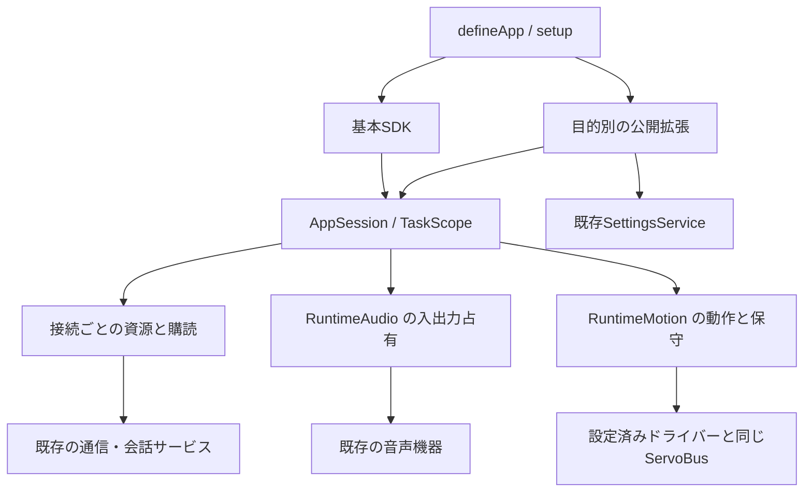

# 全実行例のSDK移行・統合記録

2026-09-08。ブランチは `codex/firmware-sdk-redesign`。今回の比較元は `5e0a5e9ab6326aa6561d9bb505563a15e0663c36`、再設計全体の起点は `6eb462331dd1677791d6aa2a6b257a20da43b9a9`。

残る21例を14パッケージへ移行・統合し、元の32例すべてを21個の app API 2 パッケージへ揃えた。`stackchan-mod.json` を持つ実行例の API 1 は0件。今回の14例は host API 7 を要求する。[全例の操作ガイド](../../firmware/mods/examples/README_ja.md) と [32例の対応表](legacy-mod-migration.md) を正本とする。

## 統合先と保持する機能

| 旧例 | 現在のパッケージ | 保持した機能・明示した変更 |
| --- | --- | --- |
| ai_stackchan / ai_stackchan_api / chatgpt | conversation | 録音・文字起こし・対話・発話、表情の道具、HTTPフォームとWebSocketの会話形式。入力方式をメニューで選択 |
| beacon_advertiser / beacon_scanner | beacon | UUID・manufacturer ID・連番・コマンドの形式、挨拶6種。初期値は文字表示、WAV生成と自由文TTSを明示選択 |
| cheerup_ble_lite / cheerup_ws | cheerup | STK / WebSocketの姿勢・表情、hoorayの立ち上がり、5つのWAV、平滑化と切断時の解放 |
| mimic_main / mimic_follow | pose_sharing | DNS-SDの名前・service type・TXT yaw/pitch。送信・追従・停止を選択 |
| calibration / dynamixel / setup_rs30x | servo_diagnostics | 設定済みサーボの状態・校正・ID・LED・通信速度。起動時の書き込みと別UART生成を廃止し、明示的な保守操作に変更 |
| chat_audioio | 同名 | 5プロバイダー、全二重音声、文字起こし、口同期、開始・停止。設定の正本を共有 |
| codex_voice | 同名 | USB会話・承認・頭のスワイプ・開始失敗後の再操作。要求受理と観測した状態を区別 |
| local_peer_hello | 同名 | 探索・確認付き送信・受信・停止、64コードポイントと制御文字処理 |
| mcp | 同名 | MCP endpoint・認証設定・表情と発話の道具、接続先の再表示 |
| face_tracker | 同名 | UnitV2の640×480の顔座標。連続HTTPを `|` で分割して受信し、単発応答の完了待ちで止まらないようにした |
| mediapipe_ble | 同名 | 既存ワイヤー形式v1〜v4、目・口・手の位置・方向・形、最新値への置換、1秒失効とトルク解放 |
| lip_sync | 同名 | マイクのライブ音量による口同期、開始・停止 |
| web_radio | 同名 | 元の8局とURL、MP3・再接続・状態・音符、局切替と停止。実装のあるCoreS3を対象化 |
| unit_temperature | 同名 | SHT3x温湿度、周期表示、手動測定、外部I²C |

素材の再生と自由文TTS、通信のワイヤー単位とSDKの度・ms、機種宣言と実際の機器の有無を区別する。UnitV2は既存の参考サーバー実装に合わせて連続応答を扱う。各クラウドサービスや外部機器への実接続を、自動試験で確認済みとはしない。

## 共通化した責務



- **公開境界**：通信・会話・ストリーミング音声・センサー・保守・設定を `stackchan/extensions/*` に集約。基本SDKへホストの機器型を増やさず、全実行例のstrict検査と解決済みimport graphで内部依存を拒否する。
- **寿命**：接続は既存AppSessionの資源登録とTaskScopeに所属し、接続内の購読を機器より先に閉じる。late open・取消し・二重close・終了後イベント・後片付け失敗を扱う。登録数とタスク数は有限。新しい独立したアプリランタイムは作らない。
- **競合**：monitorは入力、radioは出力、realtimeとUSBは両方をRuntimeAudioで確保する。通常の録音・再生と競合したら `BUSY`、物理解放に失敗したら再使用を拒否する。サーボ保守中は通常動作と周期処理を止め、終了もバス操作の完了を待つ。
- **単位と完了**：姿勢の公開値は度、時間はms、音量レベルは0〜1。USBの要求IDだけでメニューを開始済みへ変更しない。HTTPは時間・受信量の上限を持ち、分割されたUTF-8をメッセージ境界で復元する。
- **設定**：`sdk/settings-schema.ts` を本体・Web・アプリの正本にし、既存SettingsServiceの検証・優先順位・secret・適用時点を使う。chatの6キーを共通画面へ追加。MOD専用のchat設定変換を削除する。
- **周期処理**：一度に一つだけ実行し、一時的な失敗を報告して次の周期で再試行する。closeで止める。旧「一度失敗すると以後動かない」動作を変更した。

`AppConnection` は接続に属する資源とイベントをまとめる補助であり、アプリとは別のタスク実行器を持たない。低レベルのサーボ操作はcallbackのまま保ち、アプリ境界でのみPromiseへ接続する。`motion.position` は既存観測値を返し、追加のUART読み取りを作らない。

## 削除した経路と配布

旧21例のhook・raw Timer・入力代入・内部UI／機器への直接依存を削除した。重複する役割の旧ディレクトリー・manifest・入口、使用されなくなった `stt-whisper` とそのpreload・constructor smoke、旧chat設定の変換器と試験、Web RadioのPiu型複製も撤去した。Whisperの大きな録音コピーの禁止は、実際の送信バッファの同一性を確認する試験へ置き換えた。

GalleryのMediaPipe・MCP・Codex VoiceもAPI 2 / host API 7へ移し、旧実行ソースのコピーを削除した。既存のsource生成処理を拡張し、firmwareの正本から公開ソースを作る。3つのrelease XSAをGalleryの宣言と合わせて再生成し、Webの試験で宣言とarchiveを照合する。生成物への移動による行数減少は、機能削減や製品コード純減の実績に数えない。

この移行時点では `provider-dialogues` の参考クラスを保持した。その後、V1ホスト・Blocklyの旧経路を撤去し、3種類の対話とMCPクライアントをhost API 10のSDKへ統合した。現在の使い方は [プロバイダー移行](../../firmware/mods/examples/provider-dialogues/README_ja.md) を参照する。

リリース影響は firmware / Web とも **major**。[changeset](../../.changeset/sdk-example-consolidation.md) を追加した。旧archiveは統合先から再生成する。設定や書き込みの違いは各READMEに記載し、実機確認と初学者の受入を残件としている。

## 検証

Moddable 9.5.0、ESP-IDF 6.1、Node 24.19.0で、リポジトリーのnpm wrapperと `firmware/dist` を使った。ビルド成功は実機受入の代用にしない。

| 検証 | 結果 |
| --- | --- |
| `npm run check:sdk` | 基本SDK・全教材・全実行例のstrict検査成功 |
| `npm run test:unit` | 552件成功 |
| `npm run check:architecture` | 77件成功。不要なWhisperソース文字列検査を削除したため、以前の78件から1件減少 |
| `npm run check:manifest` | 6 target成功 |
| `STACKCHAN_MODULE_TEST_JOBS=4 npm run test:moddable` | 60/60 manifests成功 |
| 21例と7教材の `mod:build` | 28/28 archive生成・metadata検査成功 |
| Gallery 3例の `mod:build --mode=release` | ソースから再生成。Webで埋込metadata・XS世代・絶対ビルドパスの不在を検査 |
| Web `build` / `test:react` / `test:legacy` | ビルド成功、77件 / 258件成功 |
| Chrome `sdk-lessons-visual.mjs` | 7教材と先行5例をWASMで読み込み・操作。カメラの表示と解放も確認 |
| Chrome `mod-preflight-visual.mjs` | 将来APIの拒否と、設定終了までMODを評価しない起動・復帰を確認 |
| `build:wasm` | ビルド成功 |
| `build:release:m5stackchan_cores3` | ビルド成功、6,690,768 bytes |
| `build:release:takao_core2_sg90` | ビルド成功、3,993,312 bytes |
| `build:release:stackchan_rt` | ビルド成功、4,113,968 bytes |

追加した振る舞いの試験は、HTTPの分割送受信・タイムアウト・取消し・接続解放、会話の応答ID・道具・late response、録音バッファの保持、接続の購読とlate acquisition、音声競合、保守の完了待ち・校正の反復・両軸baudrate・不正ID、USBの要求受理と実際のメニュー状態などを対象とする。MediaPipeの送受信形式と手の形状の試験は、WebとXSの両方で維持する。

## 未受入と再設計全体の残件

実機での無線の共存・切断回復、外部サービス接続と音声入出力、温湿度の実測、サーボの可動域・ID・校正・速度・電源断時の挙動、初学者による導入・改造・復帰は未受入。高度な実機機能をWASMで擬似成功にしていない。

V1ホストとBlocklyの撤去、参考providerライブラリーの整理、全無線経路の排他と、製品ソースを起点より減らす条件は残る。今回のサンプル統合だけでF1〜F12全体が完了したとは判断しない。コード量は [固定した集計規則](evidence/firmware-retirement/measure.py) で、教材・試験・生成物を製品ソースから分けて比較する。

## コード量の計測

検証したソースのコミットは `bdde62f0c96629528241cb6beb80199f23e28692`。直前の `5e0a5e9` と同じ集計規則を使った。物理行数は空行・コメントを含み、Markdown・JSON・画像・WAV・XSA・非追跡の生成物は含めない。

| 分類 | 直前のファイル数 / 行数 | 今回のファイル数 / 行数 | 行数の差 |
| --- | ---: | ---: | ---: |
| firmware実装 | 318 / 42,024 | 324 / 43,161 | +1,137 |
| SDK・共通契約 | 17 / 616 | 24 / 1,094 | +478 |
| Web実装 | 112 / 16,059 | 112 / 16,073 | +14 |
| 型宣言 | 25 / 733 | 25 / 733 | +0 |
| **製品ソース計** | 472 / 59,432 | 485 / 61,061 | +1,629 |
| サンプル・教材（別計上） | 56 / 5,876 | 44 / 3,544 | -2,332 |
| 試験・補助（別計上） | 306 / 37,464 | 305 / 37,705 | +241 |
| 開発ツール（別計上） | 35 / 4,044 | 35 / 4,044 | +0 |
| vendor・既知の生成物（別計上） | 8 / 2,715 | 8 / 2,715 | +0 |

製品ソースは直前から **13ファイル・1,629行増**。再設計の起点からは **66ファイル・8,359行増** であり、製品コード純減は未達である。公開拡張・接続の所有・共有HTTP・音声占有・サーボ保守を追加した一方、V1ホストなどの旧公開面は残っている。サンプルが短くなったことを、製品コードの削減と取り違えない。

サンプル・教材は2,332行減った。このうちGalleryの旧コピー5ファイル・697行は、正本から生成する配布へ移した分なので、機能の整理による削減実績から除く。残る **1,635行** が実行例の統合・書き換えによる減少である。文字列の圧縮やファイル分類の付け替えを削減手段にしていない。

```sh
python3 docs/architecture/evidence/firmware-retirement/measure.py bdde62f0c96629528241cb6beb80199f23e28692
python3 docs/architecture/evidence/firmware-retirement/measure.py bdde62f0c96629528241cb6beb80199f23e28692 --files > source-inventory.json
```
