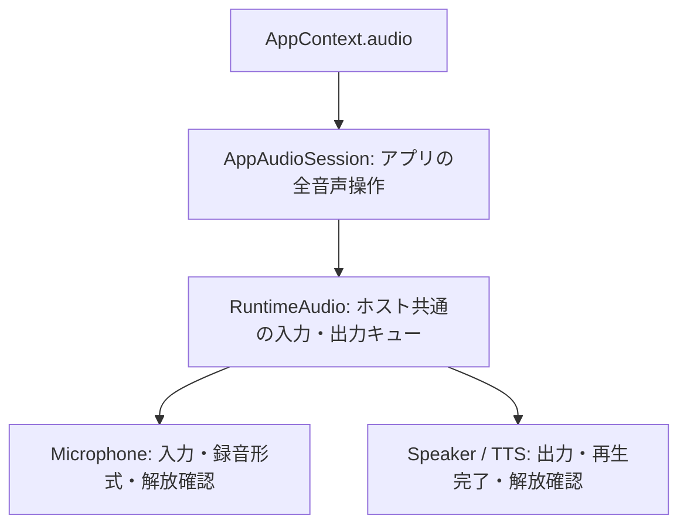

# SDK の録音とバッファ再生

公開SDKに `app.audio.record()` と `app.audio.play()` を接続する。教材はマイクやSpeakerを生成せず、録音形式を推測せず、機器のcloseも呼ばない。録音後のデータをそのまま再生へ渡せる。

```js
app.input.onPress('primary', async (task) => {
  const audio = await app.audio.record({ durationMs: 3000, signal: task.signal })
  await app.audio.play(audio, { volume: 0.5, signal: task.signal })
})
```

この変更はF1・F2・F3・F5・F7・F9の一部である。会話、USB、Web Radioとの共通調停、既存MODのSDK移行、配布時の実際の能力表、実機受入は別途残る。

## 公開契約

型の正本は [sdk/audio.ts](../../firmware/sdk/audio.ts)。`stackchan` から型を再exportし、既存の `stackchan/app` のAppAudio / PlaybackOptions参照も維持する。

| 操作・値 | 契約 |
| --- | --- |
| `record({ durationMs?, signal? })` | 1〜15,000 ms、省略時3,000 ms。入力の解放確認後にRecordedAudioを返す。最大512 KiB |
| `RecordedAudio` | `data: ArrayBuffer`、実際の `mimeType`、`filename`。データはアプリが保持する。ネイティブの手動解放は不要 |
| `play({ data, mimeType }, { volume?, signal? })` | 出力の再生完了と解放を待つ。成功はvoid、失敗はStackchanError。バイト列の借用はPromiseがsettleするまで |
| native再生形式 | 16-bit PCM WAV、8〜48 kHz、モノラルまたはステレオ。最大3 MiBかつ60秒 |
| ブラウザー再生形式 | ブラウザーのdecoderが対応する形式。最大3 MiBかつ60秒。録音器が返すWebM / MP4等をWAVへ改名しない |
| 音量 | 0〜1。省略時はSpeakerの既定値。各操作で指定できる |
| `audio.recording` / `audio.playback` | 能力照会。入力／出力を開始せずに取得する。ブラウザーの使用許可や録音成功を事前保証する値ではない |

ブラウザーの音声能力は従来の音声APIと同じ `simulated` 区分だが、録音には実際のMediaRecorder入力を使う。許可拒否や入力不在を無音データで補わない。戻り値は音声の形式とバイト列を表し、環境区分を音声の生成元として記録しない。

録音の戻り値の外側はfreezeする。ArrayBufferの内容まで不変にするものではなく、再生中に書き換えたりdetachしたりしない。録音を配列へ蓄積する場合のメモリーはアプリが管理する。

3秒録音のブラウザー受入で、100msごとに届くBlobを一つずつ非同期変換する旧処理が停止後の期限に達する問題を検出した。受信済みチャンクを一つのBlobへまとめ、一回のArrayBuffer変換を所有する形へ変更した。変換中の取消しも、その一回の変換が終了するまで解放扱いにしない。チャンク数・総バイト数・変換後の実サイズの検証は維持する。

## 所有と終了



AppAudioSessionは録音とバッファ再生にも操作ごとのCancellationSourceを作る。closeでは全操作へ取消しを通知してから実際のRuntimeAudioの結果を待つ。TaskScopeがアプリへ取消しを先に返しても、この所有は終了しない。[アプリ単位の音声所有](app-audio-lifecycle.md)に従う。

バッファ再生は発話・素材・toneと同じ出力キューを使う。録音は入力キューを使い、待機中の取消しが別の実行中録音を止めない。入力の通常完了時にもMicrophoneのreleaseFailureを確認し、解放失敗なら後続取得を禁止する。アプリのcloseにも同じ失敗を返す。

AppAudioSessionは入力・出力いずれかの解放失敗で全音声操作を拒否する。能力表示も同じ故障状態を参照し、操作が拒否されるのに利用可能と表示する状態を作らない。

ホストと実装の間は [AudioInputPort / AudioOutputPort](../../firmware/host/modules/audio/audio-ports.ts) を共有する。nativeとWASMの各実装がimplementsし、RuntimeAudioは具体的クラスやテスト用の代替型から契約を取り出さない。

## WAVとネイティブメモリー

以前のSpeakerはヘッダーを固定44バイトとして除去し、その後ろを全てPCMとして再生していた。追加のRIFFチャンク、宣言されたサイズ、不完全なフレームを検査せず、再生エラーをfalseに変換していた。

[pcm-wave.ts](../../firmware/host/modules/audio/pcm-wave.ts)はRIFF全体と各チャンクのサイズ、WORDパディング、PCMのblockAlignとbyteRateを検査し、実際のdataチャンクの範囲だけを返す。fmtとdataは各一つ、チャンク数は最大256。短いデータを切り詰めたりゼロで補ったりしない。対応外の音声形式はUNSUPPORTED、構造の不整合はINVALID_ARGUMENTとする。[MicrosoftのRIFF仕様](https://learn.microsoft.com/en-us/windows/win32/xaudio2/resource-interchange-file-format--riff-)、[WAVEFORMATEXのPCM整合条件](https://learn.microsoft.com/en-us/windows/win32/api/mmreg/ns-mmreg-waveformatex)

SDK 9.5のAudioOut.RawSamplesは非移動バッファのCポインターを保持する一方、引数のJSバッファ自体を保持しない。SpeakerはPCMをSharedArrayBufferへコピーし、C側がrememberするAudioOutのJSラッパーから参照する。closeの成功確認後に参照を外す。closeが失敗した場合はCが読み続ける可能性があるため参照を残し、プロバイダーを故障状態に保つ。開始用の一時的なclosureをGC対策として扱わない。

toneの共通範囲も10〜20,000 Hzへ揃え、出力を48 kHzで構築する。SDK 9.5のnative実装は10 Hz未満を拒否し、以前の24 kHz出力では高域の要求を正しく表せなかった。ブラウザーは実際に得られたsampleRateも検査し、Nyquist周波数以上なら開始前にUNSUPPORTEDとする。実機での音量・周波数精度・音質の受入はビルド試験と分ける。

## 移行と検証

- 公開教材は [07-recording](../../firmware/lessons/07-recording/mod.js) を使う。機能がない場合と録音・再生失敗時に案内を表示し、実行中の連打を増やさない。
- 旧 `context.record(ms)` と `context.playAudio(buffer)` は現時点で残り、戻り値や失敗形式もSDKと異なる。利用側の整理と合わせて撤去する対象であり、この旧経路を完成形として残す扱いにはしない。新しいSDKは機能不在でUNSUPPORTEDを返す。
- 低レベルnative Speaker.playの失敗はfalseからrejectへ変わる。toneの範囲縮小と合わせてfirmwareのrelease impactはmajor。Web側もtoneの範囲が変わるためmajorとする。
- NodeはWAVの不正サイズ・追加チャンク・不完全フレーム、MIMEの保持、公開操作の直列化と終了、入力解放失敗を検査する。別名packageの並列生成でexportsが欠落する問題も修正し、Nodeがpackageを読み込んだ後に追加したsubpathを解決できることを検証する。
- XSは実Timer・GCを用い、100回のPCM成功・取消し、再生中のバッファ保持、解放失敗後の保持と取得拒否を検証する。既存のnative / WASMマイク・再生の寿命試験も維持する。
- Chromiumでは7教材を実行する。録音教材は実MediaRecorderとAudioContextを使い、録音後のtrack停止、実際のデコードと再生、連打抑制、録音中の再起動による停止を確認する。入力源はChromiumの試験用メディアデバイスであり、物理機器の受入ではない。

この変更の実行結果と未完了項目は [実装台帳](firmware-sdk-redesign-progress.md) に記録する。
