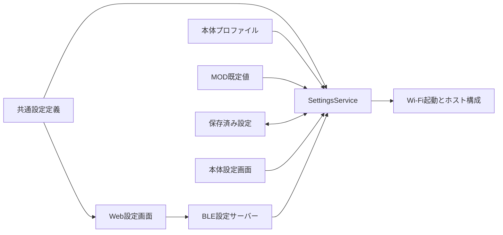

# 設定定義・保存・起動の共通契約

実装ブランチ: `codex/firmware-sdk-redesign`。F7 / F8 の設定経路を接続する段階であり、再設計全体の完了ではない。

## 正本と責務

`firmware/host/modules/preferences/settings-schema.ts` を本体と Web の共通定義とする。設定キー、型、既定値、選択肢、入力制約、秘密情報、反映時点、MOD が既定値を供給できるかを定義する。Web はこの可搬な TypeScript を直接参照する。旧 `PREF_KEYS` も同じ定義から生成する。

`SettingsService` は読み込みの優先順位、値の検証、保存、保存結果の公開用記述を担当する。本体の設定画面と BLE サーバーは、このサービスへ保存を委譲する。BLE の受信処理は設定の型や既定値を独自に決めない。



## 読み込み

優先順位は共通既定値 < 本体プロファイル < MOD 既定値 < 保存済み設定。無効な値は値そのものをログへ出さず、キー・供給元・理由コードを一度だけ報告し、下位の有効な値へ戻す。保存領域の読み出し失敗は `IO` とする。

- Wi-Fi はホストが所有する。MOD の Wi-Fi 既定値は使用しない。本体プロファイルと保存済み設定から解決する。
- `driver.typeLocked: true` は本体プロファイルだけが指定できる。固定されたドライバーを MOD や保存値で置換できない。固定値自体が無効・欠落している場合は `CONFIG` とし、別の物理ドライバーへフォールバックしない。
- 任意設定の `tts.port` / `tts.voice` / `tts.speed` / `driver.baudrate` などは、未指定なら各機器・プロバイダーの既定値を使用する。
- `wifi.ssid: ''` / `wifi.password: ''` は明示的な値であり、本体プロファイルの認証情報にも優先する。SSID が空ならオフライン。SSID がありパスワードが空ならオープンネットワークとして接続する。
- 旧 `renderer.type` は有効な `ui.type` へ移行する。公開された管理キー以外の高度なプロファイル項目は、V1 構成との互換性のため引き続き保持する。

ホスト起動は `loadPreferenceConfig()` の同じ結果を Wi-Fi 起動と機器構成へ渡す。起動処理が `mc/config` の Wi-Fi 設定を別の優先順位で読み直すことはない。

## 保存と秘密情報

一括保存では全項目のキー、固定属性、型、範囲を検証してから保存を始める。数値文字列を既存 NVS / BLE との互換入力として受け付けるが、有限値・整数要件・範囲を検証する。文字列は UTF-8 のバイト長を制限し、NUL と不正なサロゲートを拒否する。

Moddable Preference の数値保存は整数なので、管理する数値は正規化した文字列で保存する。これにより音量や小数のオフセットが失われない。任意項目の空欄は保存値を削除し、下位の既定値へ戻す。

保存が例外で中断された場合は、変更を試みたキーを逆順で以前の値へ戻す。復元にも失敗したサービスは後続の保存を拒否し、再起動と設定の確認を要求する。これは実行中の例外に対する復元であり、電源断をまたぐ複数キーのトランザクション保証ではない。

Wi-Fi パスワードと TTS / AI / MCP トークンは秘密情報として定義する。ホスト内部の利用者には実際の値を渡すが、公開用 `describe()`、BLE の初期通知、保存応答では値を空文字へ置換し、`configured` だけを返す。入力値・受信 JSON・ストレージ由来の例外をログやエラー文へ転記しない。

Web は旧本体から秘密情報の値が返ってきた場合も表示・フォーム初期値へコピーしない。変更していない秘密情報は再送しない。新しい値の保存確認後は入力欄を空に戻す。消去は明示的なフォーム操作で指定し、保存ボタンで確定する。

## BLE 設定プロトコル 2

本体は通知開始時に `{"kind":"hello","protocol":2}` と各設定の公開用記述を送る。出力は UTF-8 の JSON を改行で区切る。通知を ATT MTU に合わせて分割し、未交渉時は 20 bytes、交渉後も最大 128 bytes とする。出力待機量は 32 KiB に制限する。

入力は一つの JSON オブジェクト。バイト列として最大 32 KiB、先頭から 3 秒以内に完成させる。日本語が BLE チャンクの境界をまたぐことを許容する。切断・通知停止・サーバー終了で受信断片、送信待機列、両方向の timer を破棄する。

```json
{"requestId":1,"_batch":{"tts.volume":"0.25","wifi.ssid":"home"}}
```

本体が保存を完了した場合:

```json
{"kind":"saved","requestId":1,"applications":["live","reconnect"],"applyFailed":false}
```

検証または保存に失敗した場合:

```json
{"kind":"error","requestId":1,"code":"INVALID_ARGUMENT","message":"..."}
```

`live` は設定画面で即時反映する言語・タイムゾーン・音量、`reconnect` は次のネットワーク接続、`restart` はホスト再生成で反映する項目を表す。保存後の即時適用 callback が失敗した場合は、保存済みであることと `applyFailed: true` を両方伝える。

Web は同時保存を一つに制限し、同じ `requestId` の応答を最大 10 秒待つ。BLE 書き込みだけが完了した場合、切断した場合、応答が来ない場合を保存成功として扱わない。プロトコル 2 の通知がない旧ファームウェアへの送信は「保存未確認」として扱い、再送できるよう変更を保持する。

旧 Web の通知デコーダーは分割された応答に対応していないため、プロトコル 2 の本体と新 Web を組み合わせる。旧形式の単一項目リクエストは引き続き受け付けるが、未定義の NVS キーを書き込む経路としては利用できない。

## 検証と残りの境界

純粋な設定解決・バッチ検証・復元は Node、本体の BLE / Timer 契約は XS、ブラウザーの分割受信・応答照合・フォームの秘密情報・再試行は React / Vitest で検証する。本体の設定画面も XS で生成と操作を検証する。各ターゲットとブラウザー教材の検証結果は [実装・検証台帳](firmware-sdk-redesign-progress.md) に記録する。

F7 / F8 の残作業には、ボードの pin・UART・校正制約の完全な型定義、プロバイダーごとの話速単位の移行、アプリへ公開する限定的な設定 API、設定のスナップショット準備状態、起動サービスの取消しと終了、電源断時の永続化保証がある。既存 MOD の直接 `Preference` 利用と V1 の起動移行も継続して扱う。実機 BLE の接続・MTU・保存媒体故障の受入は、XS とブラウザーの偽トランスポートだけでは証明しない。
