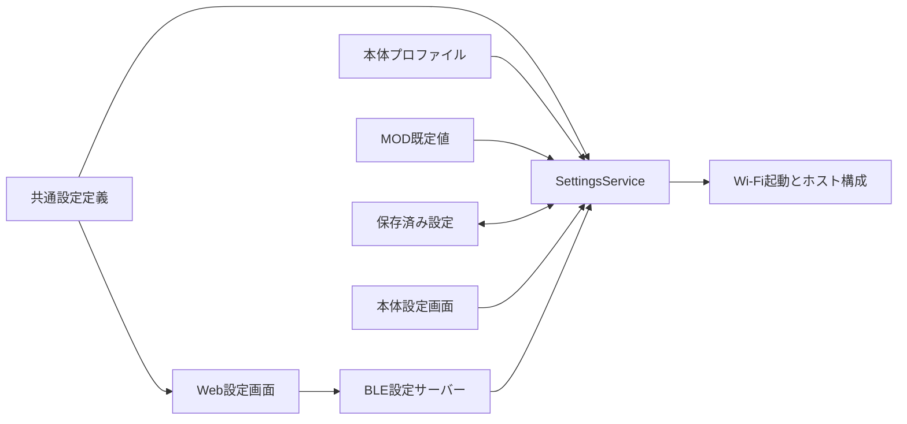

# 設定定義・保存・起動の共通契約

実装ブランチ: `codex/firmware-sdk-redesign`。F7 / F8 の設定経路を接続する段階であり、再設計全体の完了ではない。

## 正本と責務

`firmware/sdk/settings-schema.ts`（公開module `stackchan/settings-schema`）を本体・Web・SDKの共通定義とする。設定キー、型、既定値、選択肢、入力制約、秘密情報、反映時点、MOD が既定値を供給できるかを定義する。Web はこの可搬な TypeScript を直接参照する。設定キーの列挙には `SETTING_KEYS` を使う。未使用の旧 `PREF_KEYS` tuple は削除した。

`SettingsService` は読み込みの優先順位、値の検証、保存、保存結果の公開用記述を担当する。本体の設定画面と BLE サーバーは、このサービスへ保存を委譲する。BLE の受信処理は設定の型や既定値を独自に決めない。



## 読み込み

優先順位は共通既定値 < 本体プロファイル < MOD 既定値 < 保存済み設定。無効な値は値そのものをログへ出さず、キー・供給元・理由コードを一度だけ報告し、下位の有効な値へ戻す。保存領域の読み出し失敗は `IO` とする。

- Wi-Fi はホストが所有する。MOD の Wi-Fi 既定値は使用しない。本体プロファイルと保存済み設定から解決する。
- `driver.typeLocked: true` は本体プロファイルだけが指定できる。固定されたドライバーを MOD や保存値で置換できない。固定値自体が無効・欠落している場合は `CONFIG` とし、別の物理ドライバーへフォールバックしない。
- 任意設定の `tts.port` / `tts.voice` / `tts.speed` / `driver.baudrate` などは、未指定なら各機器・プロバイダーの既定値を使用する。
- `wifi.ssid: ''` / `wifi.password: ''` は明示的な値であり、本体プロファイルの認証情報にも優先する。SSID が空ならオフライン。SSID がありパスワードが空ならオープンネットワークとして接続する。
- 顔の設定には `ui.type` を使う。旧 `renderer.type` は読まず、保存領域へのコピーもしない。管理キー以外のpin・UART等はホストのハードウェア構成が所有する。V1のアプリ設定実行は撤去済みである。

ホスト起動は `loadPreferenceConfig()` の同じ結果を Wi-Fi 起動と機器構成へ渡す。起動処理が `mc/config` の Wi-Fi 設定を別の優先順位で読み直すことはない。

## 保存と秘密情報

一括保存では全項目のキー、固定属性、型、範囲を検証してから保存を始める。数値文字列を既存 NVS / BLE との互換入力として受け付けるが、有限値・整数要件・範囲を検証する。文字列は UTF-8 のバイト長を制限し、NUL と不正なサロゲートを拒否する。

Moddable Preference の数値保存は整数なので、管理する数値は正規化した文字列で保存する。これにより音量や小数のオフセットが失われない。任意項目の空欄は保存値を削除し、下位の既定値へ戻す。

保存前に、変更対象の以前の値を `settings.pending` へundo記録として永続化する。全項目の書き込み・読み戻しが成功してから記録を消して確定する。記録はNVSの4,000 bytesの文字列制限を超えうるため、Preference境界でUTF-8のArrayBufferへ変換してblobとして保存する。設定本体の既存キーは維持する。

設定を読む前、または次の保存を始める前に未確定記録を復元する。復元中は記録を更新せず、全項目が戻るまで保持するため、復元の途中で再び電源が切れても同じ処理を繰り返せる。復元に失敗したサービスは読み書きを拒否し、混在した設定を機器へ渡さない。破損・未知の記録は全体を検証してから扱い、部分的な復元や黙った削除を行わない。

これはNVSの単一キーの中断復旧に依存する。Moddable 9.5.0のESP32 Preferenceはset前にキーを消すため、その隙間もundo記録で保護する。基板での実電源断やflash故障は未検証であり、ソフトウェアの中断注入試験で代替した完了とはしない。応答が失われた保存は、再起動後にバッチ全体が以前または以後の値になる。秘密情報を含むundo記録も同じNVS領域の管理対象であり、確定後に削除する。

Wi-Fi パスワードと TTS / AI / MCP / chat のトークンは秘密情報として定義する。ホスト内部の利用者には実際の値を渡すが、公開用 `describe()`、BLE の初期通知、保存応答では値を空文字へ置換し、`configured` だけを返す。入力値・受信 JSON・ストレージ由来の例外をログやエラー文へ転記しない。

Web は秘密情報の値を表示・フォーム初期値へコピーせず、`configured` だけで設定済みかを示す。変更していない秘密情報は再送しない。新しい値の保存確認後は入力欄を空に戻す。消去は明示的なフォーム操作で指定し、保存ボタンで確定する。

## BLE 設定プロトコル 2

本体は通知開始時に `{"kind":"hello","protocol":2}`、各設定の公開用記述、最後に `{"kind":"ready"}` を送る。読み込み失敗時はエラーを返し、ready は送らない。Web は全管理キーと ready を 5 秒以内に受信してから値を公開して接続完了とする。途中の一覧、異なるプロトコル、切断、タイムアウトは接続失敗であり、保存は開始できない。出力は UTF-8 の JSON を改行で区切る。通知を ATT MTU に合わせて分割し、未交渉時は 20 bytes、交渉後も最大 128 bytes とする。出力待機量は 32 KiB に制限する。

入力は正の整数の `requestId` と `_batch` だけを持つ JSON オブジェクト。旧 `prop` / `value` 形式や ID のない要求は保存せずに拒否する。バイト列として最大 32 KiB、先頭から 3 秒以内に完成させる。日本語が BLE チャンクの境界をまたぐことを許容する。切断・通知停止・サーバー終了で受信断片、送信待機列、両方向の timer を破棄する。

```json
{"requestId":1,"_batch":{"tts.volume":"0.25","wifi.ssid":"home"}}
```

本体が保存を完了した場合:

```json
{"kind":"saved","requestId":1,"applications":["live","reconnect"],"applyFailed":false}
```

検証または保存に失敗した場合:

```json
{"kind":"error","requestId":1,"code":"INVALID_ARGUMENT","message":"..."}
```

`live` は設定画面で即時反映する言語・タイムゾーン・音量、`reconnect` は次のネットワーク接続、`restart` はホスト再生成で反映する項目を表す。保存後の即時適用 callback が失敗した場合は、保存済みであることと `applyFailed: true` を両方伝える。

Web は同時保存を一つに制限し、同じ `requestId` の応答を最大 10 秒待つ。BLE 書き込みだけが完了した場合、切断した場合、応答が来ない場合を保存成功として扱わない。保存 API は確認済みの反映時点・適用失敗フラグを返すか、エラーで終了する。旧ファームウェアへの未確認送信は廃止した。

同じリリースの本体と Web を組み合わせる。Web は改行で完了したフレームだけを解釈し、旧通知形式へのフォールバックを持たない。未定義の NVS キーも受け付けない。

## 検証と残りの境界

純粋な設定解決・バッチ検証・復元は Node、本体の BLE / Timer 契約は XS、ブラウザーの分割受信・応答照合・フォームの秘密情報・再試行は React / Vitest で検証する。本体の設定画面も XS で生成と操作を検証する。各ターゲットとブラウザー教材の検証結果は [実装・検証台帳](firmware-sdk-redesign-progress.md) に記録する。

NodeとXSで、保存と復元の各書き込み前後・set内の消去直後から再起動して設定が混在しないこと、100回の連続保存、XSの実ArrayBuffer変換で4,000 bytes超のundo記録を扱うことを確認した。旧stored-wifiの直接NVS経路は撤去し、MCPサーバーも呼び出し元から解決済みのtokenを受け取る。SDK設定API、V1起動移行、BootSessionの取消しは実装済みである。

残る境界はボードのpin・UART・校正制約、プロバイダーごとの話速単位、実機BLEの接続・MTU・保存媒体故障・電源断の受入である。XSとブラウザーの偽トランスポートだけでは証明しない。

## アプリからの利用（host API 7）

`settings(app).get / describe / set` は同じサービスへ接続する。リアルタイム会話の6キーもschemaへ集約し、Webの設定画面と共有する。旧chat_audioioのconfig変換は撤去したため、`chat.type / apiKey / endpoint / modelID / voiceID / instructions` を共通設定へ転記する。実値を読むgetとsecretを伏せるdescribeは用途が異なる。詳しくは[SDKの設定契約](../../firmware/sdk/README_ja.md#設定の正本)を参照する。

## 中断復旧の検証（2026-09-08）

Node全551件、SDK strict、構成77件、6対象のmanifest検査に成功。XS全58 manifestを検証し、依存撤去で露呈したMCP単体ビルドのコンパイラー設定をそのmoduleで明示した上で、失敗した3構成を再実行して成功した。Preferenceへの依存を設定値取得のために残してはいない。

NodeとXSの共通動作ケースは185通りの保存・復元中断状態と100回の連続保存を通過した。XSでは複数の2,048 bytesの資格情報を保存し、4,000 bytesを超えるundo記録のArrayBuffer保存・削除を確認した。破損記録・復元失敗・storageの無応答成功では、値を公開せずエラーになることを確認した。

実WASMで旧・未来APIの拒否と、設定画面から戻って正常なMODだけを起動する経路を確認。releaseビルドはCoreS3 6,690,768 bytes、Core2 SG90 3,993,312 bytes、RT 4,113,968 bytes（9.5.0+stackchan.9）。3機種とも直前から4,096 bytes増。実機flashへの書き込みと実電源断試験は行っていない。
