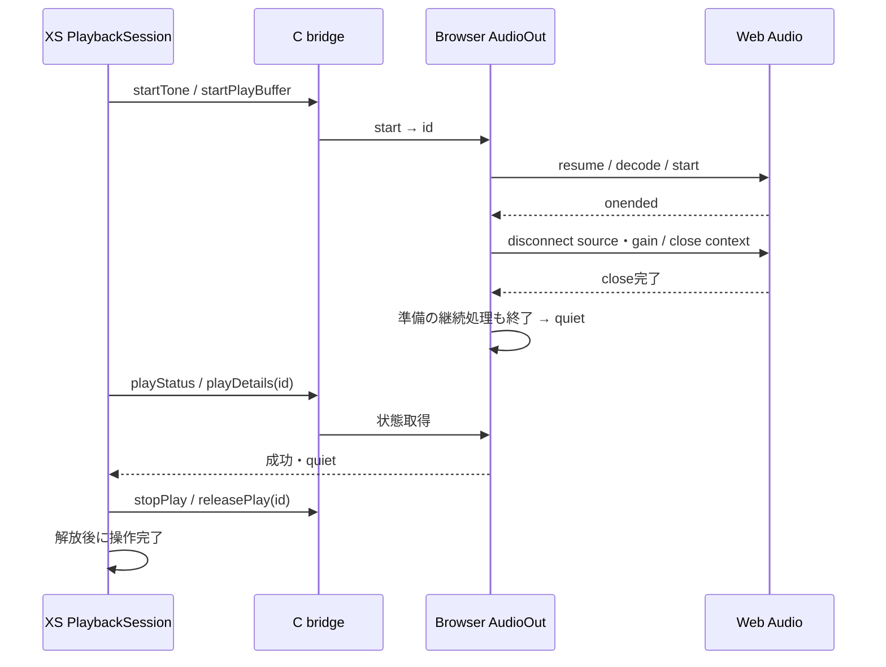

# WASM音声出力の所有と終了確認

F2 / F3 / F9のWASM出力を扱う。音声出力の完了は、Web Audioの終了イベントと資源の解放を確認した時点とする。指定時間が経過しただけでtoneを成功にする経路を廃止する。AppSession、公開録音・再生SDK、会話やUSBとの調停は引き続き別の作業として残る。

## 責任の分担

| 層 | 所有するもの | 終了時の責務 |
| --- | --- | --- |
| WASM Speaker / TTS | PlaybackSession、レンダリングの継続処理 | 共通のplayWasmAudioへ再生を渡し、取消し後の生成・送信を抑える |
| playWasmAudio | 再生識別子、状態ポーリング、操作と停止の期限 | 自分の識別子だけを止め、ブラウザーのquietまたはreleaseErrorを確認して返却する |
| C bridge | XSからブラウザーへ渡す音声バイトのコピー | 識別子と状態を受け渡す。ブラウザーの再生状態を重ねて保持しない |
| Browser AudioOut | 操作ごとのAudioContext、source、gain、resume・decodeの継続処理 | 実際の再生終了を待ち、sourceとgainを切断してcontextを閉じる |
| WasmView | Browser AudioIn / AudioOutの寿命 | 両者のsuspendを待って再起動する。破棄では両者のcloseを開始し、全結果を待つPromiseを返す |

Browser AudioOutは画面を破棄するまで一つだけ存在する。再生識別子は同時に保持するものと衝突せず、古い識別子を使うstop / releaseは次の操作へ作用しない。空のSpeakerをcloseしても、別のSpeakerやTTSの再生を止めない。

## 終了とエラーの契約

- 正常終了にはsourceのonendedとAudioContext.closeの完了・closed状態が必要。source / gainへの参照も手放す。Web Audioのcloseだけでは生成済みオブジェクトの参照まで解放されないため、各ノードの解放も所有者が行う。[Web Audio Recommendation: close](https://www.w3.org/TR/2021/REC-webaudio-20210617/#dom-audiocontext-close)
- 取消しはCANCELLED、Speaker / TTSの恒久的なcloseはCLOSED。再生の結果と物理的な解放の結果を分け、通常の取消しだけで出力を故障扱いにしない。
- 未対応のWeb Audioや古いbridgeはUNSUPPORTED。不正な数値・空または過大な入力はINVALID_ARGUMENT。デコード・開始・再生の失敗はIOまたはTIMEOUTで返す。
- stop、disconnect、Timer解放、AudioContext.closeの失敗はreleaseErrorとして保持する。他の解放も試み、Browser AudioOutとXS側PlaybackSessionの再利用を止める。RuntimeAudioは既存の出力キュー故障処理へ接続する。
- resume / decode待ちで取り消しても、継続処理が返るまでは所有を維持する。遅いデコード結果からsourceを作らず、停止確認を待つ。期限切れ後に実際の終了を確認できた場合のみ、明示的なsuspend / resumeによってブラウザー側の再利用を認める。解放処理自体の失敗は回復扱いにしない。
- 再起動は入力と出力のsuspendを両方開始し、片方が失敗しても両方の結果を待つ。いずれかが失敗した場合は新しいVMを起動しない。破棄ではReactのcleanupが待てなくても、ブラウザー側の所有と失敗の観測を維持する。
- suspendの開始後は入力・出力の新しい識別子を発行しない。停止対象を列挙した後に古いVMが要求しても、次のVMへ未回収の識別子を残さない。DOMExceptionの数値codeなどブラウザー固有の失敗は、公開コードIOへ正規化する。

## 上限と互換性

`firmware/contracts/audio-playback.js`をXSとブラウザーの共通定義とする。

| 項目 | 契約 |
| --- | --- |
| 同時再生 | 1件。保持する識別子は4件まで |
| 音声入力バイト | 非空のArrayBuffer、最大3 MiB |
| デコード後 | 60秒以下、非空、1〜2チャンネル |
| tone | 1〜24,000 Hz、0〜60,000 ms、volume 0〜1 |
| Speaker既定音量 | 0.5。明示指定したNaNを既定値へ置換しない |
| 準備 | 30秒。resumeとdecodeを含む |
| 再生終了 | 再生期間に1秒を加えた期限。通知がなければTIMEOUT |
| ブラウザー側の解放確認 | 2秒。XS側は通信・ポーリングの猶予を含め3秒 |

3 MiBは入力バイトの上限であり、ピークメモリーの保証ではない。ブラウザーのdecoderは結果の期間・チャンネルを検査する前に内部メモリーを確保する。デコード後の厳密なメモリー予算やストリーミング再生は、この実装の保証範囲に含めない。

XS内では借用したArrayBufferをそのまま受け渡し、C境界でブラウザー所有のバイトへコピーする。ブラウザー内でもdecodeAudioDataに渡す直前にコピーする。decodeAudioDataは入力ArrayBufferをdetachするため、呼出元のバイトを保つにはこのコピーが必要になる。[Web Audio Recommendation: decodeAudioData](https://www.w3.org/TR/2021/REC-webaudio-20210617/#dom-baseaudiocontext-decodeaudiodata)

従来の引数なしplayStatus、出力全体を閉じる再生close、Host.AudioOutへの直接フォールバックは廃止する。新しいC / XS bridgeとBrowser AudioOutを同じ版で更新する。Speaker.playは再生できなかった場合にfalseや空の成功を返さずrejectする。内部bridgeへ直接依存したコードは識別子方式への移行が必要である。

## 検証

- `web/simulator/audio-output.test.mjs`: 100回ずつの成功・取消し、context解放待ち、古い識別子、遅いresume / decode、終了通知なし、上限、構築・開始・解放の失敗。
- XSの`wasm-playback-lifecycle`: preloadと実Timerを使う100回ずつの再生・取消し、停止確認、期限、解放失敗の保持、TTSレンダリング中の取消しと実WAV生成。旧Node上のSpeaker試験4件をここへ移す。
- `web/simulator/recording-visual.mjs`: 専用MODとChromiumの実MediaRecorder / AudioContextを使い、録音のバイトをXS往復後に再生し、tone・取消し・再生中とデコード待ち中の再起動・破棄を検査する。実行方法は[録音bridgeの手順](wasm-recording-lifecycle.md#検証方法)と共通。

この試験用MODは内部境界の検証用であり、初学者向けの公開SDK教材ではない。物理機器の音質・実メモリー・I2S・遅延、他ブラウザーの受入は未実施である。
