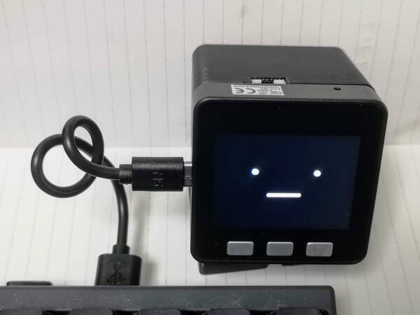

# ｽﾀｯｸﾁｬﾝ ファームウェア

## 開発に必要なもの

* ホストPC
    * Linux(Ubuntu20.04)でテスト済み
* M5Stack Basic
* USB type-Cケーブル
* [ModdableSDK](https://github.com/Moddable-OpenSource/moddable)
    * [Getting Started Doc](https://github.com/Moddable-OpenSource/moddable/blob/public/documentation/Moddable%20SDK%20-%20Getting%20Started.md)を参照
* Node.js

### (オプション) Dockerイメージを使う

このリポジトリはDockerfileによるビルド環境を提供しています。
Dockerコンテナの中でファームウェアのビルド、書き込みとデバッグが可能です。
本READMEの[インストラクション](#optional-build-and-launch-docker-container)を参照ください。

## ファームウェアのビルドと書き込み

### リポジトリをサブモジュールと一緒にクローンする

```
git clone --recursive https://github.com/meganetaaan/stack-chan.git
cd stack-chan/firmware
```

### (オプション) Dockerコンテナのビルドと起動

#### ターミナルを使う場合

```
$user@host# ./build-container.sh
$user@host# ./launch-container.sh
$root@container# npm install
```

#### VSCode Development Container (devcontainer)を使う場合

* コマンドパレットを開く
* `>Remote-Containers: Reopen in Container`を実行する

### ｽﾀｯｸﾁｬﾝをホストPCと接続する



### ビルドと書き込み(デバッグ機能を使わない場合)

```sh
# M5Stack Basic/Gray/Fireの場合
npm run deploy

# M5Stack CORE2の場合
npm run deploy:m5stack_core2
```


### ビルドと書き込み（デバッグする場合）

```sh
# M5Stack Basic/Gray/Fireの場合
npm run debug

# M5Stack CORE2の場合
npm run debug:m5stack_core2
```

このコマンドはデバッグ用にビルドしたファームウェアを書き込むと同時に、ModdableSDKのデバッガである`xsbug`を起動します。
詳しくは[xsbug(公式ドキュメント)](https://github.com/Moddable-OpenSource/moddable/blob/public/documentation/xs/xsbug.md)を参照してください。


## API

### TTS(音声合成)

[text-to-speech.md](./docs/text-to-speech.md)を参照（英語）。
