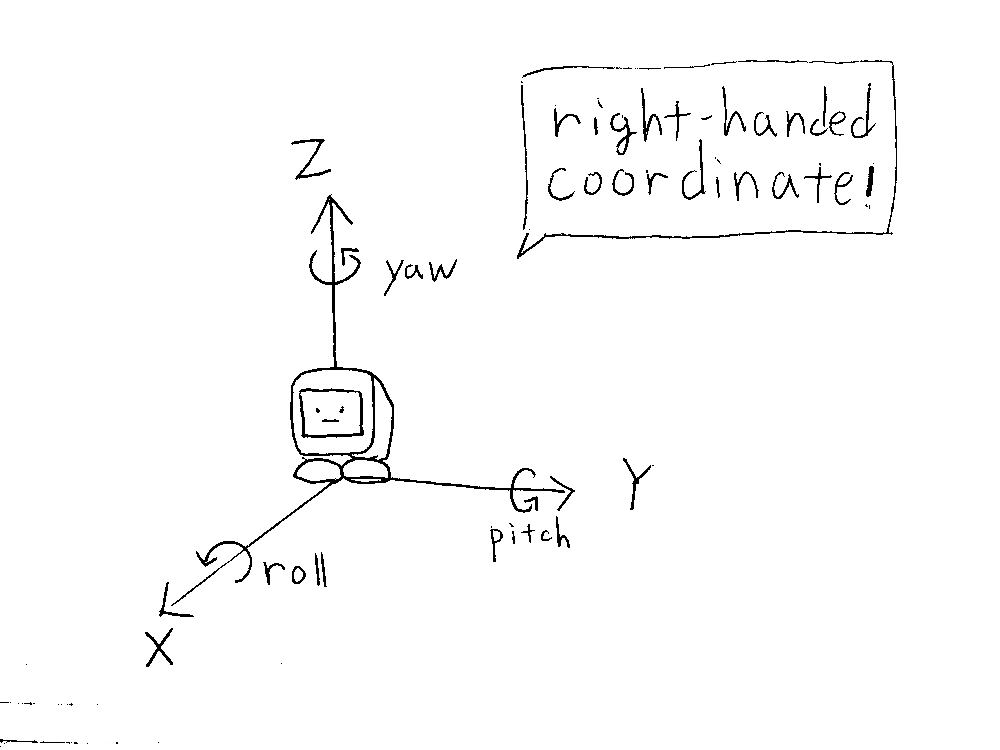

# API

[日本語](./api_ja.md)

The detailed API document is under construction.

Stack-chan firmware sources include `TSDoc` style comments.
The repository keeps `firmware/tsconfig.json` for Node-side checks and API document generation.

Generate documents under `docs/api` by running:

```console
$ npm run generate-apidoc
```

## Architecture

Mods receive a `StackchanContext` capability object from `onContextCreated`.
The context exposes a small set of capabilities so UI, motion, speech, and input implementations can be replaced independently.

- [StackchanContext](#stackchancontext): Runtime capabilities passed to mods
- [RobotUI](#robotui): Controls the Piu application, face, effects, and drawer UI
- [Motion capability](#motion-capability): Controls neck pose and gaze movement through the public motion API
- [Audio capability](#audio-capability): Plays speech through the public audio API

// TODO: Capability diagram and description

## Coordinate system



Stack-chan's coordinate system is a __right-handed__ system. When you bend your right hand's thumb, index finger, and middle finger so that they are perpendicular to each other, the thumb is the X-axis, the index finger is the Y-axis, and the middle finger is the Z-axis.

When Stack-chan's face is facing forward, the positive direction of each axis is as follows:

- Positive direction of X-axis... front of the face
- Positive direction of Y-axis... left side of the face
- Positive direction of Z-axis... head side

Also, the direction of rotation is the direction in which the right-hand screw advances in relation to the positive direction of the axis. In the case of Stack-chan's face, when rotating around each axis in the positive direction, it is as follows:

- Roll axis (rotation around X-axis) positive direction... Clockwise head tilt as seen from Stack-chan
- Pitch axis (rotation around Y-axis) positive direction... Stack-chan looking down
- Yaw axis (rotation around Z-axis) positive direction... Stack-chan looking to the left

In Stack-chan's API, __the unit of coordinates is meters and the unit of angles is radians__.
Correspondence with the coordinate system can also be referenced in the actual source code (e.g. [`mods/examples/look_around`](../mods/examples/look_around/) etc.).

## Public Types

### StackchanContext

`StackchanContext` exposes namespaced capabilities. New MODs should prefer these namespaces:

- `context.audio.say(...)`, `context.audio.record(...)`, `context.audio.playAudio(...)`
- `context.audio.useTTS(...)` for replacing the speech engine when a MOD owns that choice
- `context.motion.lookAt(...)`, `context.motion.setPose(...)`, `context.motion.setTorque(...)`
- `context.face.setEmotion(...)`, `context.face.setColor(...)`
- `context.ui.showBalloon(...)`, `context.ui.drawer.addDrawerButton(...)`
- `context.input.touch`, `context.input.touchPanel`, `context.input.imu`
- `context.lighting.lightOn(...)`, `context.camera.capture(...)`, `context.connectivity.network?.ready`
- `context.lifecycle.close()` for releasing runtime-owned timers, sensors, camera sessions, and motion timers

Input devices are optional. `context.input.touch` is defined only when the platform exposes `config.Touch`,
and `context.input.touchPanel` is defined only when the platform exposes `config.TouchPanel`.
MODs must check for `undefined` before attaching touch handlers.

`context.connectivity.network?.ready` resolves to `connected`, `skipped`, or `failed`.
Network-dependent MODs can await it and handle `skipped` or `failed` without importing host-internal network modules.

`options.tail` in `context.ui.showBalloon(text, options)` accepts `top-left`, `top-right`, `bottom-left`, or
`bottom-right`. When omitted, bottom placement uses `top-left`, while an explicit `top` position uses
`bottom-left`.

The legacy flat methods such as `context.say(...)`, `context.lookAt(...)`, `context.showBalloon(...)`, and `context.useTTS(...)` remain as compatibility shims for existing MODs.
They are deprecated for new code and may be removed after the sample MODs and downstream MODs have moved to the namespaced API.

### Lifecycle and errors

Runtime resources use `close()` as the release verb.
`close()` is idempotent, and the app runtime closes owned timers, sensors, camera sessions, and motion timers in that order.
`dispose()` is not used for firmware runtime resources.
`pause()` and `resume()` are operation-specific methods, not ownership release methods.

Optional hardware capabilities are represented as `undefined` when the platform does not provide the device.
For example, `context.input.touch`, `context.input.touchPanel`, `context.input.imu`, and `context.connectivity.network` are optional.
Required operations that cannot run on the current target throw or reject.
For example, `context.audio.record()` rejects when no microphone is available.
Supported operations with an expected unsupported result return a typed value instead of throwing.
For example, `context.audio.playAudio(buffer)` returns `false` when borrowed-buffer playback is unsupported or fails.

`Maybe<T>` is used only for user-facing operations that already surface a recoverable reason to UI or MOD code.
Promises reject for failed asynchronous commands where the caller needs control flow.
Synchronous argument errors throw.
`trace(...)` may add diagnostics, but it must not be the only failure signal for public capability operations.

The wasm audio bridge is the only current public-capability implementation that polls an asynchronous host operation.
Its 50ms interval is declared as `WASM_AUDIO_BRIDGE_POLL_INTERVAL_MS` in the bridge contract and is limited to browser audio record/play status checks.

### RobotUI

`RobotUI` is the UI capability namespace exposed as `context.ui`.
It provides face/effect operations, drawer registration, and drawer open/close methods without requiring MODs to reach through `ui.application`.

### Motion capability

The public motion API exposes `pose`, `lookAt`, `lookAway`, `setPose`, and `setTorque`.
Low-level driver objects are internal to `host/modules/motion` and are not exposed to MODs.

### Audio capability

The public audio API exposes speech playback through the capability object passed to MODs.
Provider objects for local, remote, Voicevox, ElevenLabs, and OpenAI speech are internal to `host/modules/audio`.

`playAudio(buffer)` returns `true` only when the target accepts the borrowed buffer and playback completes.
It returns `false` when the target does not support buffer playback, the buffer is empty, or playback fails.
Callers must keep ownership of the buffer and should treat `false` as an observable unsupported-or-not-played result.

- [Using Text To Speech(TTS)](./text-to-speech.md)
