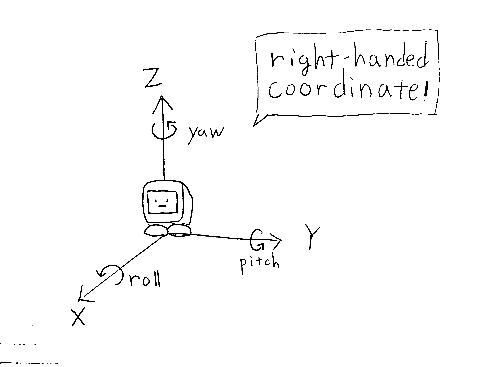

# API

[English](./api.md)

APIの詳しいドキュメントは現在作成中です。

ｽﾀｯｸﾁｬﾝのソースコードには `TSDoc` 形式のコメントがついています。
このコメントを元にマークダウン形式でAPIドキュメントを生成できます。

APIドキュメントを生成するには、`firmware`ディレクトリの下に`tsconfig.json`が必要です。
一度Stack-chanのファームウェアをビルドすると`tsconfig.json`が自動的に生成され、リンクが作成されます。

```console
$ npm run build
...
> stack-chan@0.2.1 postbuild /home/user/repos/stack-chan/firmware
> ln -sf $MODDABLE/build/tmp/${npm_config_target=esp32/m5stack}/debug/stackchan/modules/tsconfig.json ./tsconfig.json

$ file tsconfig.json
tsconfig.json: symbolic link to /home/user/.local/share/moddable/build/tmp/esp32/m5stack/debug/stackchan/modules/tsconfig.json
```

その後、次のコマンドを実行することで`docs/api`ディレクトリ配下にドキュメントを生成できます。

```console
$ npm run generate-apidoc
```

## クラス構成

ｽﾀｯｸﾁｬﾝの機能にアクセスするには`Robot`クラスを使います。
ｽﾀｯｸﾁｬﾝの機能の差し替えやカスタマイズができるように、次のクラスが定義されています。

- [Renderer](#renderer): 顔の描画
- [Driver](#driver): モータ等の駆動
- [TTS](#tts): 音声合成

// TODO: クラス図と説明

## 座標系



ｽﾀｯｸﾁｬﾝの座標系は __右手系__ です。
右手の親指、人差し指と中指がそれぞれ直行するように曲げたとき、
親指がX軸、人差し指がY軸、中指がZ軸となります。

ｽﾀｯｸﾁｬﾝの顔が正面を向いているとき、各軸の正の方向は次のとおりです。

- X軸の正方向…顔の前側
- Y軸の正方向…顔の左側
- Z軸の正方向…頭側

また、回転の向きは軸の正の方向に対して右ねじが進む向きとなります。
ｽﾀｯｸﾁｬﾝの顔でいうと、各軸の周りを正の方向へ回転する場合次のようになります。

- ロール軸（X軸まわりの回転）の正方向…ｽﾀｯｸﾁｬﾝから見て時計回りに首をかしげる動き
- ピッチ軸（Y軸まわりの回転）の正方向…ｽﾀｯｸﾁｬﾝが下を向く動き
- ヨー軸（Z軸まわりの回転）の正方向…ｽﾀｯｸﾁｬﾝが左を向く動き

ｽﾀｯｸﾁｬﾝのAPIにおいては __座標の単位はメートル、角度の単位はラジアンになります__ 。
座標系との対応は実際のソースコード（[`mods/look_around`](../mods/look_around/)など）も参考にしてください。

## クラス

### Robot

### Renderer

### Driver

### TTS

- [TTS（音声合成）の使用](./text-to-speech_ja.md)
