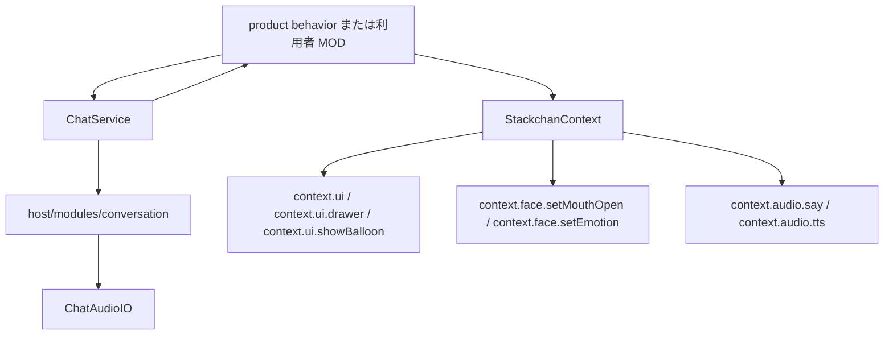
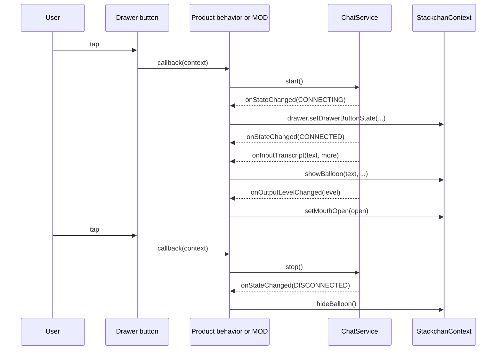

# ChatAudioIO と Stack-chan の統合設計

## 目的

Moddable の `ChatAudioIO` を Stack-chan の会話機能として扱う。

会話の実装本体は `host/modules/conversation` に置く。
UI、顔、Drawer、音声出力の更新は `StackchanContext` の capability API を通して行う。

## レイヤ構成



`ChatService` は UI と顔を直接知らない。
`ChatService` は状態、入力レベル、出力レベル、 transcript、function call を callback で上位へ通知する。

上位の product behavior または利用者 MOD は、その callback を `StackchanContext` の capability API に変換する。
たとえば transcript は `context.ui.showBalloon()`、出力レベルは `context.face.setMouthOpen()`、開始と停止は `context.ui.drawer` のボタン状態へ反映する。

## ChatService の境界

`ChatService` は `host/modules/conversation/chat.ts` に置く。
この module は `ChatAudioIO` を包み、Stack-chan 側の最小契約だけを公開する。

```ts
export type ChatCallbacks = {
  onStateChanged?: (state: ChatState, error?: string) => void
  onInputLevelChanged?: (level: number) => void
  onOutputLevelChanged?: (level: number) => void
  onInputTranscript?: (text: string, more: boolean) => void
  onOutputTranscript?: (text: string, more: boolean) => void
  onFunctionCall?: (call: string, name: string, params: Record<string, unknown>) => void
}

export class ChatService {
  start(): void
  stop(): void
  close(): void
  sendText(text: string): void
  sendFunctionResult(call: string, name: string, result: unknown): void
  setMicrophoneEnabled(enabled: boolean): void
  setVolume(volume: number): void
  get state(): ChatState
}
```

`ChatService` は UI の `Application`、Piu `Content`、Drawer の具象型を受け取らない。
これにより、会話 module は `host/modules/conversation` の中で完結し、UI module への逆依存を持たない。

## UI と顔への反映

会話状態の表示は `StackchanContext` の UI capability を使う。

- 接続中と切断中は、Drawer ボタンの状態または status bar へ反映する。
- ユーザー発話と AI 応答は、`context.ui.showBalloon()` または `context.ui.addEffect()` で表示する。
- AI 応答の出力レベルは、`context.face.setMouthOpen()` に渡す。
- エラーは会話 module で握りつぶさず、`onStateChanged(state, error)` で上位へ返す。

口の開きは `0..1` にクランプする。
既存 TTS と同じスケールを使う場合は、`Math.min(level / 2000, 1)` を基準にする。

## Drawer ボタンからの開始と停止



Drawer の callback は `StackchanContext` を受け取る。
旧来の全機能を抱えた facade を前提にしない。

## 設定

会話設定は `config.chat` に置く。
`ChatService` は `type`、`modelID`、`voiceID`、`instructions` を受け取り、`ChatAudioIO` の specifier へ変換する。

```json
{
  "chat": {
    "type": "openAIRealtime",
    "modelID": "gpt-realtime-mini",
    "voiceID": "marin",
    "instructions": "..."
  }
}
```

API key は `ChatAudioIO` の標準設定に合わせる。
ファイルへ固定値を書かない場合は、`mcconfig` の config 上書きで渡す。

## テスト配置

会話 module の pure logic は `host/modules/conversation` 配下に置く。
Node.js で検証できるものは、module-local な `*.test.ts` として置く。

Piu `Application`、Drawer、Speech balloon、顔表示に依存する確認は、対象 UI または app behavior の `__tests__/<case>/manifest.test.json` に置く。
`npm run test:moddable` は `host/app`、`host/modules`、`mods/examples` の runnable `manifest.test.json` を列挙する。

sample MOD 固有の設定や provider wiring は、`mods/examples/<sample>/__tests__/<case>/manifest.test.json` に置く。
これらは通常の CI と同じ `npm run test:moddable` で走る。

## 確認項目

- `ChatService` は `ChatAudioIO` の状態と transcript を callback へ中継する。
- Drawer ボタンは `StackchanContext` 経由で開始と停止を切り替える。
- transcript 表示は UI capability を通す。
- 出力レベルは `context.face.setMouthOpen()` だけで顔へ反映する。
- `host/modules/conversation` は `host/modules/ui` に依存しない。
- sample MOD の test manifest は `mods/examples` 配下に置く。
