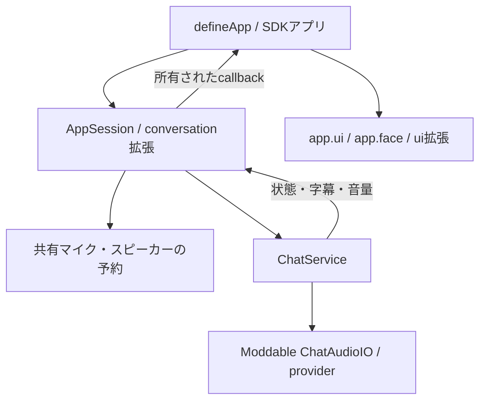

# ChatAudioIO と SDK の会話接続

アプリは `conversation(app).realtime(options)` を使います。`ChatService` と `ChatAudioIO` はホスト内部の実装です。AppSessionが接続・購読・非同期toolの寿命を所有し、`close()` とアプリ終了で解放します。



## アプリから使う

```js
import { defineApp } from 'stackchan'
import { conversation } from 'stackchan/extensions/conversation'

export default defineApp({
  async setup(app) {
    const connection = await conversation(app).realtime({
      onTranscript: (text) => app.ui.showBalloon(text),
      onOutputLevel: (level) => app.face.setMouthOpen(level),
      onState: (state, error) => {
        if (error) app.ui.showBalloon(error)
        if (state === 'disconnected' || state === 'failed') app.face.setMouthOpen(0)
      },
    })
    // 接続はAppSessionが所有する。早く停止するときは await connection.close()。
  },
})
```

app API 2、host API 7以降、`conversation.realtime` をmetadataへ宣言します。設定画面で `chat.type`、`chat.apiKey`、`chat.endpoint`、`chat.modelID`、`chat.voiceID`、`chat.instructions` を設定できます。optionsで個別に上書きする場合も、秘密を配布ソースへ固定しないでください。

[chat_audioio](../mods/examples/chat_audioio/README_ja.md) はメニューから接続・停止・provider選択を行う例です。メニューは `ui(app)`、字幕は `app.ui.showBalloon()`、口は `app.face.setMouthOpen()` を使います。SDKの出力レベルは0〜1に正規化済みなので、アプリで再変換しません。

## ホスト内部の責務

`host/modules/conversation/chat.ts` はprovider選択、接続状態、入力・出力レベル、transcript、function callを扱います。PiuのApplicationや顔の具象型を受け取りません。SDK拡張がcallbackをアプリの寿命へ結び付け、入力と出力の両方を予約してからChatServiceを構築します。他の録音・再生・会話が使用中なら `BUSY` です。

開始失敗では取得済みの資源を解放します。接続が `failed` または `disconnected` になるとSDK接続も閉じます。再開するときは新しい接続を作ります。toolは `TaskContext.signal` へ従い、終了した接続の結果を後続の接続へ送信しません。音声機器の解放に失敗した場合は、後続の操作を成功として扱いません。

## 検証

provider設定と状態遷移のpure logicは `host/modules/conversation`、SDKの所有処理は `host/app` の試験で確認します。Piuやドライバーに依存する動作は `manifest.test.json` を使います。

```sh
npm run test:unit
npm run check:sdk
npm run check:architecture
npm run test:moddable
```

外部サービスとの接続と実機音声は別途受入が必要です。全providerが同じtargetで利用可能とは限らず、`app.capabilities.get('conversation.realtime')` と接続時のエラーを確認してください。
