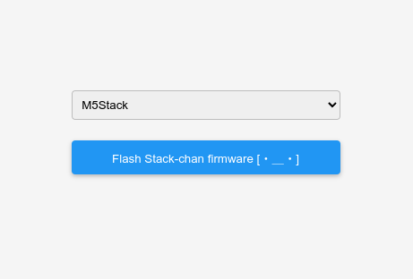
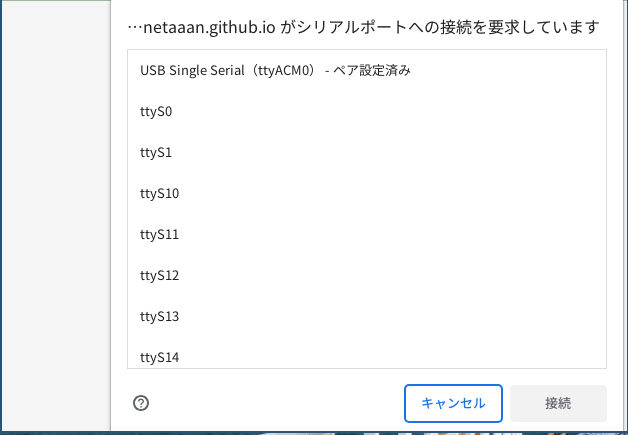
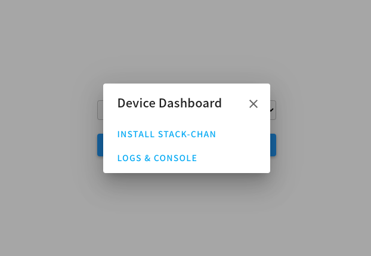
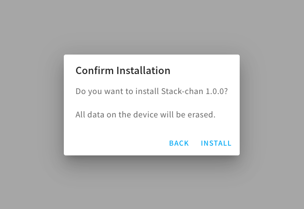
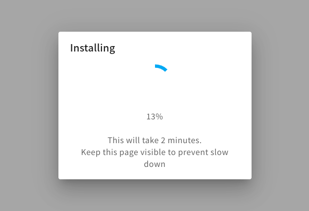
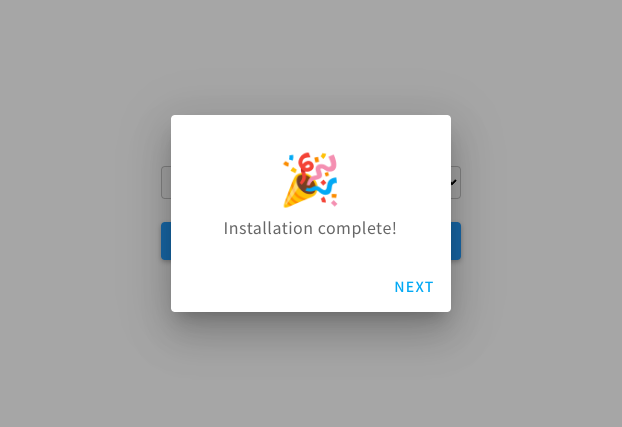

# Building and Flashing the Program

[日本語](./flashing-firmware-web_ja.md)

You can flash the Stack-chan firmware from a web browser without ModdableSDK environment.

## Prerequisites

* M5Stack USB driver is installed
* PC supports Web Serial API

## Steps

* Connect the M5Stack to your PC
* Access https://meganetaaan.github.io/stack-chan/web/flash/

* Choose the type of M5Stack from the select box (M5Stack, M5Stack Fire, M5Stack Core2, M5Stack CoreS3)
* Choose "Flash Stack-chan firmware"

* Choose Stack-chan's serial port (displayed as ttyUSB0, ttyACM0, etc.)

* Choose "INSTALL STACK-CHAN" → "INSTALL"
* Wait for 2-3 minutes

* Flashing complete!

## NOTE

The factory default settings are configured to use the SCS0009 servo.
If you wish to use a different type of servo, please refer to "[Changing Stack-chan settings from the browser](setting-preferences-web_ja.md)".
