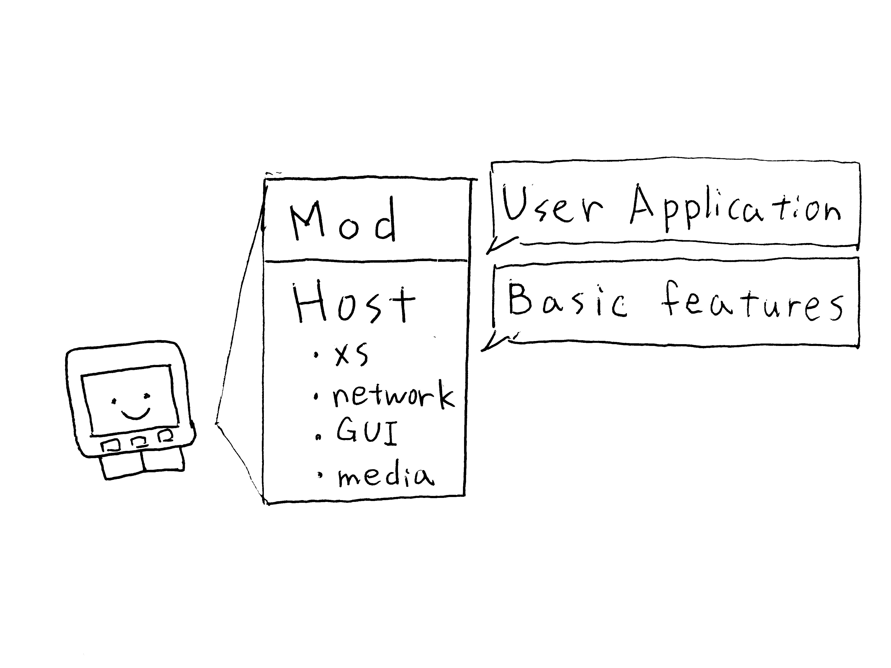
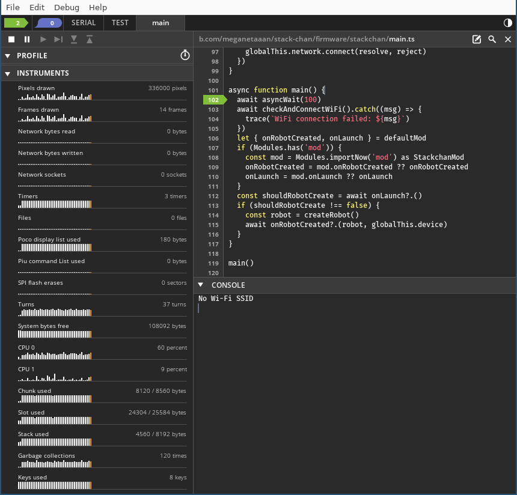

## Build and flash firmware

[日本語](./flashing-firmware_ja.md)

## Firmware architecture

### Host and MOD



Stack-chan's firmware consists of a program that provide the basic operation of Stack-chan (host), and a user application (mod).
Once the host is written, the mod can be installed in a short time for fast development.
First write the host, and then write the mods as needed.
When no MOD is installed, the host runs the product default behavior.
When a MOD is installed, that MOD replaces the product default behavior and receives the runtime context through `onContextCreated`.

### Manifest File

The host and the MOD each consist of a manifest file (manifest.json), source code for JavaScript modules, and resources such as images and audio. The manifest file includes the names and locations of the JavaScript modules (`modules`) , as well as the configurations that can be referenced within the modules (`config`). Additionally, the manifest file can include other manifest files (`include`).

For all configuration items, please refer to the [Moddable official documentation](https://github.com/Moddable-OpenSource/moddable/blob/public/documentation/tools/manifest.md).

## Configuration

StackChan can change settings such as motor types and pin assignments from the manifest file. You can modify [`stack-chan/firmware/host/app/manifest_local.json`](../host/app/manifest_local.json) for local settings. The following settings can be written under the `"config"` key.

| Key               | Description                                                                | Available values                     |
| ----------------- | -------------------------------------------------------------------------- | ------------------------------------ |
| driver.type       | Type of motor driver                                                       | "scservo", "rs30x", "pwm", "none", "dynamixel"    |
| driver.panId      | ID of the serial servo used for pan axis (horizontal rotation of the neck) | 1~254                                |
| driver.tiltId     | ID of the serial servo used for tilt axis (vertical rotation of the neck)  | 1~254                                |
| driver.offsetPan  | Offset of the pan axis                                                     | -90~90                               |
| driver.offsetTilt | Offset of the tilt axis                                                    | -90~90                               |
| tts.type          | [TTS](./text-to-speech.md) type                                            | "local", "voicevox", "remote", "voicevox-web", "elevenlabs", "openai"                  |
| tts.host          | Host name when TTS communicates with server                                | "localhost", "ttsserver.local", etc. |
| tts.port          | Port number when TTS communicates with server                              | 1~65535                              |
| tts.volume        | Volume when play TTS                                                       | 0~1                                  |

Additionally, you can specify the paths of other manifest files in a list format under the `"include"` key.

### Configuration Example: the Stack-chan M5Bottom Kit

This is an example configuration for running [Stack-chan Assembly Kit M5Bottom Version](https://mongonta.booth.pm/) distributed by Takao Akaki ([@mongonta0716](https://github.com/mongonta0716)) with the firmware in this repository. The M5Bottom version does not use a dedicated board, but connects to the M5Bottom port and servo.

When using Port.A of M5Stack Core2:

`manifest_local.json`

```json
{
  // ...
  "config": {
    "driver": {
      "type": "pwm",
      "pwmPan": 33,
      "pwmTilt": 32
    }
  }
}
```

When using Port.C of M5Stack Core2:

`manifest_local.json`

```json
{
  // ...
  "config": {
    "driver": {
      "type": "pwm",
      "pwmPan": 13,
      "pwmTilt": 14
    }
  }
}
```

When using Port.C of M5Stack Basic:

`manifest_local.json`

```json
{
  // ...
  "config": {
    "driver": {
      "type": "pwm",
      "pwmPan": 16,
      "pwmTilt": 17
    }
  }
}
```

If Stack-chan is shaking her head left and right, the configuration has been successful.

Reference: [About the firmware for Stack-chan M5Go Bottom version (Japanese)](https://raspberrypi.mongonta.com/softwares-for-stackchan/)

## Writing the base program (hosts)

As stated above, Stack-chan's firmware comprises a base program (host) and a user application (MOD).
The following commands are used to build and write a host.

_No `sudo` required for the command._

```console
# For M5Stack Basic/Gray/Fire
$ npm run build
$ npm run deploy

# For M5Stack Core2
$ npm run build --target=esp32/m5stack_core2
$ npm run deploy --target=esp32/m5stack_core2

# For M5Stack CoreS3
$ npm run build --target=esp32/m5stack_cores3
$ npm run deploy --target=esp32/m5stack_cores3
```

The program will be saved under the `$MODDABLE/build/` directory.

If written correctly, the face of Stack-chan will appear a few seconds after startup.
With the product default behavior, the M5Stack buttons change Stack-chan's behavior as follows:

- **A Button** (in the case of CoreS3, the bottom-left area of the screen) ... Stack-chan will look in a random direction every 5 seconds.
- **B Button** (in the case of CoreS3, the bottom-center area of the screen) ... Stack-chan will look left, right, down, and up.
- **C Button** (in the case of CoreS3, the bottom-right area of the screen) ... The color of Stack-chan's face will invert.

## Debugging

You can debug the program using the following commands:

```
# For M5Stack Basic/Gray/Fire
$ npm run debug

# For M5Stack Core2
$ npm run debug --target=esp32/m5stack_core2

# For M5Stack CoreS3
$ npm run debug --target=esp32/m5stack_cores3
```

These commands will open Moddable's debugger `xsbug` and connect it to the M5Stack.



Using `xsbug`, you can check logs, set breakpoints (temporarily pause the program at specific lines), and perform step-by-step execution.
For detailed instructions on how to use `xsbug`, please refer to the [official documentation](https://github.com/Moddable-OpenSource/moddable/blob/public/documentation/xs/xsbug.md).

## (Optional) Writing user application (mods)

The following command is used to build and write a mod.

_No `sudo` required for the command._

```console
# For M5Stack Basic/Gray/Fire
$ npm run mod [mod manifest file path]

# For M5Stack Core2
$ npm run mod --target=esp32/m5stack_core2 [mod manifest file path]

# For M5Stack CoreS3
$ npm run mod --target=esp32/m5stack_cores3 [mod manifest file path]
```

The standard command accepts MOD manifests that resolve to JavaScript modules.
ESP32 and lin targets can also use TypeScript modules through the Moddable toolchain.
For the WASM host, build the MOD with a TypeScript-capable target such as `lin`, then load the generated `.xsb` or archive.

After installation, the MOD runs instead of the product default behavior.
The exact button and screen behavior depends on the installed MOD.

**Example: Installing [`mods/examples/look_around`](../mods/examples/look_around/)**

```console
$ npm run mod ./mods/examples/look_around/manifest.json

> stack-chan@0.2.1 mod
> mcrun -d -m -p ${npm_config_target=esp32/m5stack} ${npm_argument} "./mods/examples/look_around/manifest.json"

# xsc mod.xsb
# xsc check.xsb
# xsc mod/config.xsb
# xsl look_around.xsa
Installing mod...complete
```

## (Optional)erase flash

After writing the MOD, if you want to revert to the behavior before the MOD was written, you can erase the written MOD with the following command.

> [!NOTE]  
> When you execute the command, it erases not only the MOD area but the entire flash area.  
> Please note that if you are using Preferences to write settings, those settings will also be erased.  
> Additionally, after executing the command, you will need to write to the host again.  

```console
$ npm run erase-flash

> stack-chan@0.2.1 erase-flash
> esptool.py erase_flash

esptool.py v4.8.dev4
Found 2 serial ports
Serial port /dev/cu.usbserial-01F05597
Connecting....
Detecting chip type... Unsupported detection protocol, switching and trying again...
Connecting.........
Detecting chip type... ESP32
Chip is ESP32-D0WDQ6-V3 (revision v3.0)
Features: WiFi, BT, Dual Core, 240MHz, VRef calibration in efuse, Coding Scheme None
Crystal is 40MHz
MAC: 8c:aa:b5:81:6c:1c
Uploading stub...
Running stub...
Stub running...
Erasing flash (this may take a while)...
Chip erase completed successfully in 25.4s
Hard reset
```

## Next Step

- [mods/README.md](../mods/README.md): The list of example mods
- [API](./api.md): API document
