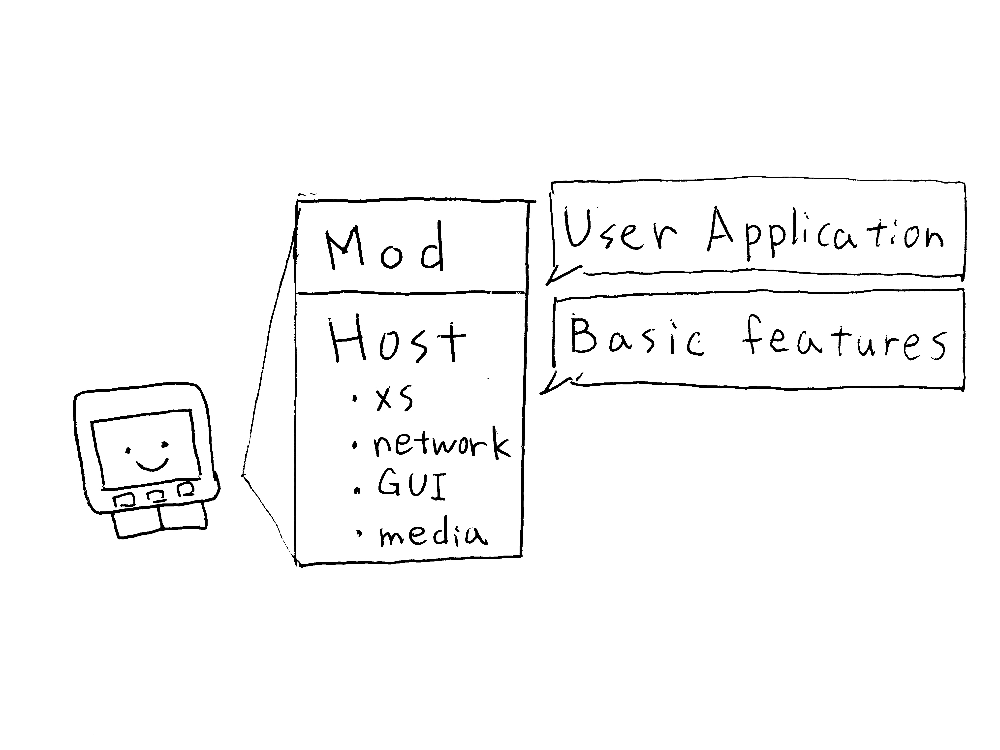
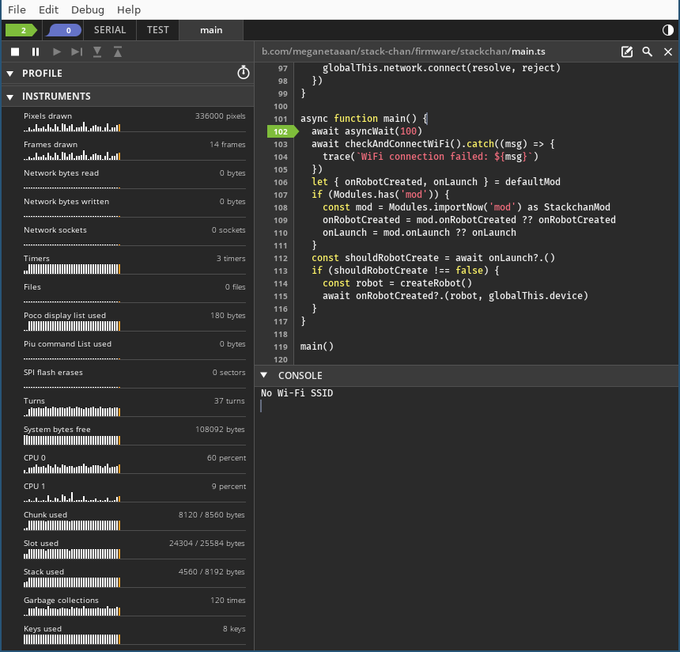

# プログラムのビルドと書き込み

[English](./flashing-firmware.md)

## ｽﾀｯｸﾁｬﾝのプログラム構成について

### ホストと MOD



ｽﾀｯｸﾁｬﾝのファームウェアは、ｽﾀｯｸﾁｬﾝの基本動作を提供するプログラム（ホスト）とユーザアプリケーション（MOD）から構成されます。
一度ホストを書き込んでしまえば、ユーザアプリケーションのインストールは短時間で終わるため高速な開発が可能です。
最初にホストを書き込み、必要に応じて MOD の書き込みを行います。

### マニフェストファイル

ホストと MOD はそれぞれ、設定用のマニフェストファイル（manifest.json）、JavaScript モジュールのソースコード、画像や音声などのリソースから構成されます。
マニフェストファイルでは、JavaScript モジュールの名前と場所（modules）や、モジュール内から参照できる設定（config）などを含みます。
また、マニフェストファイルは他のマニフェストファイルを含める（include）こともできます。

全ての設定項目は[Moddable の公式ドキュメント（英語）](https://github.com/Moddable-OpenSource/moddable/blob/public/documentation/tools/manifest.md)を参照してください。

## 設定変更

ｽﾀｯｸﾁｬﾝが使うモータの種類やピンアサインなどをマニフェストファイルから変更できます。
ユーザが変更する設定は[`stack-chan/firmware/stackchan/manifest_local.json`](../stackchan/manifest_local.json)にまとまっています。
`"config"`キーの配下に次のような設定が書けます。

| キー              | 説明                                            | 使用可能な値                                |
| ----------------- | ----------------------------------------------- | ------------------------------------------- |
| driver.type       | モータドライバの種類                            | "scservo", "rs30x", "pwm", "none"           |
| driver.panId      | パン軸（首の横回転）に使うシリアルサーボの ID   | 1~254                                       |
| driver.tiltId     | チルト軸（首の縦回転）に使うシリアルサーボの ID | 1~254                                       |
| driver.offsetPan  | パン軸のオフセット                              | -90~90                                      |
| driver.offsetTilt | チルト軸のオフセット                            | -90~90                                      |
| tts.type          | [TTS](./text-to-speech_ja.md) の種類            | "local", "voicevox"                         |
| tts.host          | TTS がサーバと通信する場合のホスト名            | "localhost", "ttsserver.local" などの文字列 |
| tts.port          | TTS がサーバと通信する場合のポート番号          | 1~65535                                     |

また、`"include"`キーの配下にリスト形式で他のマニフェストファイルのパスを指定できます。

### 設定例: ｽﾀｯｸﾁｬﾝ M5Bottom 版キットを動かす

紅木タカオ氏（[@mongonta0716](https://github.com/mongonta0716)）が頒布する
[ｽﾀｯｸﾁｬﾝ組み立てキット M5Bottom 版](https://mongonta.booth.pm/)を本リポジトリのファームウェアで動かすための設定例です。
M5Bottom 版は本リポジトリと違って専用基板を使わず、M5Bottom のポートとサーボを接続します。

M5Stack Core2 の Port.A（M5Stack Core2 本体側面の赤い穴）を使う場合:

`manifest_local.json`

```json
{
  // ...
  "config": {
    "driver": {
      "type": "pwm",
      "pwmPan": 33,
      "pwmTilt": 32
    }
  }
}
```

M5Stack Core2 の Port.C を使う場合:

`manifest_local.json`

```json
{
  // ...
  "config": {
    "driver": {
      "type": "pwm",
      "pwmPan": 13,
      "pwmTilt": 14
    }
  }
}
```

M5Stack Basic の Port.C を使う場合:

`manifest_local.json`

```json
{
  // ...
  "config": {
    "driver": {
      "type": "pwm",
      "pwmPan": 16,
      "pwmTilt": 17
    }
  }
}
```

ファームウェア導入後、ｽﾀｯｸﾁｬﾝが左右に首振りを行うようであれば成功です。

参考: [ｽﾀｯｸﾁｬﾝ M5GoBottom 版のファームウェアについて \| M5Stack 沼人の日記](https://raspberrypi.mongonta.com/softwares-for-stackchan/)

### 設定例: mod の書き込み領域を増やす

2023 年 3 月現在、Moddable は SD Card のドライバが実装されていないため、音声や画像などのリソースは mod に含めてコンパイルして書き込む形になります。
多量の音声を含む場合、ｽﾀｯｸﾁｬﾝのデフォルトのパーティションサイズである 4MB を上回って mod が書き込めない場合があります。

最近の M5Stack は 16MB の Flash を備えています。
その場合は[`stackchan/manifest_8mb_flash.json`](../stackchan/manifest_8mb_flash.json)をインクルードすることで、
mod を書き込むパーティションの容量が大幅に増加します。

```json
{
  "include": ["./manifest_8mb_flash.json"]
}
```

## 基本プログラム（ホスト）の書き込み

前述の通りｽﾀｯｸﾁｬﾝのファームウェアは基本プログラム（ホスト）とユーザアプリケーション（MOD）から構成されます。
次のコマンドで基本プログラム（ホスト）の書き込みを行います。

_コマンドに`sudo`をつける必要はありません。_

```console
# M5Stack Basic/Gray/Fireの場合
$ npm run build
$ npm run deploy

# M5Stack Core2の場合
$ npm run build --target=esp32/m5stack_core2
$ npm run deploy --target=esp32/m5stack_core2

# M5Stack CoreS3の場合
$ npm run build --target=esp32/m5stack_cores3
$ npm run deploy --target=esp32/m5stack_cores3
```

ビルドしたプログラムは`$MODDABLE/build/`ディレクトリ配下に保存されます。

正しく書き込めていれば起動から数秒後にｽﾀｯｸﾁｬﾝの顔が表示されます。
M5Stack のボタンを押すと次のように変わります。

- A ボタン（CoreS3 の場合は画面左下の領域） ... ｽﾀｯｸﾁｬﾝが 5 秒おきにランダムな方向を見る
- B ボタン（CoreS3 の場合は画面中央下の領域） ... ｽﾀｯｸﾁｬﾝが左、右、下、上を向く
- C ボタン（CoreS3 の場合は画面右下の領域） ... ｽﾀｯｸﾁｬﾝの顔の色が反転する

## デバッグ

次のコマンドでプログラムのデバッグが可能です

```console
# M5Stack Basic/Gray/Fireの場合
$ npm run debug

# M5Stack Core2の場合
$ npm run debug --target=esp32/m5stack_core2

# M5Stack CoreS3の場合
$ npm run debug --target=esp32/m5stack_cores3
```

このコマンドはModdableのデバッガ`xsbug`を開き、M5Stackと接続します。



`xsbug`を使うとログの確認やブレークポイントの設定（プログラムの特定行で一時停止する）、ステップ実行（プログラムを1行ずつ実行する）などができます。
`xsbug`の詳しい使い方は[公式ドキュメント（英語）](https://github.com/Moddable-OpenSource/moddable/blob/public/documentation/xs/xsbug.md)を参照してください。

## （オプション）ユーザアプリケーション（MOD）の書き込み

次のコマンドでユーザアプリケーション（MOD）の書き込みを行います。

_コマンドに`sudo`をつける必要はありません。_

```console
# M5Stack Basic/Gray/Fireの場合
$ npm run mod [modのマニフェストファイルのパス]

# M5Stack Core2の場合
$ npm run mod --target=esp32/m5stack_core2 [modのマニフェストファイルのパス]

# M5Stack CoreS3の場合
$ npm run mod --target=esp32/m5stack_cores3 [modのマニフェストファイルのパス]
```

**例: [`mods/look_around`](../mods/look_around/)をインストールする**

```console
$ npm run mod ./mods/look_around/manifest.json

> stack-chan@0.2.1 mod
> mcrun -d -m -p ${npm_config_target=esp32/m5stack} ${npm_argument} "./mods/look_around/manifest.json"

# xsc mod.xsb
# xsc check.xsb
# xsc mod/config.xsb
# xsl look_around.xsa
Installing mod...complete
```

## 次のステップ

- [mods/README_ja.md](../mods/README_ja.md): 同梱のサンプル MOD の紹介です。
- [API](./api_ja.md): ｽﾀｯｸﾁｬﾝの API ドキュメントです。
