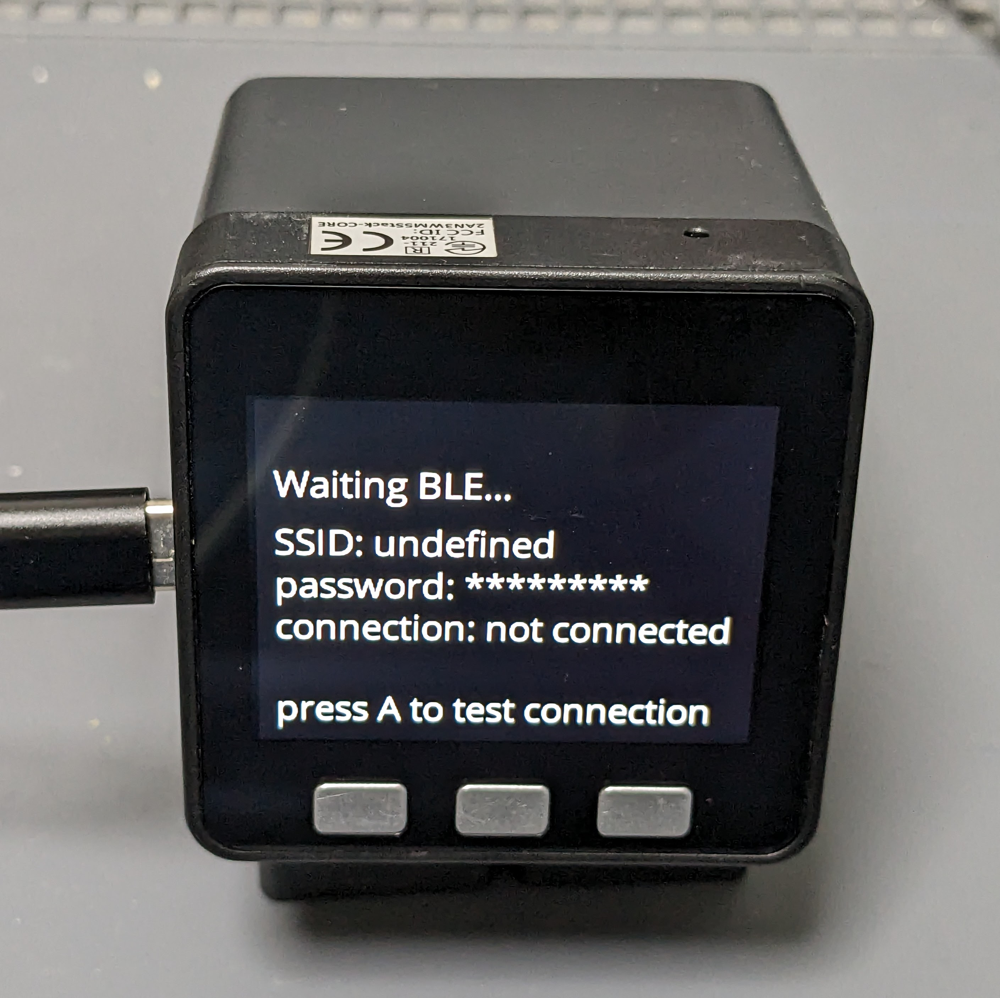
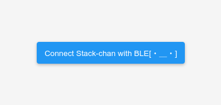
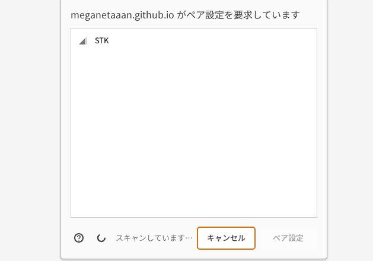
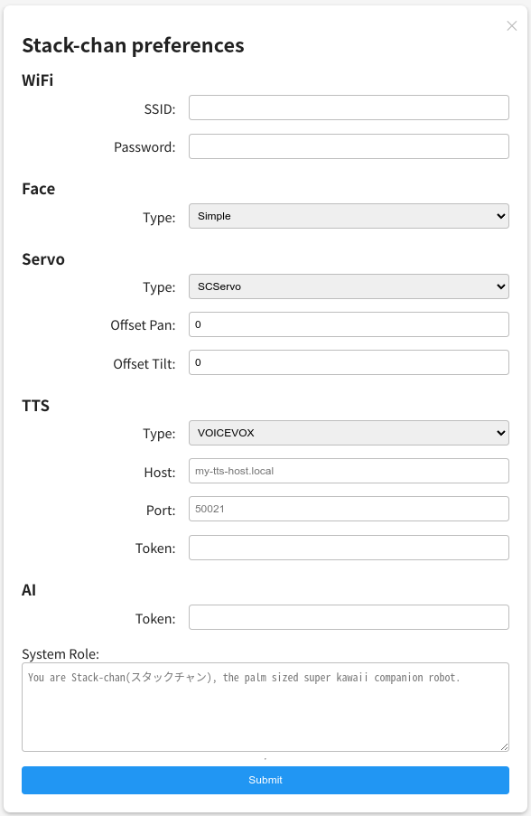

# Changing Stack-chan Settings Using a Web Browser

[日本語](./setting-preferences-web_ja.md)

You can modify Stack-chan's settings from a web browser.
Since it connects using BLE (Bluetooth Low Energy), you don't need to set up Wi-Fi in advance.

## Prerequisites

* Your PC or smartphone supports Web Bluetooth API

## Steps

* Start Stack-chan while pressing the C button. For models with a touch panel (Core2, CoreS3), start Stack-chan while touching the panel.
* The settings screen will be displayed on the M5Stack.

* Open https://meganetaaan.github.io/stack-chan/web/preference/

* Choose "Connect Stack-chan with BLE"

* Select "STK"

* A list of settings items will be displayed. Edit the items you wish to set and select "Submit."
* If you see a message saying "Preference set," the settings have been successfully written!
