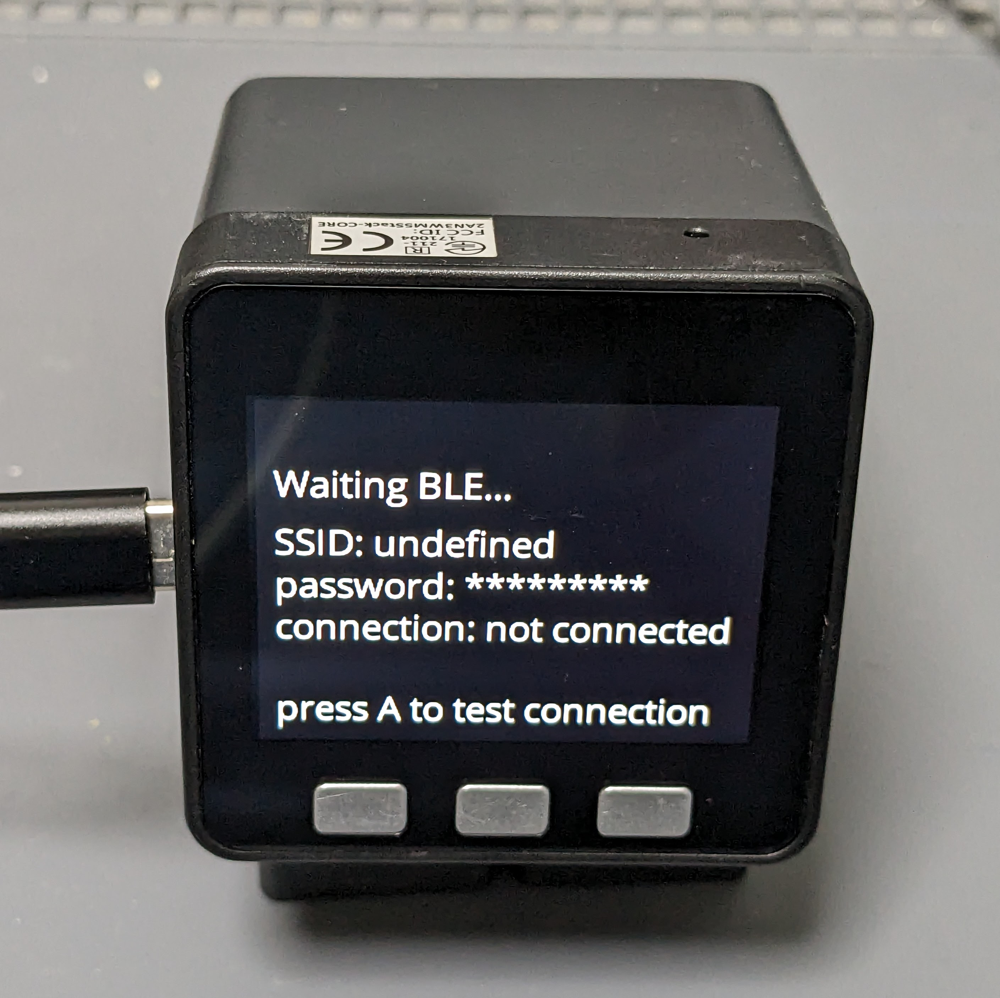
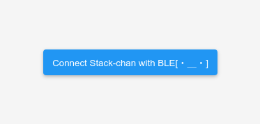
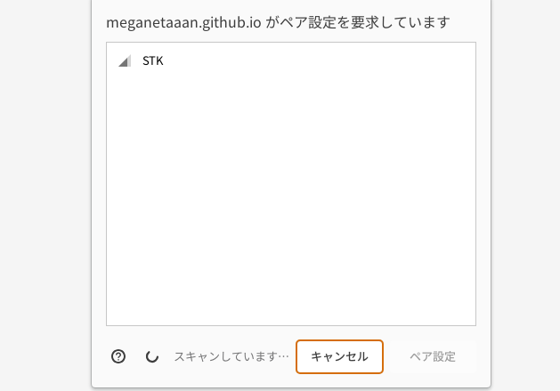
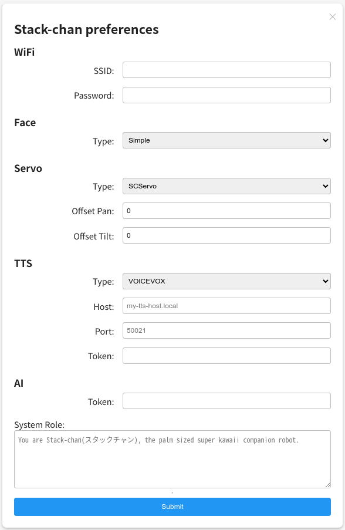

# Webブラウザを使ったｽﾀｯｸﾁｬﾝの設定変更

[English](./setting-preferences-web.md)

Webブラウザからｽﾀｯｸﾁｬﾝの設定を書き換えることができます。
BLE（Bluetooth Low Energy）を使って接続するため、事前に Wi-Fi の設定をしなくても使えます。

## 前提

* PCやスマートフォンがWeb Bluetooth APIに対応していること

## 手順

* Cボタンを押しながらｽﾀｯｸﾁｬﾝを起動する。タッチパネル搭載のモデル（Core2、CoreS3）はタッチパネルを触りながらｽﾀｯｸﾁｬﾝを起動する
* M5Stackに設定画面が表示される

* https://stack-chan.github.io/stack-chan/web/preference/ を開く

* 「Connect Stack-chan with BLE」を選択する

* 「STK」を選択する

* 設定項目が一覧表示されるので、設定したい項目を編集して「Submit」を選択する
* 「Preference set」という表示が出たら書き込み成功！

## 設定項目リファレンス

設定キーの一覧と用途は、[Preference 設定リファレンス](./preferences_ja.md)を参照してください。

> [!NOTE]
> Web 設定アプリでは、空欄の項目は送信されません。  
> 既存値を消したい場合は、消去対象を明示的に設定したうえで再起動確認してください。
