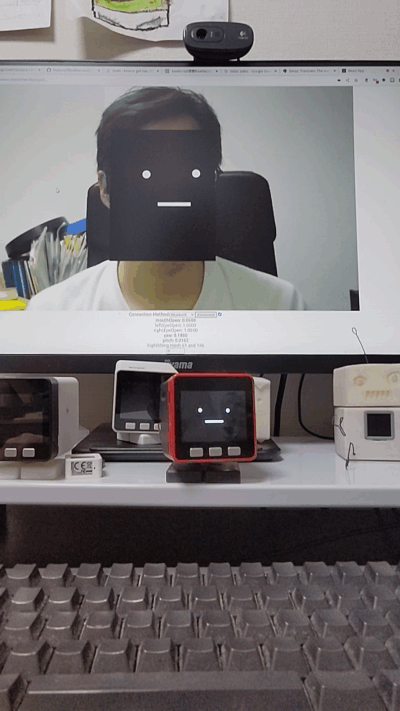
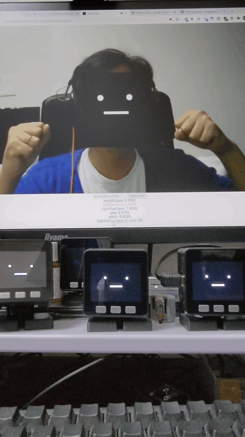

# サンプルMOD

ｽﾀｯｸﾁｬﾝのユーザアプリケーション（MOD）のサンプル集です。
MODの書き込み方法は[プログラムのビルドと書き込み](../docs/flashing-firmware_ja.md)を参照ください。

一部のMODは動かすためにネットワーク接続や外部のサーバを準備を準備する必要があります（執筆中）。

## Look Around: きょろきょろｽﾀｯｸﾁｬﾝ

- [look_around](./look_around/)

## Monologue: ぽしょぽしょ独り言ｽﾀｯｸﾁｬﾝ

- [monologue](./monologue/)

## Cheerup: ｽﾀｯｸﾁｬﾝ応援団

- [cheerup_ble_lite](./cheerup_ble_lite/): BLE版
- [cheerup_ws](./cheerup_ws/): WebSocket版

## Mimic: まねっこｽﾀｯｸﾁｬﾝ

- [mimic_main](./mimic_main/): ユーザが動かすほう
- [mimic_follow](./mimic_follow/): まねして動くほう

## Face Tracker: 顔を追いかけるｽﾀｯｸﾁｬﾝ

- [face_tracker](./face_tracker/)
