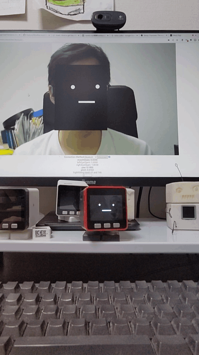
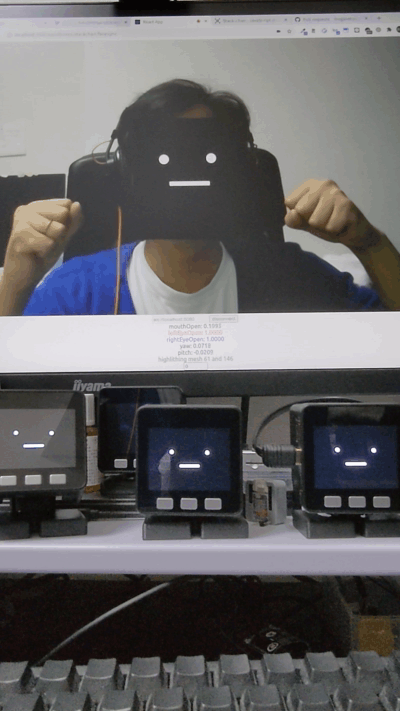
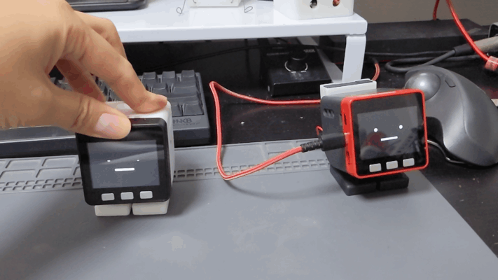
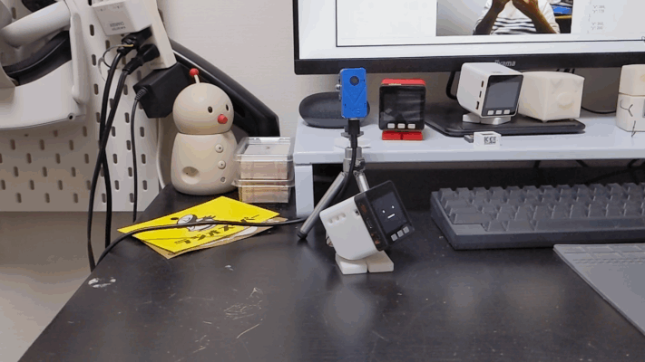

# サンプルMOD

ｽﾀｯｸﾁｬﾝのユーザアプリケーション（MOD）のサンプル集です。
MODの書き込み方法は[プログラムのビルドと書き込み](../docs/flashing-firmware_ja.md)を参照ください。

一部のMODは動かすためにネットワーク接続や外部のサーバを準備する必要があります（執筆中）。

MOD をインストールすると、ホストの製品既定動作は実行されません。
ボタンや画面操作の意味は、インストールした MOD の実装で決まります。

標準の `npm run mod` は JavaScript module を書き込み対象にします。
TypeScript で MOD を書く場合は、現時点では事前に JavaScript へ変換してから `mcrun` に渡す構成が必要です。

## M5StackChan CoreS3 Smoke

- [m5stackchan_smoke](./examples/m5stackchan_smoke/): M5StackChan CoreS3 のサーボ電源とヘッドLEDの smoke 確認です。手順は [M5StackChan CoreS3 smoke check](../docs/m5stackchan-cores3-smoke.md) を参照してください。

## Look Around: きょろきょろｽﾀｯｸﾁｬﾝ

- [look_around](./examples/look_around/)

## Monologue: ぽしょぽしょ独り言ｽﾀｯｸﾁｬﾝ

- [monologue](./examples/monologue/)

## Cheerup: ｽﾀｯｸﾁｬﾝ応援団

- [cheerup_ble_lite](./examples/cheerup_ble_lite/): BLE版
- [cheerup_ws](./examples/cheerup_ws/): WebSocket版

## Mimic: まねっこｽﾀｯｸﾁｬﾝ

- [mimic_main](./examples/mimic_main/): ユーザが動かすほう
- [mimic_follow](./examples/mimic_follow/): まねして動くほう

## Face Tracker: 顔を追いかけるｽﾀｯｸﾁｬﾝ

- [face_tracker](./examples/face_tracker/)
