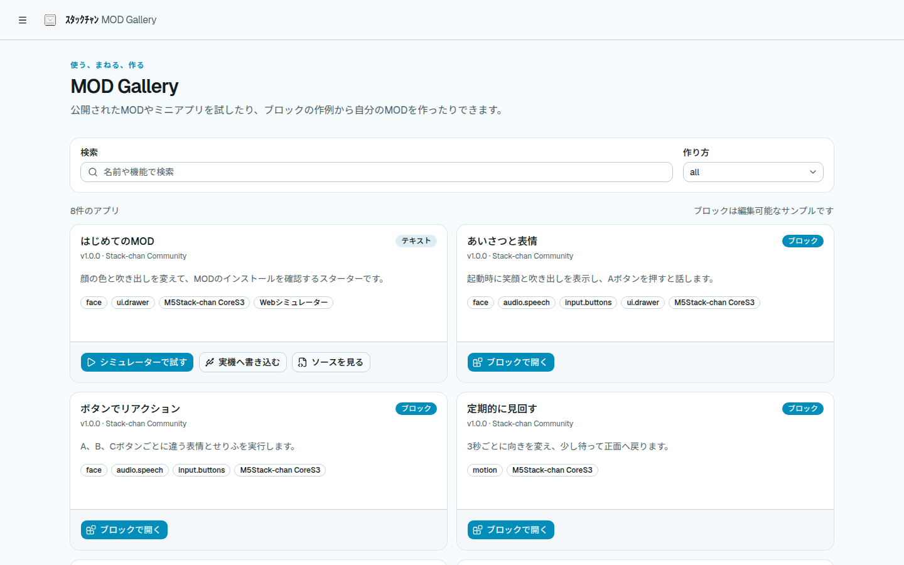
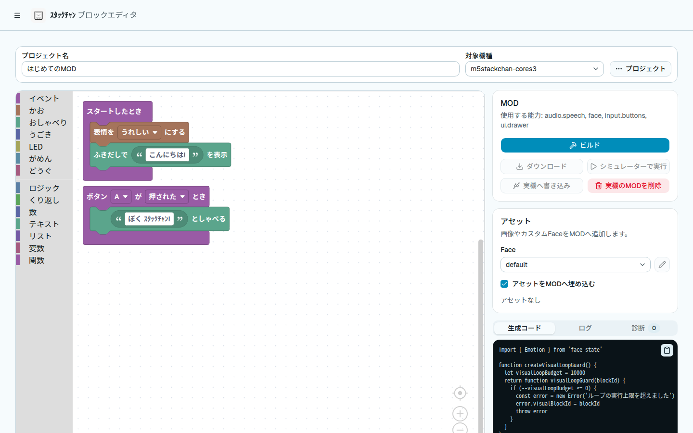

# MODとサンプル

[English](./README.md)

**MOD**は、ｽﾀｯｸﾁｬﾝのホストファームウェア上で動くユーザーアプリケーションです。

## MODを試す

公開MODは[MOD Gallery](https://stack-chan.github.io/stack-chan/web/mod-gallery/)から探せます。
名前や機能で検索し、シミュレーターまたは実機で試せます。
ブロックで作られたMODは、ブロックエディタで変更できます。

MODを選ぶときは、カードに表示される使用機能と対応機種を確認してください。
外部サービスやネットワークを使うMODは、リンク先のソースコードも確認してから書き込んでください。
実機へ書き込むときは、Galleryが対象チップ、XSバージョン、ファームウェア互換性を自動で検査します。

[](https://stack-chan.github.io/stack-chan/web/mod-gallery/)

このディレクトリの[`examples`](./examples/)には、APIの学習、テスト、ローカル開発に使えるMODのソースコードがあります。
その一部はGalleryにも掲載されています。
現在、Galleryと`examples`の収録内容は一致していませんが、今後そろえていく予定です。

## MODを作る

### ブラウザーで作る

[ブロックエディタ](https://stack-chan.github.io/stack-chan/web/editor/)では、Blocklyで処理を組み立て、ブラウザー内でMODをビルドできます。
作成したMODは[シミュレーター](https://stack-chan.github.io/stack-chan/web/simulator/)で確認し、対応する実機へ書き込めます。
最初のプロジェクトは[ブロックエディタのチュートリアル](https://stack-chan.github.io/stack-chan/web/editor/tutorial.html)に沿って作成できます。

[](https://stack-chan.github.io/stack-chan/web/editor/)

### ソースコードから作る

MODはJavaScriptまたはTypeScriptのモジュールとして実装できます。
TypeScriptのMODでは、Stack-chanのcapability APIが公開する型とModdableのモジュール指定子を使用します。

ローカル環境からMODを書き込む場合は、`firmware`ディレクトリで`manifest.json`を指定します。

```console
npm run mod -- mods/examples/look_around/manifest.json
```

環境構築、ターゲット別のコマンド、書き込み方法は[プログラムのビルドと書き込み](../docs/flashing-firmware_ja.md)を参照してください。

## MODの実行モデル

MODをインストールすると、ホストの通常動作に代わってそのMODが実行されます。
ボタンや画面操作の意味は、インストールしたMODの実装で決まります。

MODは、対象機種とホストが使用するXSバージョンに合わせてビルドする必要があります。
WASMホストで使う場合も、`lin`などTypeScriptをサポートするターゲットでビルドした`.xsb`またはアーカイブを読み込みます。

表示文字列は[`context.i18n`を使ったファームウェアのローカライズ](../docs/localization_ja.md)に従って追加します。
顔画面とホストのAppBarを維持したままPiu UIを追加する場合は、実験的な[ミニアプリ](../docs/mini-apps_ja.md)を利用できます。

## 代表的なソース例

| サンプル | 確認できる機能 |
| --- | --- |
| [`look_around`](./examples/look_around/) | モーションAPIを使った最小限の首振り |
| [`localized_drawer`](./examples/localized_drawer/) | `context.i18n`を使ったローカライズ済みUI |
| [`mini_app_sample`](./examples/mini_app_sample/) | 顔画面とAppBarを維持するミニアプリ |
| [`local_peer_hello`](./examples/local_peer_hello/) | インターネットを経由しない端末間の型付きメッセージ |
| [`web_radio`](./examples/web_radio/) | M5StackChan CoreS3でのネットワーク音声再生 |
| [`m5stackchan_smoke`](./examples/m5stackchan_smoke/) | [M5StackChan CoreS3のサーボ電源とヘッドLEDの確認](../docs/m5stackchan-cores3-smoke.md) |

## 参考資料

- [プログラムのビルドと書き込み](../docs/flashing-firmware_ja.md)
- [ファームウェアAPI](../docs/api_ja.md)
- [MODパッケージ仕様](../../docs/specs/stackchan-mod.md)
- [ローカライズ](../docs/localization_ja.md)
- [ミニアプリ（実験的）](../docs/mini-apps_ja.md)
