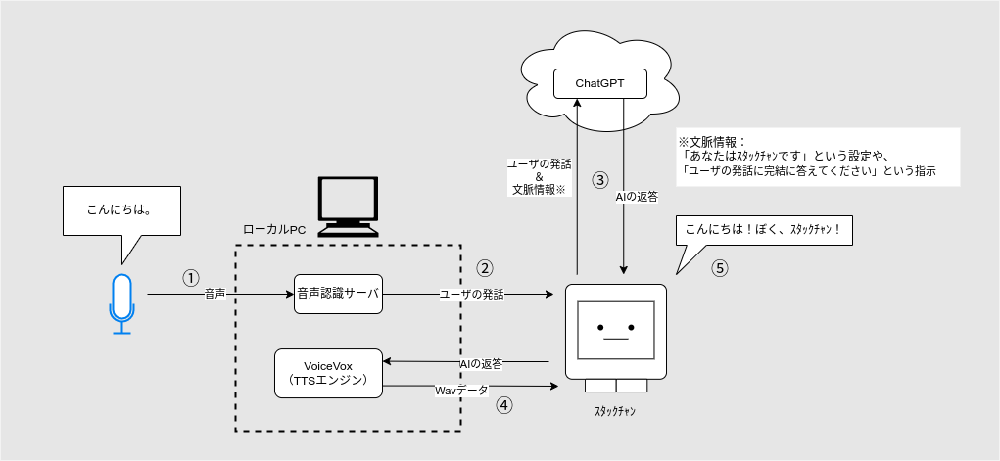

# おしゃべりｽﾀｯｸﾁｬﾝ with ChatGPT

ChatGPT APIを使ってｽﾀｯｸﾁｬﾝと雑談できるデモです。
このMODの他に「音声認識サーバ」「音声合成サーバ」を別のPCで動作させる必要があります。



## 音声認識サーバの準備

- https://github.com/meganetaaan/simple-stt-server を参照してください。
- 正しくセットアップと起動ができていれば以下のようにマイクからの音声書き起こしが表示されます。

```
$ npm start

> suburi-vosk@0.0.1 start /path/to/simple-stt-server
> node index.js

LOG (VoskAPI:ReadDataFiles():model.cc:213) Decoding params beam=13 max-active=7000 lattice-beam=6
LOG (VoskAPI:ReadDataFiles():model.cc:216) Silence phones 1:2:3:4:5:6:7:8:9:10
LOG (VoskAPI:RemoveOrphanNodes():nnet-nnet.cc:948) Removed 1 orphan nodes.
LOG (VoskAPI:RemoveOrphanComponents():nnet-nnet.cc:847) Removing 2 orphan components.
LOG (VoskAPI:Collapse():nnet-utils.cc:1488) Added 1 components, removed 2
LOG (VoskAPI:ReadDataFiles():model.cc:248) Loading i-vector extractor from model/ivector/final.ie
LOG (VoskAPI:ComputeDerivedVars():ivector-extractor.cc:183) Computing derived variables for iVector extractor
LOG (VoskAPI:ComputeDerivedVars():ivector-extractor.cc:204) Done.
LOG (VoskAPI:ReadDataFiles():model.cc:279) Loading HCLG from model/graph/HCLG.fst
LOG (VoskAPI:ReadDataFiles():model.cc:294) Loading words from model/graph/words.txt
LOG (VoskAPI:ReadDataFiles():model.cc:303) Loading winfo model/graph/phones/word_boundary.int
LOG (VoskAPI:ReadDataFiles():model.cc:310) Loading subtract G.fst model from model/rescore/G.fst
LOG (VoskAPI:ReadDataFiles():model.cc:312) Loading CARPA model from model/rescore/G.carpa
listening on port 8080
Received Info: 録音中 WAVE 'stdin' : Signed 16 bit Little Endian, レート 16000 Hz, モノラル

{ text: 'テスト' }
```

## 音声合成サーバの準備

- https://github.com/VOICEVOX/voicevox_engine を参照してください。
- dockerがインストールされた環境では[Dockerイメージ](https://hub.docker.com/r/voicevox/voicevox_engine)からの起動がおすすめです。
  - GPU版とCPU版で使用するイメージが異なります。
  - 起動コマンドは下記のようにして自PCのIPアドレスを指定してください。

```console
$ docker pull voicevox/voicevox_engine:cpu-ubuntu20.04-latest
$ docker run --rm -it -p '[自PCのIPアドレス]:50021:50021' voicevox/voicevox_engine:cpu-ubuntu20.04-latest
...
+ exec gosu user /opt/python/bin/python3 ./run.py --use_gpu --voicelib_dir /opt/voicevox_core/ --runtime_dir /opt/onnxruntime/lib --host 0.0.0.0
Warning: cpu_num_threads is set to 0. ( The library leaves the decision to the synthesis runtime )
INFO:     Started server process [1]
INFO:     Waiting for application startup.
reading /tmp/tmp8qiss_tj ... 57
emitting double-array: 100% |###########################################| 
INFO:     Application startup complete.
INFO:     Uvicorn running on http://0.0.0.0:50021 (Press CTRL+C to quit)
```

## ホスト書き込み

ｽﾀｯｸﾁｬﾝのホストを書き込みます。
このときｽﾀｯｸﾁｬﾝを無線LANネットワークに接続するために、SSIDとパスワードを指定します。

```console
# targetは esp32/m5stack または esp32/m5stack_core2 から指定
$ npm run build --target=esp32/m5stack ssid=[使用するネットワークのSSID] password=[使用するネットワークのパスワード]
$ npm run deploy --target=esp32/m5stack
```

参考：[Moddableの公式ドキュメント（英語）](https://github.com/Moddable-OpenSource/moddable/tree/public/examples#wifi-configuration)

## mod書き込み

ChatGPT連携のmodを書き込みます。

1. ChatGPTのAPIキーを`api-key.js`に記述します。

```
const API_KEY = 'YOUR_API_KEY_HERE'
export default API_KEY
```

2. 次のコマンドでmodを書き込みます。

```console
$ npm run mod ./mods/chatgpt/manifest.json
```

## キャラクター設定（systemメッセージ）の変更

TBD
