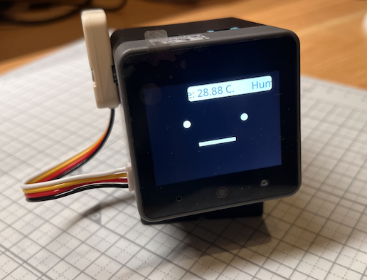
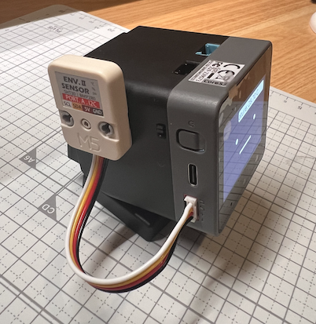

# SHT3xで温度・湿度を表示する

SHT30 / SHT3x を搭載した環境センサーユニットを、本体の既定の外部 I²C バス（対応ボードの PORT.A）へ接続します。

## 操作と改造



起動直後にセンサーを準備し、最初は3秒後、以後60秒ごとに温度（℃）と相対湿度（%）を表示します。「温度・湿度を測る」から手動で再測定できます。吹き出しは10秒で閉じます。



測定間隔や表示は `mod.ts` を編集します。ホストに SHT3x ドライバーを含めてあるため、アプリの manifest にセンサーの内部ドライバーを追加する必要はありません。別のセンサーに変える場合は、まずホスト側の型付き拡張を用意します。

外部 I²C が未対応なら `UNSUPPORTED`、未接続や読取失敗なら `IO` です。配線とセンサー型を確認して手動再測定します。起動時の機器生成に失敗した場合は MOD を起動し直します。アプリ終了時には同じ所有者がセンサーを閉じます。

## ビルドと導入

このブランチの app API 2 / host API 7 が必要です。古い host / XSA は更新・再ビルドします。`firmware/` で依存関係とツールチェーンを準備して実行してください。

```sh
npm run mod:build -- mods/examples/unit_temperature/manifest.json
npm run mod -- mods/examples/unit_temperature/manifest.json
```

前者はビルド、後者は既定の CoreS3 への書き込みです。別機種は対応する `mod:stackchan_rt` / `mod:takao_core2_sg90` を使います。機種の宣言と利用できる機能を確認してください。[全例と共通の復帰手順](../README_ja.md)、[公開 SDK](../../../sdk/README_ja.md) に共通契約をまとめています。
