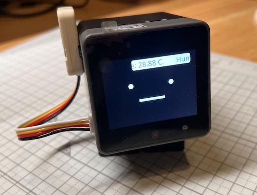

# ユニットを使ったデモ

M5Stack 用のユニット使ったデモになります。
このデモでは SHT30 を搭載した環境センサーユニットから定期的に温度・湿度を取得し画面上に表示します。

## ユニットの接続

ユニットは PORT.A の Grove ポートに接続します。

## 他のセンサーユニットを使用する

使用するセンサーのドライバーは本 mod の`manifest.json`で指定しており、これを変更することで他のセンサーユニットも使用することができます。
Moddable で使用可能なセンサードライバーの一覧は[こちら](https://github.com/Moddable-OpenSource/moddable/blob/public/modules/drivers/readme.md)から確認できます。

> [!NOTE]  
> mod のビルド時に`### mod cannot contain native code`とエラーが表示された場合、mod の制約により mod の実装に C 言語のソースコードが含めることができないことを示しています。  
> その場合は、ホスト側でドライバーないしドライバーが依存するモジュールを事前に読み込む必要があります。  
> Moddable における mod の詳細については[公式のドキュメント](https://github.com/Moddable-OpenSource/moddable-jp/blob/dev/translate-jp/documentation/xs/mods.md)より確認ができます。
