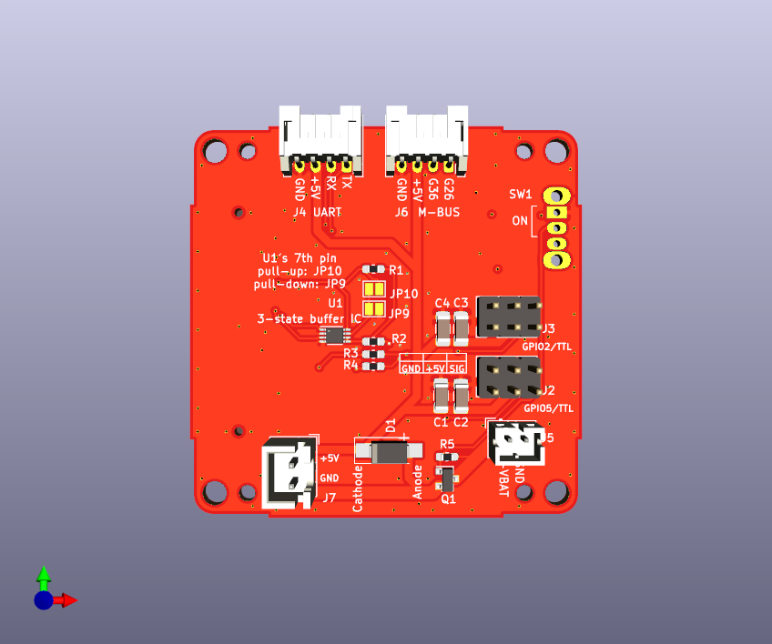
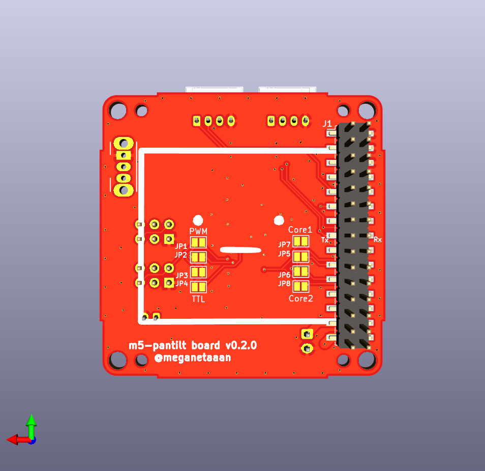
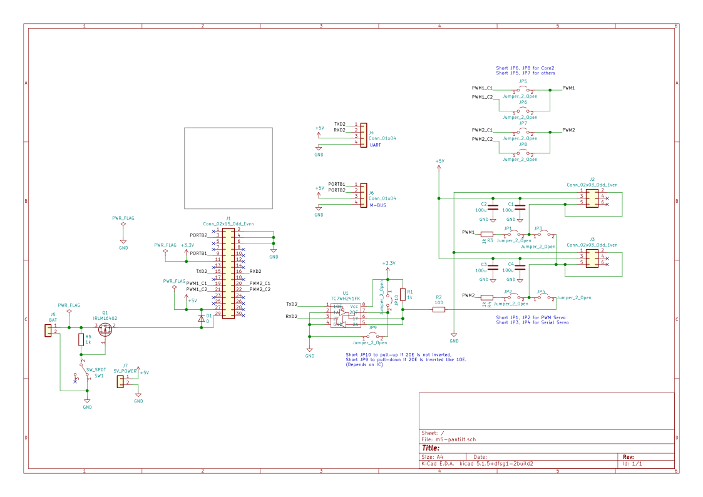

# Stack-chan schematics

[日本語](./README_ja.md)

## Feature

* Drive two servos
  * PWM * 2ch or
  * Serial * 2ch
* M5Unit PortB
* External 5V Power Supply
* Battery, which can be charged through M5Stack.
* (Optional) Power switch

## Parts list

See the parts list on our GitHub Pages (under construction)

### Which type of servo should I use?

#### PWM (SG90)

**Pros**: Low cost
* Very low cost (~500yen), easy to find.
* PortC (serial communication) is available for users.

**Cons**: Difficult to control and having a (small) safety risk.
* Difficult to change its angle smoothly.
* Inrush current is high and may cause the M5Stack to power down in rare cases. SG90 possibly get very hot and may emit smoke when overloaded, such as when the angle exceeds the physical limits of the Stack-chan.
* Cannot control torque ON/OFF. Twisting the Stack-chan's head while the torque is ON may result in servo damage.

#### Serial (RS304MD)

**Pros**: High functionality
* Complex control such as speed limit is possible. Since the current servo angle can be read, we can make rich functions such as changing the action according to the direction of the stuck-chan's face.

**Cons**: High cost and having a bit large size.
* It is relatively expensive (~3,000 yen)
* Users cannot use PortC. 
* Because RS304MD is a bit larger than SG90, it sticks out slightly behind the body.

## SMD PCB Manufacturing

You can place an order for SMD (Surface Mount Device) PCBs with PCB manufacturers like JLCPCB using the following files (links to be added):

- Gerber Files
- BOM (Bill of Materials)
- CPL (Component Placement List)

(A guide on how to place an order will be posted soon.)
