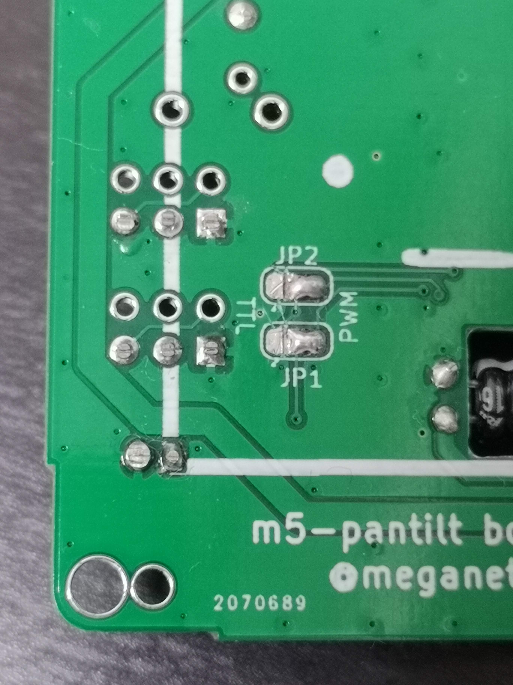
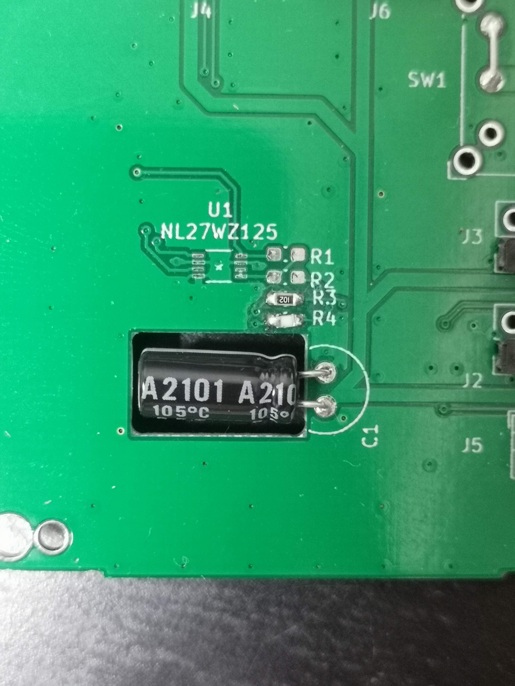
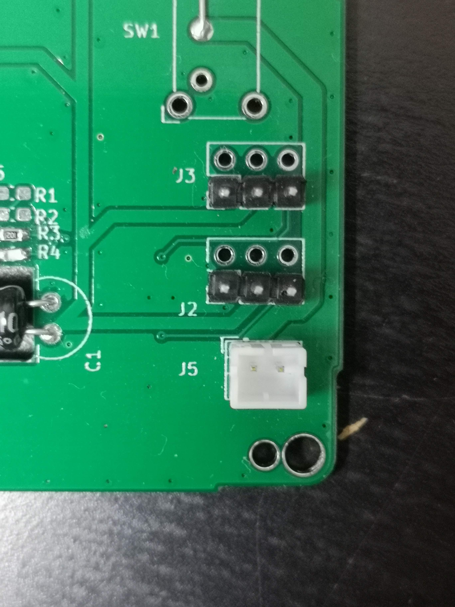
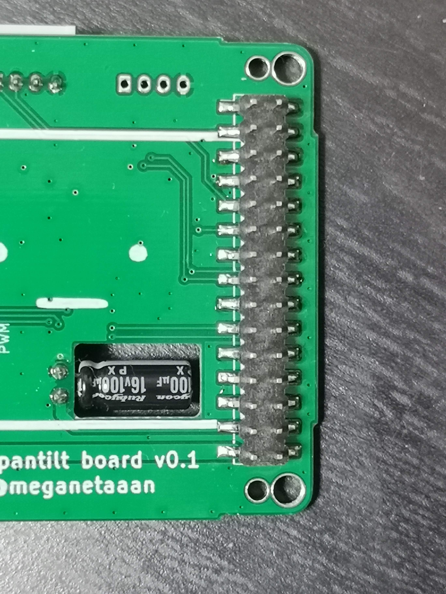

# Stack-chan schematics

[日本語](./README_ja.md)

## Feature

* Drive two servos
  * TTL or
  * PWM * 2ch
* M5Unit port
  * PortB
  * PortC(only available with PWM servo)
* Battery
* (Optional) Power switch

## Parts list

__(NOTE) This list includes both options for [Serial](#Serial(TTL)-Servo) and [PWM](#PWM-Servo). You will only need eigher of them. See [assembly instruction](#Assembly).__

|Reference| Quantity| Value| Footprint| URL|
|:--:|:--|:--|:--|:--|
| C1 |1|"100u"|"Capacitor_THT:C_Radial_D6.3mm_H11.0mm_P2.50mm"|"https://www.sengoku.co.jp/mod/sgk_cart/detail.php?code=46S8-5GL7"|
| J1 |1|"Conn_02x15_Odd_Even"|"Connector_PinHeader_2.54mm:PinHeader_2x15_P2.54mm_Vertical_SMD"|"https://www.switch-science.com/catalog/3654/"|
| J2 J3 |2|"Conn_02x03_Odd_Even"|"Connector_PinHeader_2.54mm:PinHeader_2x03_P2.54mm_Vertical"||
| J5 |1|"BAT"|"Connector_JST:JST_PH_B2B-PH-K_1x02_P2.00mm_Vertical"|"https://akizukidenshi.com/catalog/g/gC-12802/"|
| J4 J6 |2|"Conn_01x04"|"Connector_JST:JST_PH_S4B-PH-K_1x04_P2.00mm_Horizontal"||
| JP1 JP2 |2|"Jumper_3_Bridged12"|"Jumper:SolderJumper-3_P1.3mm_Bridged12_RoundedPad1.0x1.5mm"||
| R1 R3 R4 |3|"1k"|"Resistor_SMD:R_0603_1608Metric_Pad1.05x0.95mm_HandSolder"||
| R2 |1|"100"|"Resistor_SMD:R_0603_1608Metric_Pad1.05x0.95mm_HandSolder"|"https://www.sengoku.co.jp/mod/sgk_cart/detail.php?code=EEHD-57FV"|
| SW1 |1|"SW_SPDT"|"Button_Switch_THT:SW_E-Switch_EG1224_SPDT_Angled"||
| U1 |1|"NL27WZ125"|"NL27WZ125USG"|"https://www.digikey.jp/number/ja/on-semiconductor/488/NL27WZ125/291486"|

## Assembly

### PWM Servo

With this settings the board can drive two PWM Servos.
Tested with:

* [SG-90](https://www.towerpro.com.tw/product/sg90-7/)
* [EMAX ES08MD](https://emaxmodel.com/collections/digital-servo/products/emax-es08md-13g-mini-metal-digital-servo-for-rc-model)

#### Parts

* Resistor SMD 0603(1608Metric)
  * 1kΩ * 2pc
* Capacitor 10V/100uF * 1pc
* Pin Header 2.54mm 1x3pin
  * 1row-3column * 2pc
* [Pin Header 2.54mm 2x15pin](https://www.switch-science.com/catalog/3654/)
* JST PH 2-pin Connector * 1pc
* (Optional) PH 4-pin Connector * 2pc
* (Optional) Power switch [EG1224](https://www.digikey.com/en/products/detail/e-switch/EG1224/502052)

#### Soldering

1. Change direction of JP1 and JP2. Cut the left patterns and solder right patterns of them. 
1. Solder 1kΩ resistor on R3 and R4.
1. Solder Capacitor on C1, bend it and fit it in the hole. 
1. Solder pin headers. and PH 2-pin connector 
1. (Optional) Solder PH 4-pin connectors for PortB and PortC
1. Solder power switch OR short the top 2 holes 
1. Solder 2x15 pin header 

### Serial(TTL) Servo

With this settings the board can drive two Serial(TTL) Servos.
Tested with:

* Futaba [RS304MD](http://futaba.co.jp/robot/command_type_servos/rs304md)

#### Parts

* Resistor SMD 0603(1608Metric)
  * 1kΩ * 1pc
  * 100Ω * 1pc
* Capacitor 10V/100uF * 1pc
* 3-State Buffer IC [NL27WZ125](https://www.digikey.jp/number/ja/on-semiconductor/488/NL27WZ125/291486) * 1pc
* Pin Header 2.54mm 1x3pin
  * 1row-3column * 2pc OR
  * 2row-2column * 2pc
* [Pin Header 2.54mm 2x15pin](https://www.switch-science.com/catalog/3654/)
* JST PH 2-pin Connector * 1pc
* (Optional) PH 4-pin Connector * 1pc

#### Soldering

1. Solder resistors, 1kΩ on R1 and 100Ω on R2
1. Solder IC. See the tiny hole on the chip is on top-left side of silk
1. Solder Capacitor on C1, bend it and fit it in the hole. 
1. Solder pin headers. and PH 2-pin connector 
1. (Optional) Solder PH 4-pin connectors for PortB
1. Solder power switch OR short the top 2 holes 
1. Solder 2x15 pin header 
