# Stack-chan schematics

[日本語](./README_ja.md)

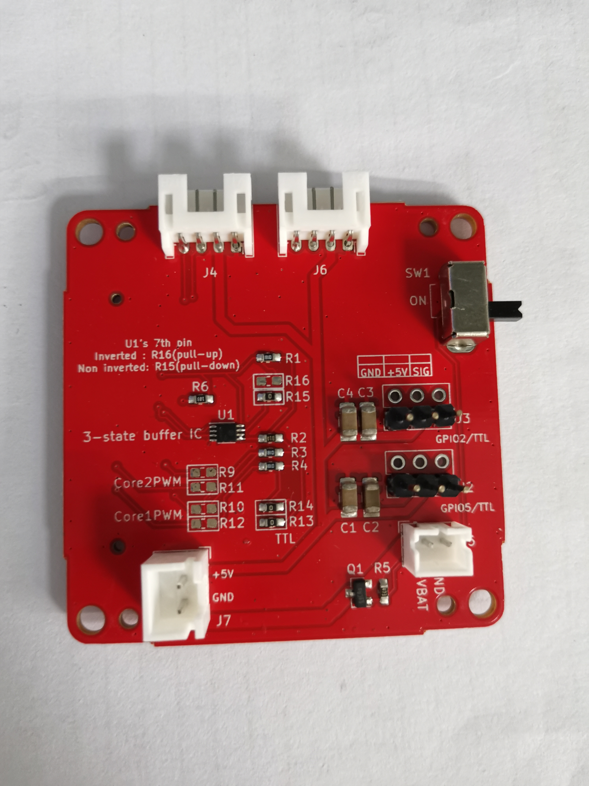
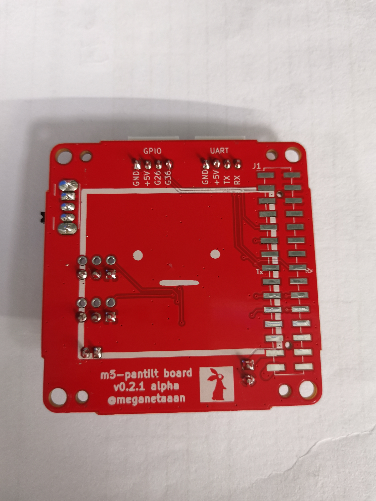

## Feature

* Drive two servos
  * PWM * 2ch or
  * Serial * 2ch
* M5Unit port
  * PortB
  * PortC (only available with PWM servo)
* Battery, which can be charged through M5Stack.
* (Optional) Power switch

## Parts list

__(NOTE) This list includes both options for [Serial](#Serial(TTL)-Servo) and [PWM](#PWM-Servo). You will only need eigher of them. See [assembly instruction](#Assembly).__

|Reference| Quantity| Value| Footprint| URL|
|:--:|:--|:--|:--|:--|
| C4 C1 C3 C2 |4|"100u"|"Capacitor_SMD:C_1206_3216Metric_Pad1.42x1.75mm_HandSolder"|"~"|"https://akizukidenshi.com/catalog/g/gP-15633/"|
| J1 |1|"Conn_02x15_Odd_Even"|"Connector_PinHeader_2.54mm:PinHeader_2x15_P2.54mm_Vertical_SMD"|"~"|"https://www.switch-science.com/catalog/3654/"|
| J3 J2 |2|"Conn_02x03_Odd_Even"|"Connector_PinHeader_2.54mm:PinHeader_2x03_P2.54mm_Vertical"|"~"|
| J5 |1|"BAT"|"Connector_JST:JST_PH_B2B-PH-K_1x02_P2.00mm_Vertical"|"~"|"https://akizukidenshi.com/catalog/g/gC-12802/"|
| J6 J4 |2|"Conn_01x04"|"Connector_JST:JST_PH_S4B-PH-K_1x04_P2.00mm_Horizontal"|"~"|
| J7 |1|"5V_POWER"|"Connector_JST:JST_XH_B2B-XH-A_1x02_P2.50mm_Vertical"|"~"|"https://akizukidenshi.com/catalog/g/gC-12802/"|
| Q1 |1|"IRLML6402"|"Package_TO_SOT_SMD:SOT-23"|"https://www.infineon.com/dgdl/irlml6402pbf.pdf?fileId=5546d462533600a401535668d5c2263c"|"https://akizukidenshi.com/catalog/g/gI-02553/"|
| R1 R4 R3 |3|"1k"|"Resistor_SMD:R_0603_1608Metric_Pad1.05x0.95mm_HandSolder"|"~"|
| R2 |1|"100"|"Resistor_SMD:R_0603_1608Metric_Pad1.05x0.95mm_HandSolder"|"~"|"https://www.sengoku.co.jp/mod/sgk_cart/detail.php?code=EEHD-57FV"|
| R5 |1|"47k"|"Resistor_SMD:R_0603_1608Metric_Pad1.05x0.95mm_HandSolder"|"~"|
| R6 |1|"10k"|"Resistor_SMD:R_0603_1608Metric_Pad1.05x0.95mm_HandSolder"|"~"|
| R9 R10 R11 R12 R13 R14 R16 R15 |8|"0"|"Resistor_SMD:R_0603_1608Metric_Pad1.05x0.95mm_HandSolder"|"~"|
| SW1 |1|"SW_SPDT"|"Button_Switch_THT:SW_CuK_OS102011MA1QN1_SPDT_Angled"|"~"|"https://www.digikey.jp/ja/products/detail/c-k/OS102011MA1QN1/1981430"|
| U1 |1|"TC7WH241FK"|"m5-pantilt:NL27WZ125USG"|""

### Which type of servo should I use?

#### PWM (SG90)

**Pros**: Low cost
* Very low cost (~500yen), easy to find.
* PortC (serial communication) is available for users.

**Cons**: Difficult to control and having a (small) safety risk.
* Difficult to change its angle smoothly.
* Inrush current is high and may cause the M5Stack to power down in rare cases. SG90 possibly get very hot and may emit smoke when overloaded, such as when the angle exceeds the physical limits of the stack-chan.

#### Serial (RS304MD)

**Pros**: High functionality
* Complex control such as speed limit is possible. Since the current servo angle can be read, we can make rich functions such as changing the action according to the direction of the stuck-chan's face.

**Cons**: High cost and having a bit large size.
* It is relatively expensive (~3,000 yen)
* Users cannot use PortC. 
* Because RS304MD is a bit larger than SG90, it sticks out slightly behind the body.

## Assembly

### PWM Servo

__NOTE: The Stack-chan board v0.2.1 (alpha) has wrong silk sign. PWM_Core1 and PWM_Core2 are reversed.__

With this settings the board can drive two PWM Servos.
Tested with:

* [SG-90](https://www.towerpro.com.tw/product/sg90-7/)

#### Parts

* Resistor SMD 0603(1608Metric)
  * 1kΩ * 2pc
  * 0Ω * 2pc
* Capacitor 100uF 1206(3216Metric) (Rated Voltage >= 10V) * 2pc
* Pin Header 2.54mm 1x3pin
  * 1row-3column * 2pc
* [Pin Header 2.54mm 2x15pin](https://www.switch-science.com/catalog/3654/)
  * Be aware of lower pin height(about 3mm) than usual. We recommend you to use the product of the link above.
  * ピンの高さが一般的なピンヘッダより短い（3mm）のでご注意ください。リンク先のM5Stackの製品をおすすめします。
* JST PH 2-pin Connector * 1pc
* **Optional: Grove port connector**
  * PH 4-pin Connector * 2pc
* **Optional: Power switch**
  * Slide switch [OS102011MA1QN1](https://www.digikey.jp/ja/products/detail/c-k/OS102011MA1QN1/1981430)
  * Resistor SMD 0603(1608Metric) 47kΩ * 1pc
  * Pch MOSFET [IRLML6402](https://akizukidenshi.com/catalog/g/gI-02553/)

#### Soldering

1. Solder or jump 0Ω resistors
  * For M5Stack Basic/Gray/Fire: R9, R11
  * For M5Stack Core2: R10, R12
1. Solder 1kΩ resistor on R3 and R4.
1. Solder the capacitors to C1, C2, C3, and C4. For each servo, the total capacitance of the two capacitors in parallel should be about 100uF or more. (In this document, two 100uF capacitors are connected in parallel.)
1. Solder pin headers J2 and J3. and PH 2-pin connector J5 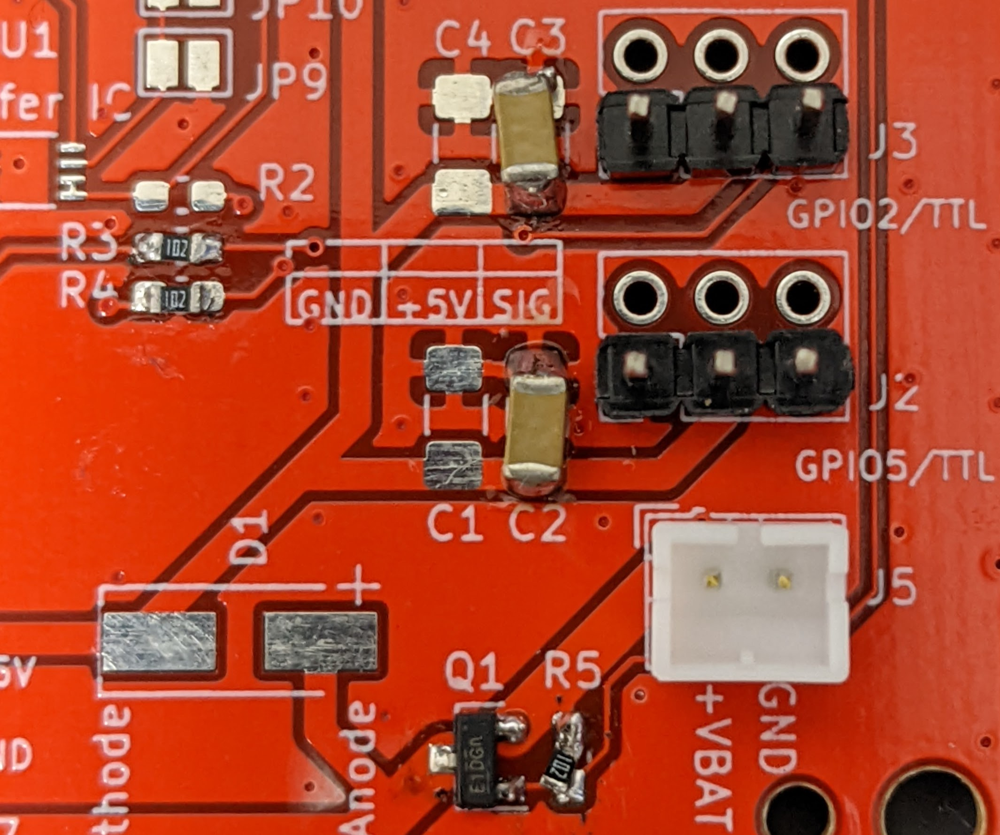
1. (Optional) When using Grove ports, Solder PH 4-pin connectors to J6 (PortB) and J4 (PortC) 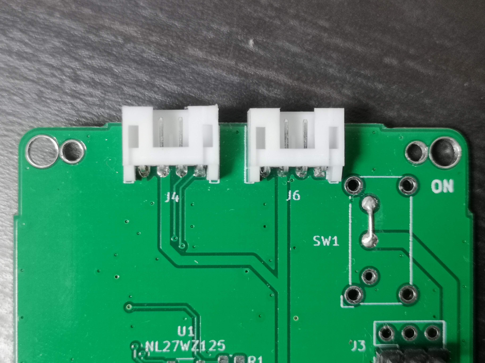
1. (Optional) When using the power switch, solder the MOSFET to Q1, the 47kΩ resistor to R5, and the slide switch to SW1. 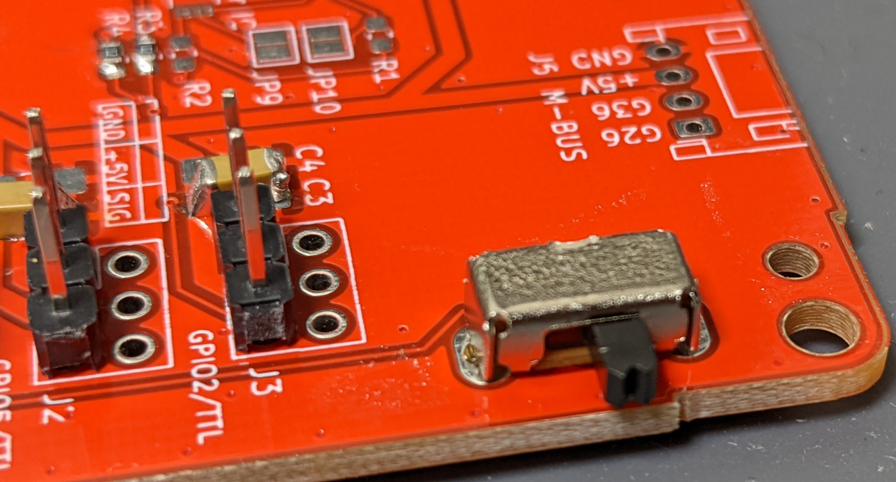
  1. When not, short-circuit the source and drain of the MOSFET.
1. Solder 2x15 pin header 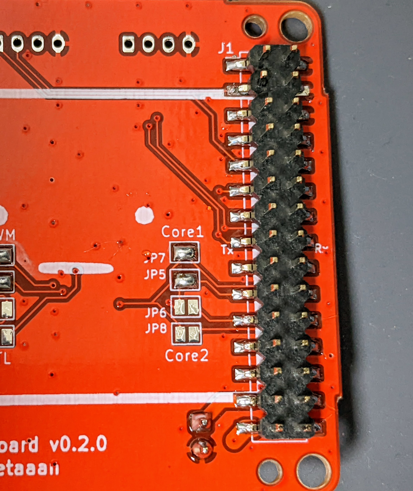

### Serial(TTL) Servo

With this settings the board can drive two Serial(TTL) Servos.
Tested with:

* Futaba [RS304MD](http://futaba.co.jp/robot/command_type_servos/rs304md)
* Feetech [SCS0009](https://www.switch-science.com/catalog/8042/)

#### Parts

* Resistor SMD 0603(1608Metric)
  * 1kΩ * 1pc
  * 10kΩ * 1pc
  * 100Ω * 1pc
  * 0Ω * 3pc
* Capacitor 100uF 1206(3216Metric) (Rated Voltage >= 10V) * 2pc
* 3-State Buffer IC [NL27WZ125](https://www.digikey.jp/number/ja/on-semiconductor/488/NL27WZ125/291486) * 1pc
  * **OR** [TC7WH241FK](https://akizukidenshi.com/catalog/g/gI-10884/) * 1pc
* Pin Header 2.54mm 1x3pin that matches the connector shape of the servos.
  * 1row-3column * 2pc OR
  * 2row-2column * 2pc
* [Pin Header 2.54mm 2x15pin](https://www.switch-science.com/catalog/3654/)
  * Be aware of lower pin height(about 3mm) than usual. We recommend you to use the product of the link above.
* JST PH 2-pin Connector * 1pc
* **Optional: Grove port connector**
  * PH 4-pin Connector * 1pc
* **Optional: Power switch**
  * Slide switch [OS102011MA1QN1](https://www.digikey.jp/ja/products/detail/c-k/OS102011MA1QN1/1981430)
  * Resistor SMD 0603(1608Metric) 47kΩ * 1pc
  * Pch MOSFET [IRLML6402](https://akizukidenshi.com/catalog/g/gI-02553/)

#### Soldering

1. Solder 0Ω or jump resistors to R13 and R14 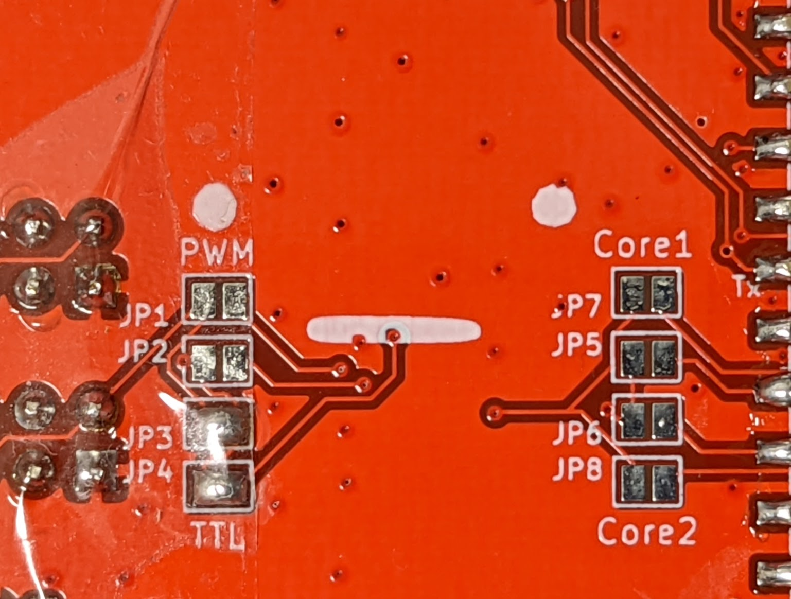
1. Solder resistors, 1kΩ on R1, 100Ω on R2 and 10kΩ on R6
1. Solder IC. See the tiny hole on the chip is on top-left side of silk 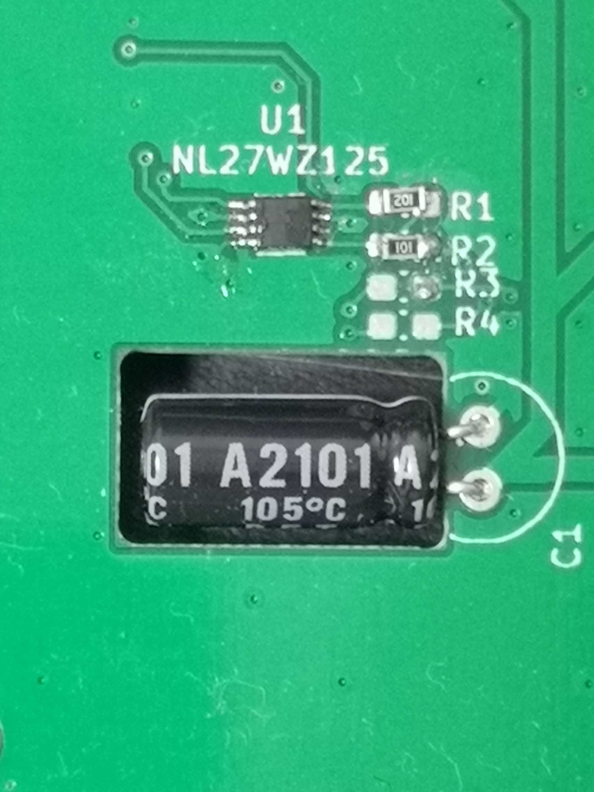
1. Solder 0Ω or jump resistor to R15 **OR** JP16
  - R15 if you use NL27WZ125
  - R16 if you use TC7WH241FK
1. Solder the capacitors to C1, C2, C3, and C4. For each servo, the total capacitance of the two capacitors in parallel should be about 100uF or more. (In this document, two 100uF capacitors are connected in parallel.)
1. Solder pin headers. and PH 2-pin connector 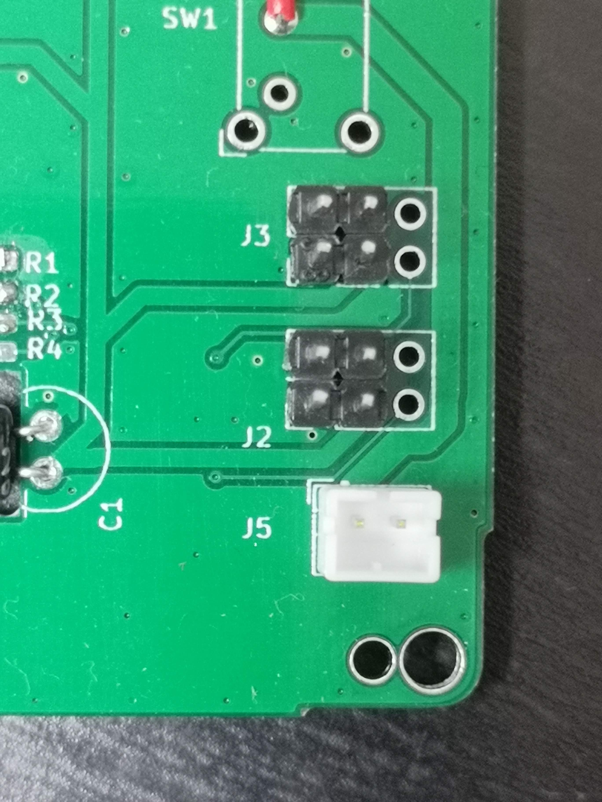
1. (Optional) When using Grove PortB, Solder PH 4-pin connectors for J6 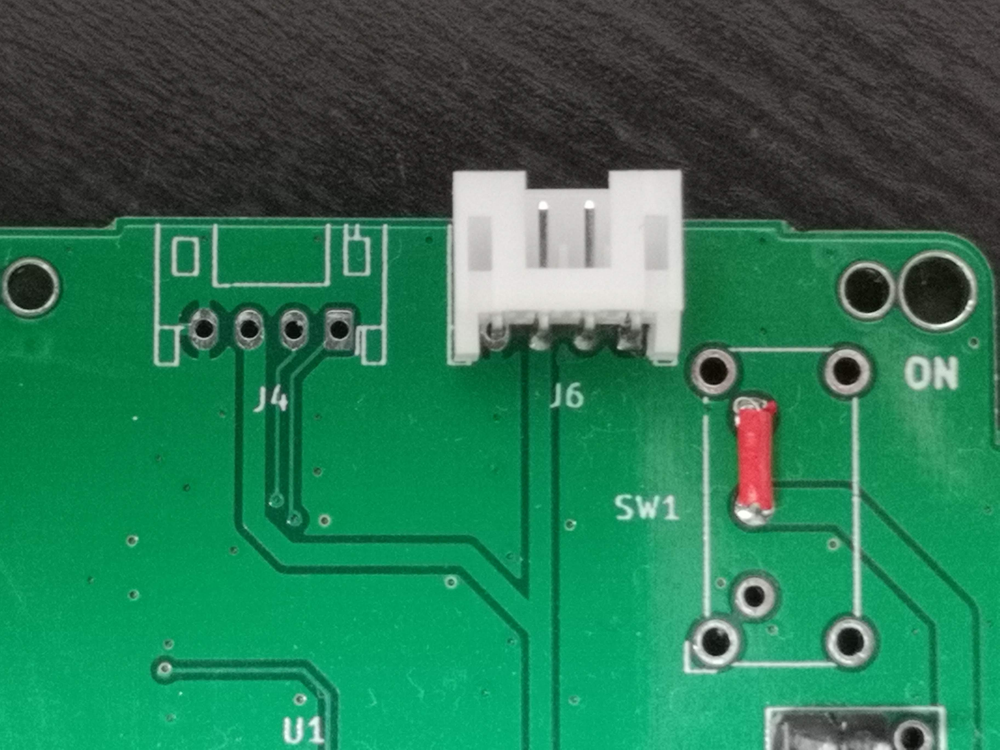
1. (Optional) When using the power switch, solder the MOSFET to Q1, the 47kΩ resistor to R5, and the slide switch to SW1. 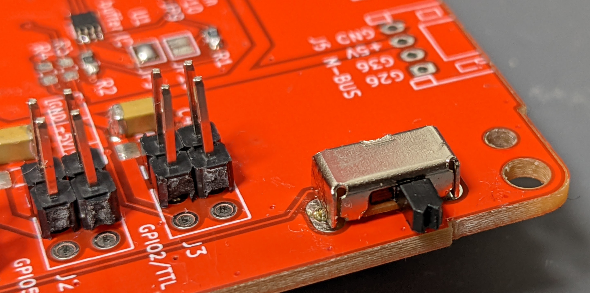
  1. When not, short-circuit the source and drain of the MOSFET.
1. Solder 2x15 pin header 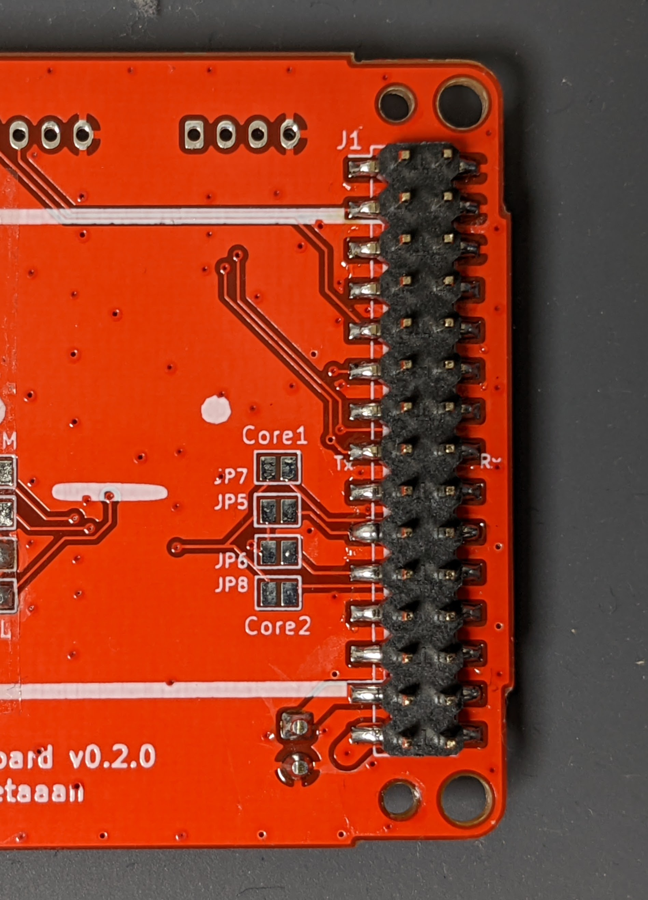
