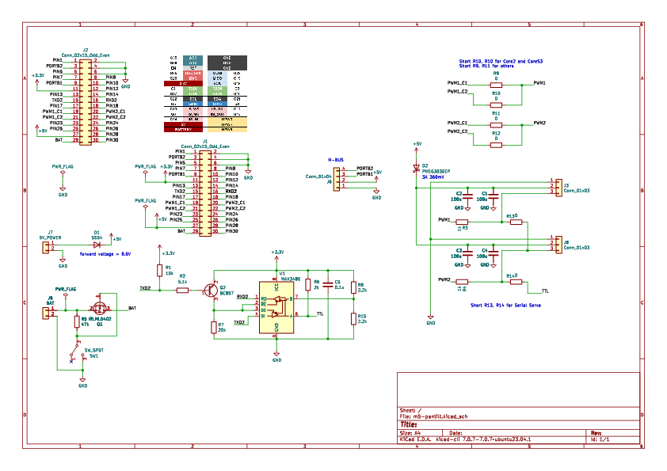

# ｽﾀｯｸﾁｬﾝ 基板

[English](./README.md)

基板の写真は最新のバージョンと異なる場合があります。

## 機能

* 2つのサーボを駆動
  * PWM * 2chまたは
  * TTL * 2ch
* M5Unitのポート（PortB）を搭載
* 電池 (M5Stackからの充電に対応)
* 外部からの5V給電
* (オプション) 電源スイッチ

## パーツリスト

ｽﾀｯｸﾁｬﾝのGitHub Pagesを参照してください（リンク追加予定）。

### PWMとシリアルサーボのどちらが良いか

#### PWMサーボ (SG90)

**Pros**: 低コスト
* 低コスト (~500円)で入手性が高いです。
* PortC (シリアル通信) が利用可能です。

**Cons**: 制御が難しい & 若干の安全性リスク有り
* サーボの角度をスムーズに変化させることが難しいです。
* 突入電流が大きく、まれにM5Stackの電源が落ちることがあります。例えば、ｽﾀｯｸﾁｬﾝの物理的な拘束を超えた角度司令を与えたときなどは、SG90が発熱したり発煙したりする場合があります。
* トルクのON/OFFの制御ができません。トルクがONの状態でｽﾀｯｸﾁｬﾝの頭をひねるとサーボが破損する場合があります。

#### シリアルサーボ (RS304MD)

**Pros**: 高機能
* 角速度制限などの複雑な制御が可能です。また、現在の角度情報を読み取れるので、ｽﾀｯｸﾁｬﾝの顔の向きに合わせて動作を変えるなど、高度な機能を実現できます。

**Cons**: 高コスト & サイズが大きい
* 高コスト (~3000円)
* RS304MDはSG90より一回り大きいので、サーボが本体から少し飛び出た格好になります。

## SMD基板の製造

下記のファイル（リンクを追加予定）を使って、JLCPCB等のPCBメーカーにSMD（表面実装）基板の発注が可能です。

- ガーバーファイル
- BOM（部品表）
- CPL（部品配置）

（発注方法のガイドを掲載予定）
