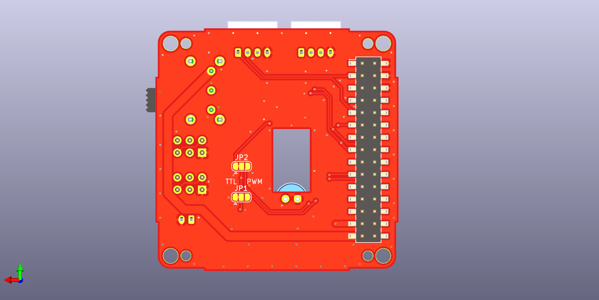

# Stack-chan schematics

TOP

BOTTOM

## Feature

* Drive two servos
  * TTL or
  * PWM * 2ch
* M5Unit port
  * PortB
  * PortC(only available with PWM servo)
* Battery
* (Optional) Power switch

## Parts

|Reference| Quantity| Value| Footprint| URL|
|:--:|:--|:--|:--|:--|
| C1 |1|"100u"|"Capacitor_THT:C_Radial_D6.3mm_H11.0mm_P2.50mm"|"https://www.sengoku.co.jp/mod/sgk_cart/detail.php?code=46S8-5GL7"|
| J1 |1|"Conn_02x15_Odd_Even"|"Connector_PinHeader_2.54mm:PinHeader_2x15_P2.54mm_Vertical_SMD"|"https://www.switch-science.com/catalog/3654/"|
| J2 J3 |2|"Conn_02x03_Odd_Even"|"Connector_PinHeader_2.54mm:PinHeader_2x03_P2.54mm_Vertical"||
| J5 |1|"BAT"|"Connector_JST:JST_PH_B2B-PH-K_1x02_P2.00mm_Vertical"|"https://akizukidenshi.com/catalog/g/gC-12802/"|
| J4 J6 |2|"Conn_01x04"|"Connector_JST:JST_PH_S4B-PH-K_1x04_P2.00mm_Horizontal"||
| JP1 JP2 |2|"Jumper_3_Bridged12"|"Jumper:SolderJumper-3_P1.3mm_Bridged12_RoundedPad1.0x1.5mm"||
| R1 R3 R4 |3|"1k"|"Resistor_SMD:R_0603_1608Metric_Pad1.05x0.95mm_HandSolder"||
| R2 |1|"100"|"Resistor_SMD:R_0603_1608Metric_Pad1.05x0.95mm_HandSolder"|"https://www.sengoku.co.jp/mod/sgk_cart/detail.php?code=EEHD-57FV"|
| SW1 |1|"SW_SPDT"|"Button_Switch_THT:SW_E-Switch_EG1224_SPDT_Angled"||
| U1 |1|"NL27WZ125"|"NL27WZ125USG"|"https://www.digikey.jp/number/ja/on-semiconductor/488/NL27WZ125/291486"|

## Assembly

TODO
